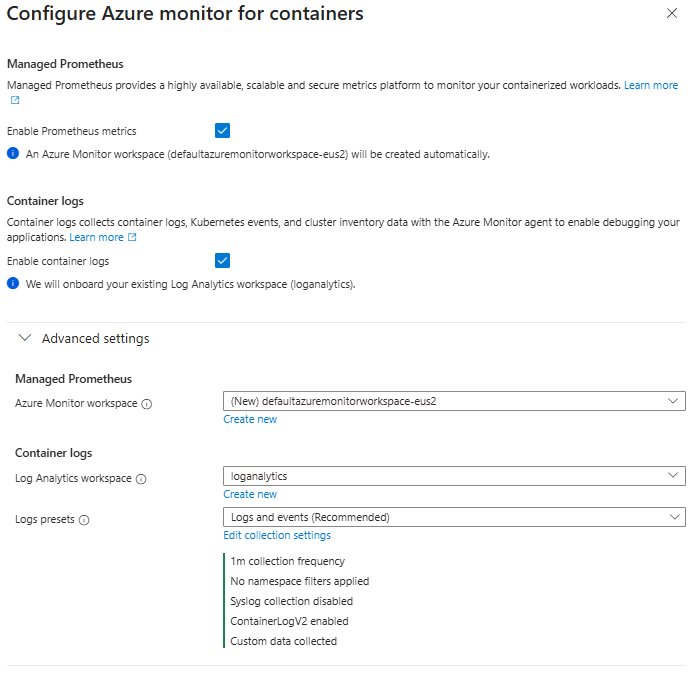
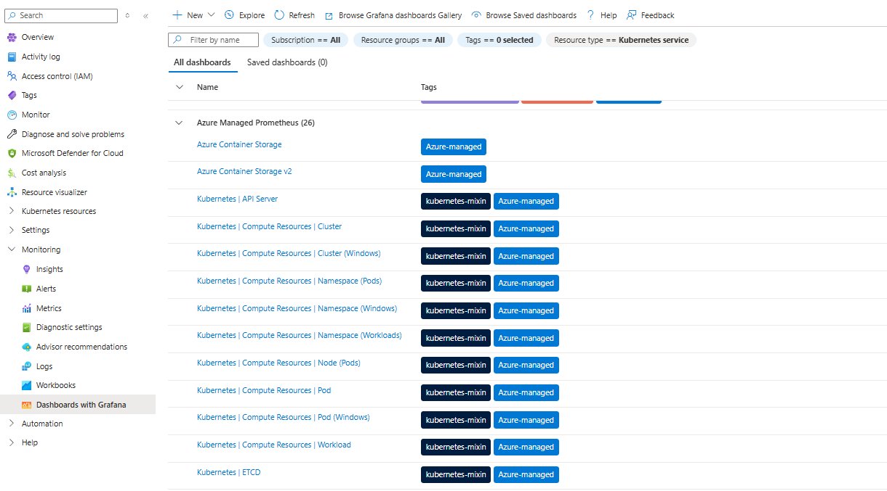
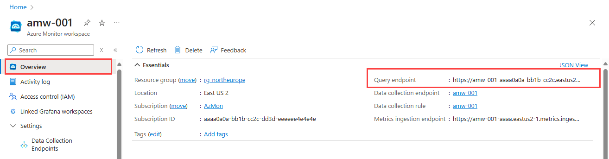
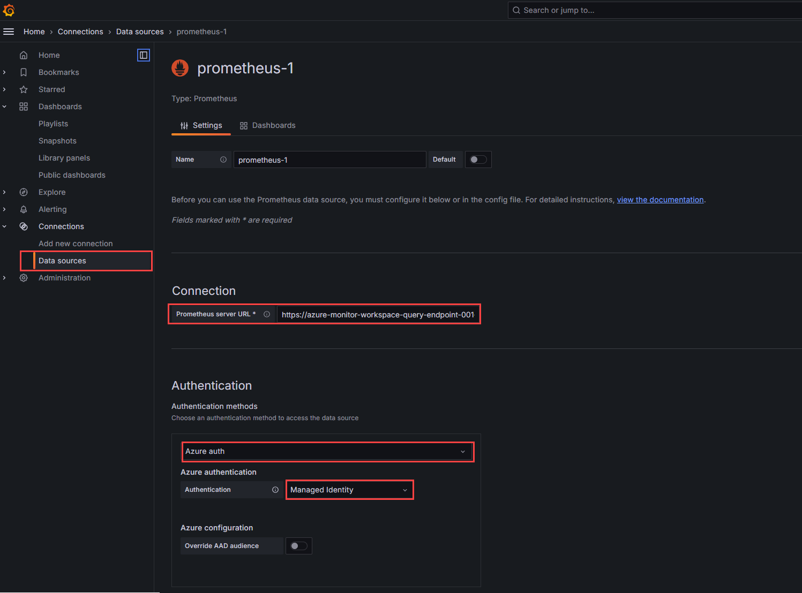
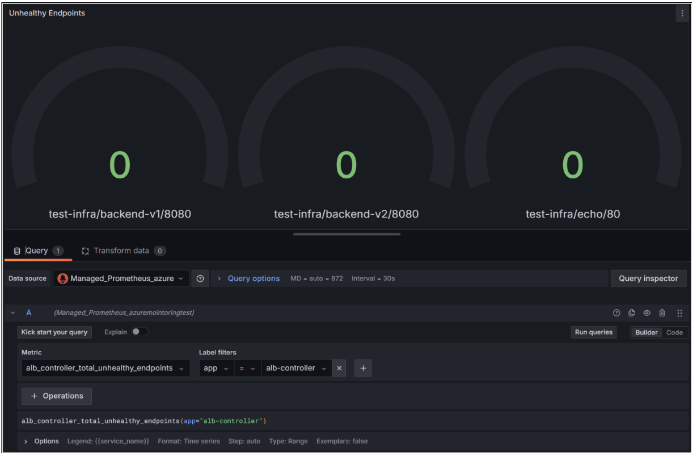
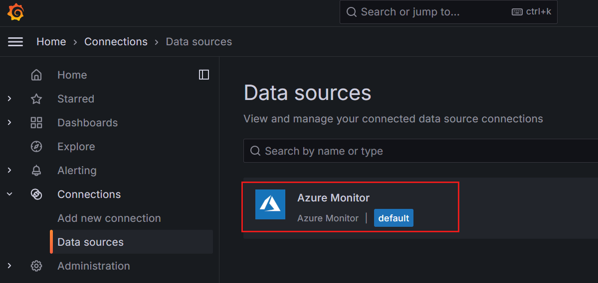
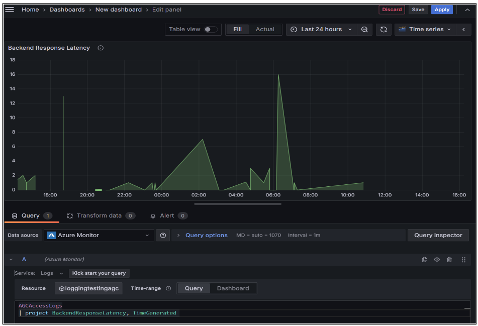

# Configure Application Gateway for Containers with Prometheus and Grafana

Establishing monitoring for Application Gateway for Containers is a crucial part of successful operations. Monitoring allows you to visualize how traffic is controlled, providing actionable insights that help optimize performance and troubleshoot issues promptly. Monitoring also enhances security by providing valuable insights during investigations, which helps ensure that your gateway remains secure and resilient against threats.

## Learn about the services
Before you start the configuration, review how these components work together to create a unified monitoring solution.

- [What is Azure Monitor Managed Prometheus?](/azure/azure-monitor/metrics/prometheus-metrics-overview)
    - Azure Managed Prometheus offers native integration and management capabilities, simplifying the setup and management of monitoring infrastructure. It integrates with Azure Managed Grafana, provides a seamless data source for Azure Monitor dashboards with Grafana, and can also provide data for your existing self-managed Grafana environment. See [Self-managed Prometheus to Grafana](/azure/azure-monitor/metrics/prometheus-metrics-overview)

- [What is Azure Grafana?](/azure/azure-monitor/visualize/visualize-grafana-overview#azure-managed-grafana)
    - Azure Monitor Dashboards with Grafana: Delivers prebuilt Grafana dashboards directly in the Azure portal. It's automatically available at no cost and with no configuration requirements. See available data sources with [Azure Monitor Dashboards with Grafana](/azure/azure-monitor/visualize/visualize-grafana-overview#data-sources). If you require other data sources, then see Azure Managed Grafana. 
    - Azure Managed Grafana is an open-source analytics and visualization platform that enables you to query, monitor, and create interactive dashboards for metrics, logs, and traces from multiple data sources. 

- [What is Azure Monitor Workspace?](/azure/azure-monitor/metrics/azure-monitor-workspace-manage?tabs=azure-portal)
    - The workspace is a unique environment for data collected by Azure Monitor. Each workspace has its own data repository, configuration, and permissions.

You can monitor Azure Application Gateway for Containers resources in the following ways. Refer to the diagram.
- [Backend Metrics](../../application-gateway/for-containers/application-gateway-for-containers-metrics.md): Each client request creates a log entry that can be used to identify slow requests, determine error rates, and correlate WAF Metrics with backend services. The metrics endpoint enables exposure to Prometheus.
  
- [Diagnostic Logs](../../application-gateway/for-containers/diagnostics.md): Access Logs audit all requests made to Application Gateway for Containers. Logs can provide several characteristics, such as the client's IP, requested URL, request latencies, return code, and bytes in and out. An access log is collected every 60 seconds. This includes the activity log, access log, and firewall log.

:::image
type="content" source="./media/prometheus-grafana/agc-monitoring-flowchart.png" alt-text="Screenshot of architecture grid diagram." lightbox="./media/prometheus-grafana/agc-monitoring-flowchart.png"
:::

## Prerequisites
- An active Kubernetes cluster.
- An active Application Gateway for Containers deployment.
- An active resource group with Contributor permission.
- Monitoring Reader role assigned for access to Azure Managed Prometheus (Azure Monitor workspace).

## Azure Monitor dashboards with Grafana
Azure Monitor includes native support for Grafana dashboards directly within the Azure portal. This built-in capability allows you to quickly access prebuilt dashboards and create custom visualizations for monitoring your Azure resources without leaving Azure Monitor. 

Use the following steps to use the Grafana dashboards that are already available in the Azure portal with the data sources from Azure Monitor managed service for Prometheus metrics scraped from Kubernetes clusters.

1. In the Azure portal, navigate to your AKS cluster.
2. Select **Monitoring**.
3. Select **Dashboards with Grafana**.
4. Select **Configure**.
5. Select **Enable Prometheus Metrics** and **Container Logs**. Under **Advanced Settings**, select your specific Azure Monitor workspace, Log Analytics workspace, and log presets.

    

6. Browse the list of available dashboards in the Azure Managed Prometheus listings.

    

See additional customization in [Azure Monitor Dashboards with Grafana](/azure/azure-monitor/visualize/visualize-use-grafana-dashboards)

## Azure Managed Grafana
Azure Managed Grafana provides a dedicated, fully managed Grafana instance with broader flexibility. Choose Azure Managed Grafana when you need advanced user management, customization, integration with a wide variety of Azure and non-Azure data sources, or when you require Grafana's full feature set, such as advanced alerting, reporting, and enterprise plugins.

## Complete the steps to configure Prometheus and Grafana
1. Sign in to the [Azure portal](https://portal.azure.com) with your Azure account.
2. Navigate to your AKS cluster in the Azure portal.
    - **New AKS cluster**: Configure monitoring in the **Monitoring** tab and enable Prometheus metrics and container logs.
    - **Existing cluster**: Navigate to your cluster in the Azure portal. In the service menu, select **Monitor** and then **Monitor Settings**.

    

3. In the **Search resources, services, and docs (G+/)** box, enter *Azure Managed Grafana* and select **Azure Managed Grafana**.
4. Create an [Azure Managed Grafana workspace](/azure/managed-grafana/quickstart-managed-grafana-portal).
    > [!NOTE]
    > An Azure Managed Grafana instance is automatically configured with a managed identity with the Monitoring Data Reader role. This role allows the identity to read monitoring data for the subscription. The identity is used to authenticate Grafana to Azure Monitor.
5. Create an [Azure Monitor workspace](/azure/azure-monitor/metrics/azure-monitor-workspace-manage?tabs=azure-portal). Copy the **Query endpoint**.

    


## Create the Prometheus data source in Grafana
1. Open your Azure Managed Grafana workspace in the Azure portal and select the endpoint to view the Grafana workspace.
2. Select **Connections** > **Data sources** and then select **Add data source**.
3. Search for and select **Prometheus**.
4. Paste the query endpoint from your Azure Monitor workspace into the **Prometheus server URL** field.
5. Under **Authentication**, select **Azure Auth**.
6. Under **Azure Authentication**, select **Managed Identity** from the **Authentication** dropdown list.
7. Scroll to the bottom of the page and select **Save & test**.

    

## Graph Prometheus metrics on Grafana
A Grafana dashboard contains panels and rows. You can import a Grafana dashboard and adapt it to your own scenario, create a new Grafana dashboard, or duplicate an existing dashboard.

1. In the Azure portal, open your Azure Managed Grafana workspace and select the **Endpoint URL**.

2. In the Grafana portal, go to **Dashboards** > **New Dashboard**.

3. Select one of the following options:
    - **Add a new panel**: Instantly creates a dashboard from scratch with a first default panel.
    - **Add a new row**: Instantly creates a dashboard with a new empty row.
    - **Add a panel from the panel library**: Instantly creates a dashboard with an existing reusable panel from another workspace you have access to.
4. Select **Add a new panel**.
5. Search for and select **Prometheus** as a data source.
6. Select the desired metric. For example, select `alb_controller_total_unhealthy_endpoints` to show any unhealthy endpoints of your backend service. Choose **app** as `alb-controller`. Select the name of the panel, type of visualization, and time range.

   
7. Select **Save** and **Apply** to add the panel to your dashboard.


## Graph Azure Monitor Logs on Grafana
After you create the resources, you can combine them and configure Prometheus.
1. Expand the menu on the left and select **Connections** > **Data sources**.

   

2. **Azure Monitor** is listed as a built-in data source for your Azure Managed Grafana workspace. Select **Azure Monitor**.
3. In the **Settings** tab, authenticate through **Managed Identity** and select your subscription from the dropdown list. When you select managed identity, the authentication and authorization are made through the system-assigned or the user-assigned managed identity you configured in your Azure Managed Grafana workspace.
4. Select **Add a new panel**.
5. Search for and select **Azure Monitor** as a data source.
6. Enter the following example query:
    ```kusto
    AGCAccessLogs
    | project BackendResponseLatency, TimeGenerated
    ```

7. Select **Time Series** as a visualization.
8. Select the name, description, and time range of the panel.

    
9. Select **Save** and **Apply** to add the panel to your dashboard.