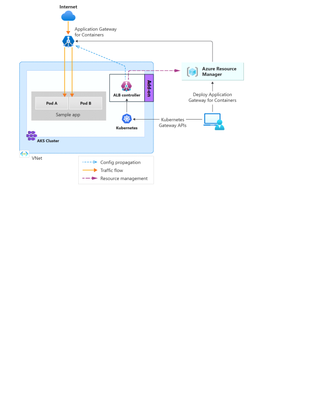

# Quickstart: Deploy Application Gateway for Containers ALB Controller using AKS Add-on

The [ALB Controller](application-gateway-for-containers-components.md#application-gateway-for-containers-alb-controller) is responsible for translating Gateway API and Ingress API configuration within Kubernetes to load balancing rules within Application Gateway for Containers. The following guide walks through the steps needed to enable both the AKS managed Gateway API and Application Gateway for Containers ALB Controller add-ons on a new or existing Azure Kubernetes Service (AKS) cluster.



## Prerequisites

You need to complete the following tasks before enabling the ALB Controller add-on on your cluster:

1. Prepare your Azure subscription and your `az-cli` client.


    ```azurecli-interactive
    # Sign in to your Azure subscription.
    SUBSCRIPTION_ID='<your subscription id>'
    az login
    az account set --subscription $SUBSCRIPTION_ID

    # Register required resource providers on Azure.
    az provider register --namespace Microsoft.ContainerService
    az provider register --namespace Microsoft.Network
    az provider register --namespace Microsoft.NetworkFunction
    az provider register --namespace Microsoft.ServiceNetworking

    # Install Azure CLI extensions.
    az extension add --name alb

    # Install and update the AKS preview extension.
    az extension add --name aks-preview
    az extension update --name aks-preview
    ```
 
2. Register add-on feature

    ```azurecli-interactive
    # Register required preview features
    az feature register --namespace "Microsoft.ContainerService" --name "ManagedGatewayAPIPreview"
    az feature register --namespace "Microsoft.ContainerService" --name "ApplicationLoadBalancerPreview"
    ```

## Setup an AKS cluster with the AKS add-on

The AKS add-on can be enabled on new or existing clusters.

> [!NOTE]
> The AKS cluster needs to be in a [region where Application Gateway for Containers is available](overview.md#supported-regions)
> AKS cluster should use [Azure CNI](/azure/aks/configure-azure-cni) or [Azure CNI Overlay](/azure/aks/concepts-network-azure-cni-overlay).
> AKS cluster should have the workload identity feature enabled. [Learn how](/azure/aks/workload-identity-deploy-cluster#update-an-existing-aks-cluster) to enable workload identity on an existing AKS cluster.

### New Cluster

Use the following commands to create a new AKS cluster with Azure CNI, workload identity enabled, gateway API add-on, and the Application Gateway for Containers add-on enabled.

```azurecli-interactive
AKS_NAME='<your cluster name>'
RESOURCE_GROUP='<your resource group name>'
LOCATION='northeurope'
VM_SIZE='<the size of the vm in AKS>' # The size needs to be available in your location

az group create --name $RESOURCE_GROUP --location $LOCATION
az aks create \
    --resource-group $RESOURCE_GROUP \
    --name $AKS_NAME \
    --location $LOCATION \
    --node-vm-size $VM_SIZE \
    --network-plugin azure \
    --enable-oidc-issuer \
    --enable-workload-identity \
    --enable-gateway-api \
    --enable-application-load-balancer \
    --generate-ssh-key
```

>[!Note]
>To prevent conflict with other services using Gateway API, the Application Gateawy for Containers add-on requires use of the AKS Gateway API add-on.

### Existing Cluster

#### Add prerequisites to an existing cluster

If using an existing cluster, ensure you enable Workload Identity support on your AKS cluster. Workload identities can be enabled via the following commands:

# [Azure CLI](#tab/azure-cli)

```azurecli-interactive
AKS_NAME='<your cluster name>'
RESOURCE_GROUP='<your resource group name>'
az aks update -g $RESOURCE_GROUP -n $AKS_NAME --enable-oidc-issuer --enable-workload-identity --no-wait
```

# [Azure PowerShell](#tab/azure-powershell)

```azurepowershell-interactive
$AKS_NAME = '<your cluster name>'
$RESOURCE_GROUP = '<your resource group name>'

# Get the AKS cluster object
$cluster = Get-AzAksCluster -ResourceGroupName $RESOURCE_GROUP -Name $AKS_NAME

# Set security profile
$cluster.SecurityProfile.WorkloadIdentity = $True

# Update the cluster
Set-AzAksCluster -InputObject $cluster -EnableOidcIssuer
```

---

#### Install ALB Controller add-on

With an existing cluster, you can enable the Gateway API and Application Gateway for Containers add-ons with the following commands:

# [Azure CLI](#tab/azure-cli)

```azurecli-interactive
AKS_NAME='<your cluster name>'
RESOURCE_GROUP='<your resource group name>'

# Update the AKS cluster
az aks update --name ${AKS_NAME} --resource-group ${RESOURCE_GROUP} --enable-gateway-api --enable-application-load-balancer
```

# [Azure Rest](#tab/azure-rest)

Here's how to update an existing AKS cluster via REST api, through the use of the Azure CLI REST command.

```azurecli-interactive
AKS_NAME='<your cluster name>'
RESOURCE_GROUP='<your resource group name>'
AKS_ID=$(az aks show -g $RESOURCE_GROUP -n $AKS_NAME --query id -o tsv)
AKS_REGION=$(az aks show -g $RESOURCE_GROUP -n $AKS_NAME --query location -o tsv)

az rest \
  --method put \
  --uri "https://management.azure.com${AKS_ID}?api-version=2025-09-02-preview" \
  --body '{
    "location": "${AKS_REGION}",
    "properties": {
      "ingressProfile": {
        "applicationLoadBalancer": {
          "enabled": true
        },
        "gatewayAPI": {
          "installation": "Standard"
        }
      }
    }
  }' \
  --verbose
```

---

#### Verify the ALB Controller installation

##### Verify ALB Controller Pods

Verify the ALB Controller pods are running in the `kube-system` namespace:

```azurecli-interactive
kubectl get pods -n kube-system | grep alb-controller
```

You should see two `alb-controller` pods in `Running` state:

| NAME                                     | READY | STATUS  | RESTARTS | AGE  |
| ---------------------------------------- | ----- | ------- | -------- | ---- |
| alb-controller-6648c5d5c-sdd9t           | 1/1   | Running | 0        | 4d6h |
| alb-controller-6648c5d5c-au234           | 1/1   | Running | 0        | 4d6h |

##### Verify GatewayClass

Verify GatewayClass `azure-alb-external` is installed on your cluster:

```azurecli-interactive
kubectl get gatewayclass azure-alb-external -o yaml
```

##### Validate Add-on Resources in Azure Portal

Navigate to the `MC_` (node) resource group for your AKS cluster. You should see the following resources automatically created by the add-on:

###### Managed Identity

An identity named `applicationloadbalancer-<cluster-name>` is created with the following role assignments:

| Role | Scope |
| ---- | ----- |
| Network Contributor | MC resource group |
| AppGw for Containers Configuration Manager | MC resource group |
| Reader | MC resource group |

The `applicationloadbalancer-<cluster-name>` identity will have a federated identity credential configured with the following properties:

- **Name:** aksfic
- **Namespace:** kube-system
- **Service Account:** alb-controller-sa

>[!Warning]
>It is unsupported to modify the identity or namespace when provisioning integration with the add-on. If you wish to customize your deployment, consider [deployment with helm](quickstart-deploy-application-gateway-for-containers-alb-controller-helm.md).

###### Subnet

A subnet named `aks-appgateway` with subnet delegation enabled for `Microsoft.ServiceNetworking/TrafficController`

You should see that the GatewayClass has a condition that reads **Valid GatewayClass**. This condition indicates that a default GatewayClass is set up and that any gateway resources that reference this GatewayClass is managed by ALB Controller automatically.

```output
apiVersion: gateway.networking.k8s.io/v1beta1
kind: GatewayClass
metadata:
  creationTimestamp: "2023-07-31T13:07:00Z"
  generation: 1
  name: azure-alb-external
  resourceVersion: "64270"
  uid: 6c1443af-63e6-4b79-952f-6c3af1f1c41e
spec:
  controllerName: alb.networking.azure.io/alb-controller
status:
  conditions:
    - lastTransitionTime: "2023-07-31T13:07:23Z"
    message: Valid GatewayClass
    observedGeneration: 1
    reason: Accepted
    status: "True"
    type: Accepted
```

## Next Steps

Now that you have successfully installed an ALB Controller on your cluster, you can provision the Application Gateway For Containers resources in Azure.

The next step is to link your ALB controller to Application Gateway for Containers. How you create this link depends on your deployment strategy.

There are two deployment strategies for management of Application Gateway for Containers:
- **Bring your own (BYO) deployment:** In this deployment strategy, deployment and lifecycle of the Application Gateway for Containers resource, Association resource, and Frontend resource is assumed via Azure portal, CLI, PowerShell, Terraform, etc. and referenced in configuration within Kubernetes.
   - To use a BYO deployment, see [Create Application Gateway for Containers - bring your own deployment](quickstart-create-application-gateway-for-containers-byo-deployment.md).
- **Managed by ALB controller:** In this deployment strategy, ALB Controller deployed in Kubernetes is responsible for the lifecycle of the Application Gateway for Containers resource and its sub resources. ALB Controller creates an Application Gateway for Containers resource when an **ApplicationLoadBalancer** custom resource is defined on the cluster. The service lifecycle is based on the lifecycle of the custom resource.
  - To use an ALB managed deployment, see [Create Application Gateway for Containers managed by ALB Controller](quickstart-create-application-gateway-for-containers-managed-by-alb-controller.md).

## Sample Scenarios to Try

- [Backend MTLS](how-to-backend-mtls-gateway-api.md?tabs=alb-managed)
- [SSL/TLS Offloading](how-to-ssl-offloading-gateway-api.md?tabs=alb-managed)
- [Traffic Splitting / Weighted Round Robin](how-to-traffic-splitting-gateway-api.md?tabs=alb-managed)

## Uninstall Application Gateway for Containers and ALB Controller

If you wish to uninstall the ALB Controller add-on, complete the following steps.

### Disable the ALB Controller Add-on

Disable the ALB Controller add-on on your cluster:

# [Azure CLI](#tab/azure-cli)

```azurecli-interactive
AKS_NAME='<your cluster name>'
RESOURCE_GROUP='<your resource group name>'

# Update the AKS cluster
az aks update --name ${AKS_NAME} --resource-group ${RESOURCE_GROUP} --disable-gateway-api --disable-application-load-balancer
```

# [Azure Rest](#tab/azure-rest)

Here's how to update an existing AKS cluster via REST api, through the use of the Azure CLI REST command.

```azurecli-interactive
AKS_NAME='<your cluster name>'
RESOURCE_GROUP='<your resource group name>'
AKS_ID=$(az aks show -g $RESOURCE_GROUP -n $AKS_NAME --query id -o tsv)
AKS_REGION=$(az aks show -g $RESOURCE_GROUP -n $AKS_NAME --query location -o tsv)

az rest \
  --method put \
  --uri "https://management.azure.com${AKS_ID}?api-version=2025-09-02-preview" \
  --body '{
    "location": "${AKS_REGION}",
    "properties": {
      "ingressProfile": {
        "applicationLoadBalancer": {
          "enabled": false
        },
        "gatewayAPI": {
          "installation": "Disabled"
        }
      }
    }
  }' \
  --verbose
```

---

### Delete the Resource Group

To fully clean up all resources including the Application Gateway for Containers, delete the resource group:

# [Azure CLI](#tab/azure-cli)

```azurecli-interactive
az group delete --resource-group $RESOURCE_GROUP
```

# [Azure PowerShell](#tab/azure-powershell)

```azurepowershell-interactive
Remove-AzResourceGroup -Name $RESOURCE_GROUP -Force
```

---
