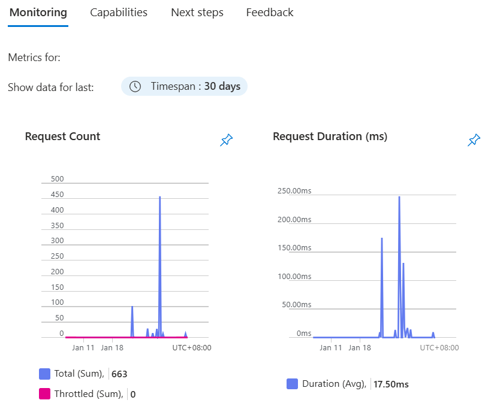
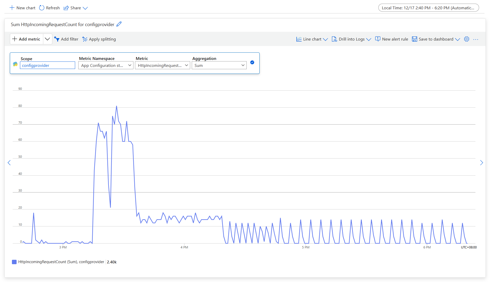
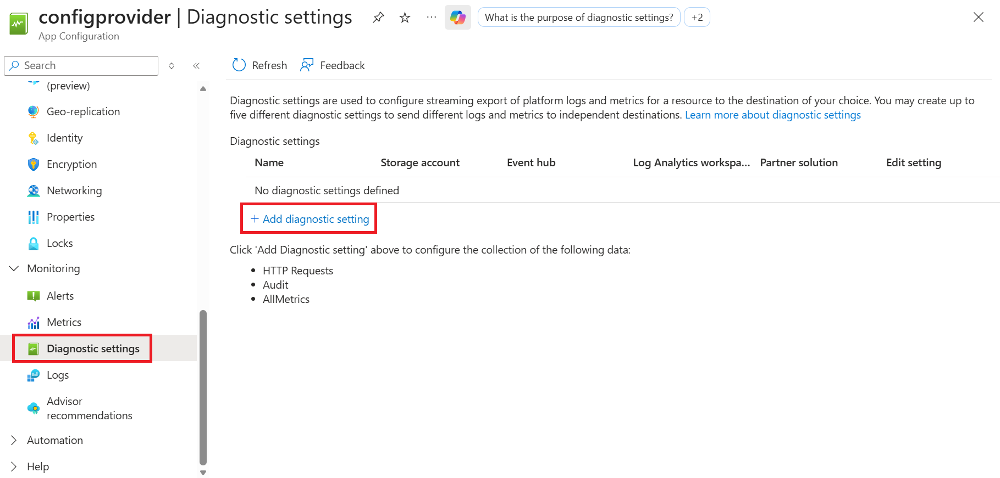
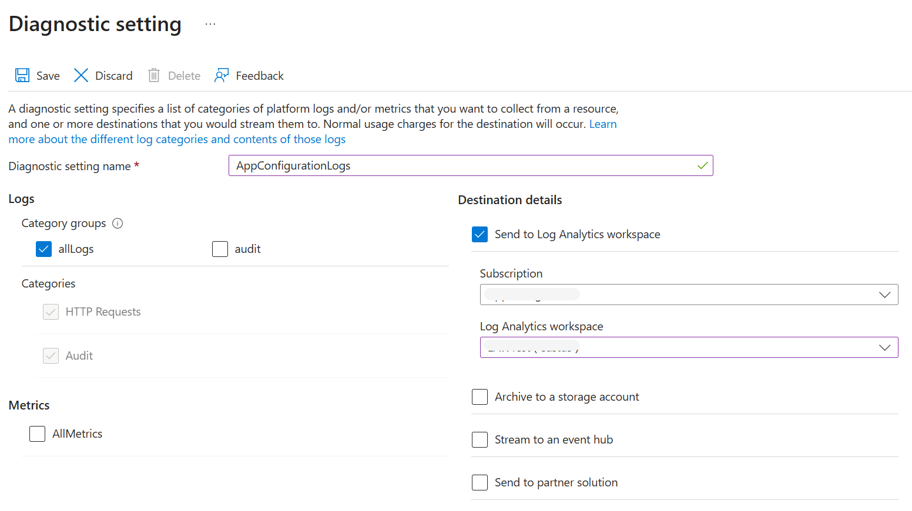
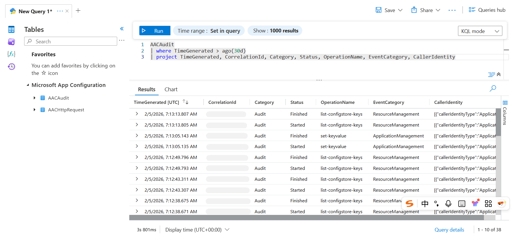
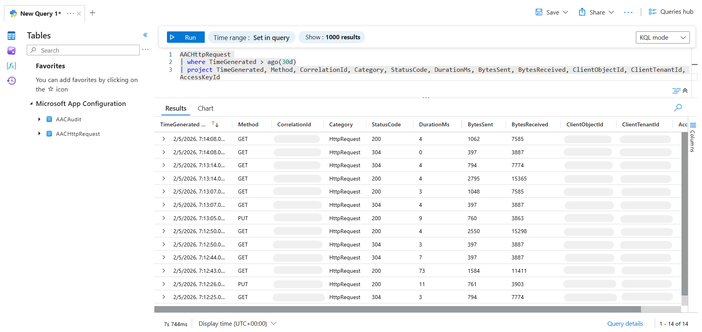

# Monitoring App Configuration
When you have critical applications and business processes relying on Azure resources, you want to monitor those resources for their availability, performance, and operation.

This article provides an overview of the monitoring data, including metrics and logs, emitted by Azure App Configuration. App Configuration integrates with [Azure Monitor](/azure/azure-monitor/overview) to collect and analyze this data. If you're new to Azure Monitor or want to understand the common monitoring concepts that apply across Azure services, see [Monitor Azure resources with Azure Monitor](/azure/azure-monitor/essentials/monitor-azure-resource).

App Configuration collects the same categories of monitoring data as other Azure services described in [Monitoring data from Azure resources](/azure/azure-monitor/essentials/monitor-azure-resource). For details on the specific metrics and logs emitted by App Configuration, see the [Schema reference](#schema-reference).

## Metrics
Metrics for your App Configuration store are collected automatically, no manual configuration is required.

### Metrics overview
In the Azure portal, navigate to your App Configuration store. The **Overview** blade displays key usage metrics, including the total number of requests over the time and the average request duration.

> [!div class="mx-imgBorder"]
> 

### Metrics analysis

In the Azure portal, navigate to your App Configuration store. To view the full set of available metrics, open the **Metrics** blade under the **Monitoring** section. Alternatively, you can also analyze App Configuration metrics alongside other Azure service metrics with [Azure Monitor metrics explorer](/azure/azure-monitor/metrics/analyze-metrics).

The following list summarizes all metrics collected for App Configuration.

* HTTP Incoming Request Count
* HTTP Incoming Request Duration
* Throttled HTTP Request Count (HTTP status code 429 Responses)
* Daily Storage Usage
* Request Quota Usage
* Replication Latency
* Snapshot Storage Size

Select the **Metric** name and the **Aggregation** type. The following screenshot shows a **Sum** of **HTTP Incoming Request Count** for an App Configuration store.

> [!div class="mx-imgBorder"]
> 

For more information about App Configuration metrics, see [supported metrics for Microsoft.AppConfiguration/configurationStores](/azure/azure-monitor/reference/supported-metrics/microsoft-appconfiguration-configurationstores-metrics).

## Logs
Azure App Configuration logs include activity logs and resource logs.

### Activity logs
[Activity logs](/azure/azure-monitor/reference/tables/azureactivity) provide insight into subscription-level events and show management plane activities (create, update, delete operations on your App Configuration resource). However, they don't capture data plane operations like key-value reads and writes. You can view them in the **Activity log** blade. Alternatively, follow the steps in [Log collection](#log-collection) to route them to Log Analytics workspace for more complex querying scenarios.

### Resource logs
App Configuration provides two types of resource logs.
- **Audit logs**: Capture write operations (create, update, delete) on your data plane resources, such as key-values. Audit logs don't include data plane read operations but include management plane operations. Entries are unaggregated. Query them in the **AACAudit** table. For more information, refer to [AACAudit](/azure/azure-monitor/reference/tables/AACAudit).
- **HTTP request logs**: Capture both read and write operations on your data plane resources, such as key-values. Operations are aggregated for better performance and to reduce log volume. Aggregation is based on HTTP method and status code. Each log entry may represent multiple similar operations within a certain time window. Query them in the **AACHttpRequest** table. For more information, refer to [AACHttpRequest](/azure/azure-monitor/reference/tables/AACHttpRequest).

#### Log collection
Metrics and the activity log are collected and stored automatically, and can be routed to other locations by using a diagnostic setting.

Resource Logs (including audit logs and HTTP request logs) aren't collected and stored until you create a diagnostic setting and route them to one or more locations, such as a Log Analytics workspace. If you don't already have one, create a [Log Analytics workspace](/azure/azure-monitor/logs/quick-create-workspace) and follow these steps to create and enable a diagnostic setting.

 #### [Portal](#tab/portal)

1. Sign in to the Azure portal.

1. Navigate to your App Configuration store.

1. In the **Monitoring** section, select **Diagnostic settings**, then select **+Add diagnostic setting**. 
    > [!div class="mx-imgBorder"]
    > 

1. In the **Diagnostic setting** page, enter a name for your setting, then select the log categories you want to collect (such as **HTTP Requests** or **Audit**) and choose the destination to send your logs to. Available destinations include Log Analytics workspace, storage account, and event hub. We recommend using Log Analytics workspace. To send them to a Log Analytics workspace, choose **Send to Log Analytics workspace**.

    > [!div class="mx-imgBorder"]
    > 

1. Enter the name of your **Subscription** and **Log Analytics workspace**. 
1. Select **Save** and verify that the Diagnostic settings page now lists your new diagnostic setting. 
    

 ### [Azure CLI](#tab/cli)
    
1. Open the Azure Cloud Shell, or if you installed the Azure CLI locally, open a command console application such as Windows PowerShell.

1. If your identity is associated with more than one subscription, then set your active subscription to the subscription of the App Configuration store that you want to enable logs for.

    ```Azure CLI
    az account set --subscription <your-subscription-id>
    ```

1. Enable logs by using the az monitor [diagnostic-settings create command](/cli/azure/monitor/diagnostic-settings#az-monitor-diagnostic-settings-create).

    ```Azure CLI
    az monitor diagnostic-settings create --name <setting-name> --workspace <log-analytics-workspace-resource-id> --resource <app-configuration-resource-id> --logs '[{"category": <category name>, "enabled": true "retentionPolicy": {"days": <days>, "enabled": <retention-bool}}]'
    ```

 ### [PowerShell](#tab/PowerShell)
    
1. Open a Windows PowerShell command window, and sign in to your Azure subscription by using the Connect-AzAccount command. Then, follow the on-screen directions.

    ```PowerShell
    Connect-AzAccount
    ```

1. Set your active subscription to the subscription of the App Configuration account that you want to enable logging for.

    ```PowerShell
    Set-AzContext -SubscriptionId <subscription-id>
    ```
    
1. To enable logs for a Log Analytics Workspace, use the [Set-AzDiagnosticSetting PowerShell](/previous-versions/azure/mt631625(v=azure.100)?redirectedfrom=MSDN) cmdlet. 

    ```PowerShell
    Set-AzDiagnosticSetting -ResourceId <app-configuration-resource-id> -WorkspaceId <log-analytics-workspace-resource-id> -Enabled $true
    ```
1. Verify that your diagnostic setting is correctly set and log categories are enabled. 

    ```PowerShell
    Get-AzureRmDiagnosticSetting -ResourceId <app-configuration-resource-id> 
    ```
---
For more information on creating a diagnostic setting using the Azure portal, CLI, or PowerShell, see [create a diagnostic setting to collect logs and metrics in Azure](/azure/azure-monitor/essentials/diagnostic-settings).

#### Audit Log
In the portal, navigate to **Monitoring** > **Logs**, and then go to the query editor. Expand **Tables** and select **AACAudit** to see the audit logs of your configuration store. Select **KQL mode**, enter a Kusto query into the editor, and results are displayed below.

> [!div class="mx-imgBorder"]
> 

The following queries are samples that you can use to help you monitor your App Configuration resource through audit logs.

* List all audit requests in the last three days 
    ```Kusto
    AACAudit
    | where TimeGenerated > ago(3d)
    ```

#### HTTP request log
In the portal, navigate to **Monitoring** > **Logs**, and then go to the query editor. Expand **Tables** and select **AACHttpRequest** to see the HTTP request logs of your configuration store. Select **KQL mode**, enter a Kusto query into the editor, and results are displayed below.

> [!div class="mx-imgBorder"]
> 

Following are sample queries that you can use to help you monitor your App Configuration resource through HTTP request logs.


* List all HTTP Requests in the last three days 
    ```Kusto
    AACHttpRequest
    | where TimeGenerated > ago(3d)
    ```

* List all throttled requests (returned HTTP status code 429 for too many requests) in the last three days 
    ```Kusto
    AACHttpRequest
    | where TimeGenerated > ago(3d)
    | where StatusCode == "429"
    ```

* List the number of requests sent in the last three days by IP Address 
    ```Kusto
    AACHttpRequest
    | where TimeGenerated > ago(3d)
    | summarize requestCount=sum(HitCount) by ClientIPAddress
    | order by requestCount desc 
    ```

* Create a pie chart of the types of status codes received in the last three days
    ```Kusto
    AACHttpRequest
    | where TimeGenerated > ago(3d)
    | summarize requestCount=sum(HitCount) by StatusCode
    | order by requestCount desc 
    | render piechart 
    ```

* List the number of requests sent by day for the last 14 days
    ```Kusto
    AACHttpRequest
    | where TimeGenerated > ago(14d)
    | extend Day = startofday(TimeGenerated)
    | summarize requestCount=sum(HitCount) by Day
    | order by Day desc  
    ```

You can also view the logs in **Logs** blade in the Log Analytics workspace if you have the **Log Analytics Reader** role on the workspace. For detailed information on Log Analytics workspace access control, see [Manage access to Log Analytics workspaces](/azure/azure-monitor/logs/manage-access#built-in-roles).

Regarding the log query scope, when you select **Monitoring** > **Logs** from the App Configuration menu, Log Analytics is opened with the query scope set to the current App Configuration resource. This means that log queries will only include data from that resource. If you want to run a query that includes data from other configuration store or data from other Azure services, select **Logs** in the Log Analytics workspace. See [Log query scope and time range in Azure Monitor Log Analytics](/azure/azure-monitor/log-query/scope/) for details.

#### Data access tracking
Caller identity information is present in Azure App Configuration's Audit and HTTP request logs. 

To identify who is making changes to your App Configuration store, the recommended way is to use audit logs. Audit logs include caller identity, caller IP address, the action performed, and the target resource. Use **CallerIdentity** to correlate a change with the specific caller. Audit logs are only produced for write operations.

HTTP request logs are generated for both write and read operations. Due to the fact these logs are aggregated, some caller identity details may be lost as part of the aggregation process. HTTP request logs are best for understanding request patterns and performance characteristics such as user agent, request duration, and request volume. The **ClientObjectId**, **ClientTenantId**, and **AccessKeyId** fields provide caller context.

| Log type | Logged operations | Is aggregated |
|-------|-----|-----|
| Audit | Write | No |
| HTTP Requests | Read, Write | Yes |

App Configuration supports Microsoft Entra ID authentication and access key-based authentication. If you authenticate with an Entra ID, you can retrieve the client object ID and client tenant ID to identify the caller. If you authenticate with an access key, you can retrieve the access key ID to determine which key was used.

Following are sample queries for the **AACAudit** and **AACHttpRequest** tables that show caller identity information.

* Identify key-value changes in the audit logs from the past seven days, extracting the operation name, target resource, caller identity, and caller IP address.

    ```Kusto
    AACAudit
    | where TimeGenerated > ago(7d)
    | where OperationName in ("set-keyvalue", "delete-keyvalue")
    | project TimeGenerated, OperationName, TargetResource, CallerIdentity, CallerIPAddress, _ResourceId
    | sort by TimeGenerated desc
    ```

* Identify key‑value read and write operations in HTTP request logs from the past seven days, extracting the HTTP method, request URI, status code, client object ID, client tenant ID, access key ID, client IP address, user agent, and hit count.

    ```Kusto
    AACHttpRequest
    | where TimeGenerated > ago(7d)
    | where Method in ("PUT", "DELETE", "GET")
    | project TimeGenerated, Method, _ResourceId, RequestURI, StatusCode, ClientObjectId, ClientTenantId, AccessKeyId, ClientIPAddress, UserAgent, HitCount
    | sort by TimeGenerated desc
    ```

## Alerts

Azure Monitor alerts notify you when significant conditions appear in your monitoring data, helping you detect and resolve issues before they impact your service or applications. You can configure alerts based on [metrics](/azure/azure-monitor/alerts/alerts-types#metric-alerts), [logs](/azure/azure-monitor/alerts/alerts-types#log-alerts), and the [activity log](/azure/azure-monitor/alerts/alerts-types#activity-log-alerts). Each alert type offers distinct advantages and trade‑offs.

The following table lists common and recommended alert rules for App Configuration.

| Alert type | Condition | Description  |
|:---|:---|:---|
|Request quota usage| RequestQuotaUsage > 80 | The configuration store has consumed over 80% of the [request quota](./faq.yml#are-there-any-limits-on-the-number-of-requests-made-to-app-configuration). Upgrade your store or follow the [best practices](./howto-best-practices.md#reduce-requests-made-to-app-configuration) to optimize your usage. |

## Schema reference

### Metrics schema
For details on the metrics schema, see [App Configuration Metrics](/azure/azure-monitor/reference/supported-metrics/microsoft-appconfiguration-configurationstores-metrics)

### Logs schema

#### Activity logs schema
App Configuration Activity logs schema follows the Azure Activity logs schema. For the full schema definition, refer to [AzureActivity](/azure/azure-monitor/reference/tables/AzureActivity).

#### Resource logs schema
| Category display name | Log table schema |
|-------|-----|
| `HTTP Requests` | [AACHttpRequest](/azure/azure-monitor/reference/tables/AACHttpRequest) |
| `Audit` | [AACAudit](/azure/azure-monitor/reference/tables/AACAudit) |

For more schema information, see a list of [Common and service-specific schemas for Azure resource logs](/azure/azure-monitor/essentials/resource-logs-schema).

## Next steps

* See [Monitor Azure resources with Azure Monitor](/azure/azure-monitor/essentials/monitor-azure-resource) for details on monitoring Azure resources.
