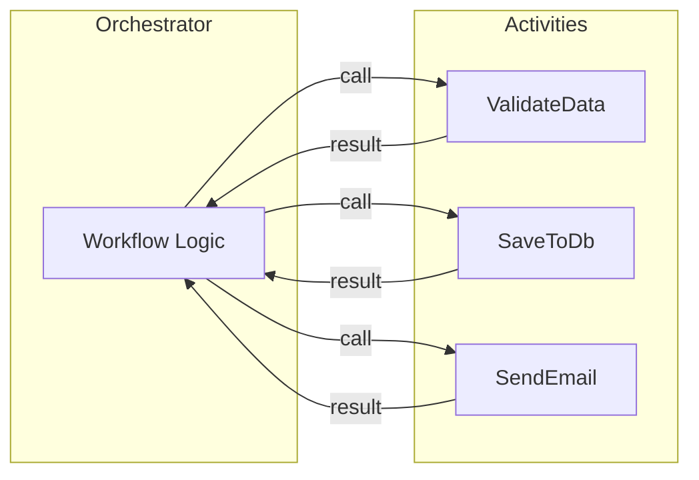

# Activity functions in Azure Durable

Activity functions are where the "real work" happens in a durable orchestration. They perform the actual business logic, I/O operations, and computations that your workflow needs.

> [!NOTE]
> Select your programming language preference at the top of the article.

## What is an activity?

An activity function is a regular function that:

- Performs database calls, API requests, file operations, and computations
- Is invoked from within an orchestrator
- Can automatically be retried after failed activities
- Don't need to be deterministic and has no replay constraints, unlike orchestrators



## Activity guarantees

### At-least-once execution

Activities execute **at least once**. If an activity fails after completing its work but before reporting success, it might run again.

**Implication**: Make your activities **idempotent** when possible — running them multiple times with the same input should produce the same result.

```csharp
// ✅ Idempotent - Uses upsert pattern
public async Task<bool> UpdateOrderStatus(OrderStatusUpdate update)
{
    await _database.UpsertAsync(new {
        OrderId = update.OrderId,
        Status = update.NewStatus,
        UpdatedAt = DateTime.UtcNow
    });
    return true;
}

// ⚠️ Not idempotent - Increments a counter
public async Task<int> IncrementCounter(string counterId)
{
    return await _database.IncrementAsync(counterId); // May double-increment!
}
```

---

## Code examples

::: zone pivot="programming-language-csharp"

```csharp
using Microsoft.Azure.Functions.Worker;
using Microsoft.Extensions.Logging;

public class OrderActivities
{
    private readonly ILogger<OrderActivities> _logger;
    private readonly IPaymentService _paymentService;
    
    public OrderActivities(ILogger<OrderActivities> logger, IPaymentService paymentService)
    {
        _logger = logger;
        _paymentService = paymentService;
    }

    [Function(nameof(ValidateOrder))]
    public async Task<bool> ValidateOrder([ActivityTrigger] Order order)
    {
        _logger.LogInformation("Validating order {OrderId}", order.Id);
        
        // Perform validation logic
        if (order.Items == null || !order.Items.Any())
        {
            _logger.LogWarning("Order {OrderId} has no items", order.Id);
            return false;
        }
        
        if (order.TotalAmount <= 0)
        {
            _logger.LogWarning("Order {OrderId} has invalid amount", order.Id);
            return false;
        }
        
        return true;
    }

    [Function(nameof(ProcessPayment))]
    public async Task<PaymentResult> ProcessPayment([ActivityTrigger] PaymentRequest request)
    {
        _logger.LogInformation("Processing payment for {Amount}", request.Amount);
        
        try
        {
            var result = await _paymentService.ChargeAsync(
                request.CardToken,
                request.Amount,
                request.Currency
            );
            
            return new PaymentResult
            {
                Success = true,
                TransactionId = result.TransactionId
            };
        }
        catch (PaymentException ex)
        {
            _logger.LogError(ex, "Payment failed");
            return new PaymentResult
            {
                Success = false,
                ErrorMessage = ex.Message
            };
        }
    }

    [Function(nameof(SendConfirmation))]
    public async Task SendConfirmation([ActivityTrigger] ConfirmationRequest request)
    {
        _logger.LogInformation("Sending confirmation to {Email}", request.Email);
        
        await _emailService.SendAsync(new Email
        {
            To = request.Email,
            Subject = $"Order {request.OrderId} Confirmed",
            Body = $"Thank you for your order!"
        });
    }
}
```

::: zone-end
::: zone pivot="programming-language-javascript"

todo

::: zone-end
::: zone pivot="programming-language-python"

```python
import azure.durable_functions as df
import logging

myApp = df.DFApp()

@myApp.activity_trigger(input_name="order")
def validate_order(order: dict) -> bool:
    logging.info(f"Validating order {order['id']}")
    
    # Perform validation logic
    if not order.get('items'):
        logging.warning(f"Order {order['id']} has no items")
        return False
    
    if order.get('total_amount', 0) <= 0:
        logging.warning(f"Order {order['id']} has invalid amount")
        return False
    
    return True

@myApp.activity_trigger(input_name="request")
def process_payment(request: dict) -> dict:
    logging.info(f"Processing payment for {request['amount']}")
    
    try:
        # Call payment service
        result = payment_service.charge(
            card_token=request['card_token'],
            amount=request['amount'],
            currency=request['currency']
        )
        
        return {
            "success": True,
            "transaction_id": result.transaction_id
        }
    except PaymentError as e:
        logging.error(f"Payment failed: {e}")
        return {
            "success": False,
            "error_message": str(e)
        }

@myApp.activity_trigger(input_name="request")
def send_confirmation(request: dict) -> None:
    logging.info(f"Sending confirmation to {request['email']}")
    
    email_service.send(
        to=request['email'],
        subject=f"Order {request['order_id']} Confirmed",
        body="Thank you for your order!"
    )
```

::: zone-end
::: zone pivot="programming-language-powershell"

todo

::: zone-end
::: zone pivot="programming-language-java"

todo

::: zone-end
::: zone pivot="programming-language-java"

```java
import com.microsoft.azure.functions.*;
import com.microsoft.azure.functions.annotation.*;

public class OrderActivities {
    
    private static final Logger logger = Logger.getLogger(OrderActivities.class.getName());
    
    @FunctionName("ValidateOrder")
    public boolean validateOrder(
        @DurableActivityTrigger(name = "order") Order order) {
        
        logger.info("Validating order " + order.getId());
        
        // Perform validation logic
        if (order.getItems() == null || order.getItems().isEmpty()) {
            logger.warning("Order " + order.getId() + " has no items");
            return false;
        }
        
        if (order.getTotalAmount() <= 0) {
            logger.warning("Order " + order.getId() + " has invalid amount");
            return false;
        }
        
        return true;
    }

    @FunctionName("ProcessPayment")
    public PaymentResult processPayment(
        @DurableActivityTrigger(name = "request") PaymentRequest request) {
        
        logger.info("Processing payment for " + request.getAmount());
        
        try {
            var result = paymentService.charge(
                request.getCardToken(),
                request.getAmount(),
                request.getCurrency()
            );
            
            return new PaymentResult(true, result.getTransactionId(), null);
        } catch (PaymentException e) {
            logger.severe("Payment failed: " + e.getMessage());
            return new PaymentResult(false, null, e.getMessage());
        }
    }

    @FunctionName("SendConfirmation")
    public void sendConfirmation(
        @DurableActivityTrigger(name = "request") ConfirmationRequest request) {
        
        logger.info("Sending confirmation to " + request.getEmail());
        
        emailService.send(
            request.getEmail(),
            "Order " + request.getOrderId() + " Confirmed",
            "Thank you for your order!"
        );
    }
}
```

::: zone-end

---

## Activity best practices

| Best practice | Description | ✅ Do | ❌ Don't |
|---------------|-------------|-------|----------|
| **Make activities idempotent** | Design so repeated execution is safe | ✅ | |
| **Use dependency injection** | Inject services for testability | ✅ | |
| **Log extensively** | Activities are the right place for detailed logging | ✅ | |
| **Handle exceptions** | Return meaningful error information | ✅ | |
| **Keep activities focused** | Each activity should do one thing well | ✅ | |
| **Call activities from activities** | Only orchestrators can call activities | | ❌ |
| **Store shared state** | Each activity execution should be independent | | ❌ |
| **Assume single execution** | Activities might run multiple times | | ❌ |

---

## Activity input/output

::: zone pivot="programming-language-csharp"

### Single value input

```csharp
// Definition
[Function(nameof(Greet))]
public string Greet([ActivityTrigger] string name) => $"Hello, {name}!";

// Call from orchestrator
var greeting = await context.CallActivityAsync<string>("Greet", "World");
```

### Complex Object Input

```csharp
// Definition
[Function(nameof(ProcessOrder))]
public OrderResult ProcessOrder([ActivityTrigger] Order order) { ... }

// Call from orchestrator
var result = await context.CallActivityAsync<OrderResult>("ProcessOrder", order);
```

### Multiple Values (Use Object)

```csharp
// Use a class or record for multiple inputs
public record EmailRequest(string To, string Subject, string Body);

[Function(nameof(SendEmail))]
public void SendEmail([ActivityTrigger] EmailRequest request) { ... }

// Call from orchestrator
await context.CallActivityAsync("SendEmail", new EmailRequest(
    To: "user@example.com",
    Subject: "Hello",
    Body: "World"
));
```

::: zone-end
::: zone pivot="programming-language-javascript"

todo

::: zone-end
::: zone pivot="programming-language-python"

todo

::: zone-end
::: zone pivot="programming-language-powershell"

todo

::: zone-end
::: zone pivot="programming-language-java"

todo

::: zone-end

---

## Retry Policies

Configure automatic retries for activities:

::: zone pivot="programming-language-csharp"

```csharp
var options = TaskOptions.FromRetryPolicy(new RetryPolicy(
    maxNumberOfAttempts: 5,
    firstRetryInterval: TimeSpan.FromSeconds(1),
    backoffCoefficient: 2.0,
    maxRetryInterval: TimeSpan.FromMinutes(1)
));

var result = await context.CallActivityAsync<string>(
    "UnreliableActivity", 
    input, 
    options
);
```

::: zone-end
::: zone pivot="programming-language-javascript"

todo

::: zone-end
::: zone pivot="programming-language-python"

```python
retry_options = df.RetryOptions(
    first_retry_interval_in_milliseconds=1000,
    max_number_of_attempts=5
)

result = yield context.call_activity_with_retry(
    "UnreliableActivity",
    retry_options,
    input
)
```

::: zone-end
::: zone pivot="programming-language-powershell"

todo

::: zone-end
::: zone pivot="programming-language-java"

todo

::: zone-end

---

## Next Steps

- [Learn about Entity functions](./durable-functions-entities.md)
- [Explore Fan-Out/Fan-In Pattern](./durable-functions-overview.md#fan-in-out)
- [View Code Samples](/samples/browse/?term=durable%20functions)