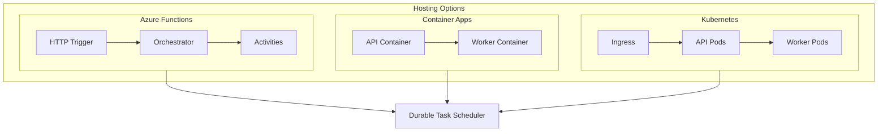
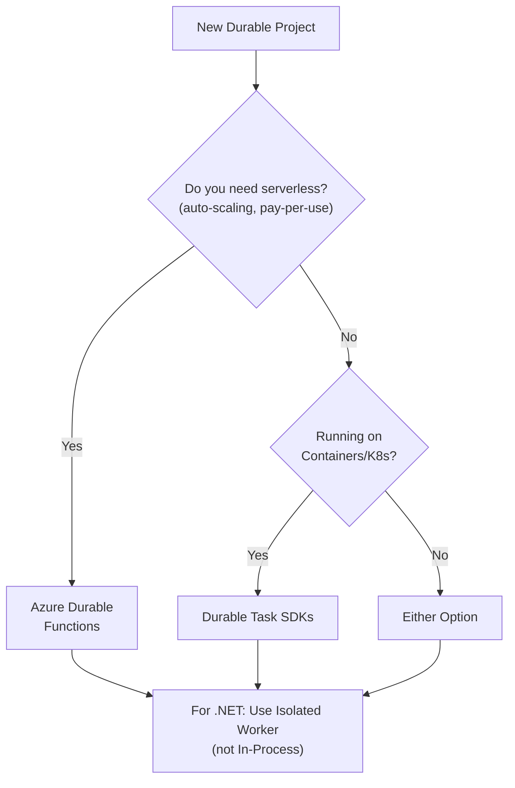

# Choose your hosting option for Azure Durable

Durable orchestrations can run on multiple Azure compute platforms. Each option offers different tradeoffs between simplicity, control, and cost.

## Feature comparison

| Feature | Azure Functions | Container Apps | AKS |
|---------|-----------------|----------------|-----|
| **Best For** | Serverless, event-driven workloads | Containerized microservices | Full orchestration control |
| **Framework/SDK** | Durable Functions | Durable Task SDK | Durable Task SDK |
| **Pricing Model** | Pay-per-execution | Per vCPU-second | Node-based |
| **Cost Model** | Pay-per-execution | Compute-based | Compute-based |
| **Scaling** | Automatic | Manual or platform-managed | Manual or platform-managed |
| **Scale to Zero** | Yes | Yes | With KEDA |
| **Min Instances** | 0 | 0 | 1+ pods |
| **Max Scale** | 200+ instances | 300 replicas | Unlimited |
| **Startup Time** | Cold start possible | Faster with min replicas | Depends on config |
| **Networking** | VNet integration | Built-in VNet | Full control |
| **Language Support** | C#, JS, Python, Java, PS | Any containerized | Any containerized |
| **Local Development** | Functions Core Tools | Docker | Docker/minikube |
| **Complexity** | Low | Medium | High |
| **Hosting Plans** | Consumption, Flex, Premium, Dedicated, Container Apps | Serverless containers | Managed Kubernetes |

## Quick comparison

```
┌──────────────────────────────────────────────────────────────────┐
│                    HOSTING OPTIONS COMPARISON                     │
├──────────────────────────────────────────────────────────────────┤
│                                                                   │
│  AZURE FUNCTIONS (Durable Functions)                             │
│  ┌─────────────────────────────────────────────────────────────┐ │
│  │  • Serverless, pay-per-execution                            │ │
│  │  • Scale to zero                                            │ │
│  │  • Built-in triggers and bindings                          │ │
│  │  • Multi-language support (C#, JS, Python, Java, PS)       │ │
│  │  • Fastest time to production                               │ │
│  └─────────────────────────────────────────────────────────────┘ │
│                                                                   │
│  AZURE CONTAINER APPS (Durable Task SDK)                         │
│  ┌─────────────────────────────────────────────────────────────┐ │
│  │  • Container-based workloads                                │ │
│  │  • KEDA-based autoscaling                                   │ │
│  │  • Simplified Kubernetes experience                         │ │
│  │  • Good for microservices architectures                     │ │
│  └─────────────────────────────────────────────────────────────┘ │
│                                                                   │
│  AZURE KUBERNETES SERVICE (Durable Task SDK)                     │
│  ┌─────────────────────────────────────────────────────────────┐ │
│  │  • Full Kubernetes control                                  │ │
│  │  • Custom networking and scaling                            │ │
│  │  • Existing K8s investment                                  │ │
│  │  • Maximum flexibility                                      │ │
│  └─────────────────────────────────────────────────────────────┘ │
│                                                                   │
└──────────────────────────────────────────────────────────────────┘
```

## Decision guide

### Choose Azure Functions when:

- You want serverless, pay-per-execution pricing
- You need scale-to-zero capability
- You want to leverage Azure Functions triggers and bindings
- You're building event-driven applications
- You prefer a familiar Azure Functions programming model
- You need multi-language support (C#, JavaScript, Python, Java, PowerShell)

### Choose Azure Container Apps when:

- You have containerized workloads
- You want a simplified Kubernetes-like experience
- You need microservices with service discovery
- You want KEDA-based autoscaling
- You don't need full Kubernetes control

### Choose Azure Kubernetes Service when:

- You need full control over infrastructure
- You have existing Kubernetes expertise
- You need custom networking configurations
- You're integrating with existing K8s workloads
- You need advanced scaling strategies

## Architecture overview



## Azure Durable Functions

Azure Durable Functions is an extension of Azure Functions that enables stateful workflows in a serverless environment. It's the easiest way to get started if you're already using Azure Functions.

### Hosting plans

| Plan | Description | Use Case |
|------|-------------|----------|
| **Consumption** | Serverless, auto-scaling, pay-per-execution | Variable workloads, cost-sensitive |
| **Flex Consumption** | Enhanced Consumption with faster scaling | Burst workloads, faster cold start |
| **Premium** | Pre-warmed instances, VNET integration | Low latency, enterprise features |
| **Dedicated (App Service)** | Predictable pricing, reserved capacity | Steady workloads, existing App Service |
| **Container Apps** | Container-based Functions | Container workloads with Functions model |

### .NET hosting models

For .NET developers using Durable Functions, there are two hosting models:

#### In-process model (legacy)

The **in-process model** runs your function code in the same process as the Azure Functions host.

```csharp
// In-Process model - uses WebJobs SDK
using Microsoft.Azure.WebJobs;
using Microsoft.Azure.WebJobs.Extensions.DurableTask;

public static class MyOrchestrator
{
    [FunctionName("MyOrchestrator")]
    public static async Task<string> Run(
        [OrchestrationTrigger] IDurableOrchestrationContext context)
    {
        return await context.CallActivityAsync<string>("SayHello", "World");
    }

    [FunctionName("SayHello")]
    public static string SayHello([ActivityTrigger] string name)
    {
        return $"Hello, {name}!";
    }
}
```

**Characteristics:**
- Tight integration with Functions host
- Shares memory with the host process
- Uses `IDurableOrchestrationContext` interface
- Package: `Microsoft.Azure.WebJobs.Extensions.DurableTask`

> **Important**: The in-process model is in [maintenance mode](https://learn.microsoft.com/azure/azure-functions/functions-versions). New projects should use the **isolated worker model**.

#### Isolated worker model (recommended)

The **isolated worker model** runs your function code in a separate .NET worker process.

```csharp
// Isolated Worker model - uses Durable Task SDK
using Microsoft.Azure.Functions.Worker;
using Microsoft.DurableTask;
using Microsoft.DurableTask.Client;

public static class MyOrchestrator
{
    [Function(nameof(MyOrchestrator))]
    public static async Task<string> Run(
        [OrchestrationTrigger] TaskOrchestrationContext context)
    {
        return await context.CallActivityAsync<string>("SayHello", "World");
    }

    [Function("SayHello")]
    public static string SayHello([ActivityTrigger] string name)
    {
        return $"Hello, {name}!";
    }
}
```

**Characteristics:**
- Process isolation from Functions host
- Full control over dependencies and .NET version
- Uses `TaskOrchestrationContext` class (Durable Task SDK)
- Package: `Microsoft.Azure.Functions.Worker.Extensions.DurableTask`
- Supports .NET 6, 7, 8+

### Comparison: In-process vs isolated

| Feature | In-Process | Isolated Worker |
|---------|------------|-----------------|
| **Status** | Maintenance mode | Recommended |
| **.NET Version** | .NET 6 only | .NET 6, 7, 8+ |
| **Process** | Shared with host | Separate process |
| **Dependency Control** | Limited | Full control |
| **Cold Start** | Faster | Slightly slower |
| **Context Type** | `IDurableOrchestrationContext` | `TaskOrchestrationContext` |
| **Entities** | Full support | Full support |
| **Custom Middleware** | Limited | Full support |

### Multi-language support

Azure Durable Functions supports multiple programming languages:

| Language | Model | Status |
|----------|-------|--------|
| **C#** | In-Process / Isolated | GA |
| **JavaScript/TypeScript** | Isolated (Node.js) | GA |
| **Python** | Isolated | GA |
| **Java** | Isolated | GA |
| **PowerShell** | Isolated | GA |

---

## Durable Task SDKs (Portable)

The **Durable Task SDKs** allow you to run durable orchestrations on any compute platform, independent of Azure Functions.

### Supported platforms

| Platform | Description |
|----------|-------------|
| **Azure Container Apps** | Serverless containers with scale-to-zero |
| **Azure Kubernetes Service (AKS)** | Managed Kubernetes clusters |
| **Azure App Service** | Managed web app hosting |
| **Virtual Machines** | IaaS compute |
| **On-premises** | Self-hosted servers |

### SDK languages

| Language | Package | Status |
|----------|---------|--------|
| **.NET** | `Microsoft.DurableTask.Worker.AzureManaged` | GA |
| **Python** | `durabletask-azure` | GA |
| **Java** | `com.microsoft.durabletask` | Preview |
| **JavaScript** | Coming soon | Planned |

### Example: .NET Console App

```csharp
using Microsoft.DurableTask;
using Microsoft.DurableTask.Worker;
using Microsoft.DurableTask.Client;
using Microsoft.Extensions.Hosting;

var builder = Host.CreateApplicationBuilder(args);

// Configure worker
builder.Services.AddDurableTaskWorker(options =>
{
    options.AddOrchestrator<MyOrchestrator>();
    options.AddActivity<SayHelloActivity>();
})
.UseDurableTaskScheduler(connectionString, taskHub);

// Configure client
builder.Services.AddDurableTaskClient()
    .UseDurableTaskScheduler(connectionString, taskHub);

var host = builder.Build();
await host.RunAsync();

// Orchestrator
[DurableTask(nameof(MyOrchestrator))]
public class MyOrchestrator : TaskOrchestrator<string, string>
{
    public override async Task<string> RunAsync(
        TaskOrchestrationContext context, string input)
    {
        return await context.CallActivityAsync<string>(
            nameof(SayHelloActivity), input);
    }
}

// Activity
[DurableTask(nameof(SayHelloActivity))]
public class SayHelloActivity : TaskActivity<string, string>
{
    public override Task<string> RunAsync(
        TaskActivityContext context, string name)
    {
        return Task.FromResult($"Hello, {name}!");
    }
}
```

## Decision flowchart



## Migration: In-process to isolated

If you have an existing in-process Durable Functions app, Microsoft provides a [migration guide](https://learn.microsoft.com/azure/azure-functions/durable/durable-functions-dotnet-isolated-overview).

### Key changes

| In-Process | Isolated Worker |
|------------|-----------------|
| `IDurableOrchestrationContext` | `TaskOrchestrationContext` |
| `IDurableActivityContext` | `TaskActivityContext` |
| `IDurableClient` | `DurableTaskClient` |
| `Microsoft.Azure.WebJobs.Extensions.DurableTask` | `Microsoft.Azure.Functions.Worker.Extensions.DurableTask` |

---

## Next steps

- [Host a Durable Task SDK app on Azure Container Apps](durable-task-scheduler/quickstart-container-apps-durable-task-sdk.md)
- [Overview of Azure Container Apps hosting](durable-functions-container-apps-hosting.md)
- [Host a Durable Task SDK app on Azure Kubernetes Service](durable-task-scheduler/quickstart-aks-durable-task-sdk.md)
- [Overview of AKS hosting](durable-functions-aks-hosting.md)