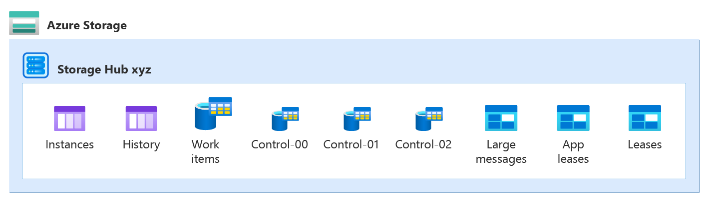

# Task hubs

A *task hub* is a representation of the current state of the application in storage, including all the pending work. While an application runs, the task hub continually stores the progress of orchestration, activity, and entity functions. This approach ensures that the application can resume processing where it left off if it restarts after being temporarily stopped or interrupted. A task hub also enables applications to scale the compute workers dynamically.

::: zone pivot="durable-functions"


::: zone-end

Conceptually, a task hub stores the following information:

* The **instance states** of all orchestration and entity instances.
* The messages to be processed, including:
  * Any **activity messages** that represent activities waiting to be run.
  * Any **instance messages** that are waiting to be delivered to instances.

Activity messages are stateless and can be processed anywhere. Instance messages need to be delivered to a particular stateful instance (orchestration or entity), identified by its instance ID.

::: zone pivot="durable-functions"

Internally, each storage provider may use a different organization to represent instance states and messages. For example, the Azure Storage provider stores messages in Azure Storage Queues, but the MSSQL provider stores them in relational tables. These differences don't matter for application design, but some of them might influence performance characteristics. For more information, see [Representation in storage](durable-functions-task-hubs.md#representation-in-storage).

::: zone-end

::: zone pivot="durable-task-sdks"

Durable Task SDKs use the [Durable Task Scheduler](durable-task-scheduler/durable-task-scheduler.md) as the backend for task hubs. The Durable Task Scheduler is a fully managed service that handles storage internally.

::: zone-end

## Work items

The activity messages and instance messages in the task hub represent the work that the application needs to process. While the application is running, it continuously fetches *work items* from the task hub. Each work item is processing one or more messages. We distinguish two types of work items:

* **Activity work items**: Run an activity function to process an activity message.
* **Orchestrator work item**: Run an orchestrator or entity function to process one or more instance messages.

Workers can process multiple work items at the same time, subject to the configured per-worker concurrency limits.

::: zone pivot="durable-functions"

For more information on concurrency throttles, see [Performance and scale](durable-functions-perf-and-scale.md#concurrency-throttles).

::: zone-end

Once a worker completes a work item, it commits the effects back to the task hub. These effects vary by the type of function that was executed:

* A completed activity function creates an instance message containing the result, addressed to the parent orchestrator instance.
* A completed orchestrator function updates the orchestration state and history, and may create new messages.
* A completed entity function updates the entity state, and may also create new instance messages.

For orchestrations, each work item represents one **episode** of that orchestration's execution. An episode starts when there are new messages for the orchestrator to process. Such a message may indicate that the orchestration should start; or it may indicate that an activity, entity call, timer, or suborchestration has completed; or it can represent an external event. The message triggers a work item that allows the orchestrator to process the result and to continue with the next episode. That episode ends when the orchestrator either completes, or reaches a point where it must wait for new messages.

### Execution example

Consider a fan-out-fan-in orchestration that starts two activities in parallel, and waits for both of them to complete:

::: zone pivot="durable-functions"

# [C#](#tab/csharp)

```csharp
[FunctionName("Example")]
public static async Task Run([OrchestrationTrigger] IDurableOrchestrationContext context)
{
    Task t1 = context.CallActivityAsync<int>("MyActivity", 1);
    Task t2 = context.CallActivityAsync<int>("MyActivity", 2);
    await Task.WhenAll(t1, t2);
}
```

# [JavaScript](#tab/javascript)

```JavaScript
module.exports = df.orchestrator(function*(context){
    const tasks = [];
    tasks.push(context.df.callActivity("MyActivity", 1));
    tasks.push(context.df.callActivity("MyActivity", 2));
    yield context.df.Task.all(tasks);
});
```

# [Python](#tab/python)

```python
def orchestrator_function(context: df.DurableOrchestrationContext):
    tasks = []
    tasks.append(context.call_activity("MyActivity", 1))
    tasks.append(context.call_activity("MyActivity", 2))
    yield context.task_all(tasks)
```

# [PowerShell](#tab/powershell)

```powershell
param($Context)

$Tasks = @()

$Tasks += Invoke-DurableActivity -FunctionName 'MyActivity' -Input 1 -NoWait
$Tasks += Invoke-DurableActivity -FunctionName 'MyActivity' -Input 2 -NoWait

Wait-DurableTask -Task $Tasks
```

# [Java](#tab/java)

```java
@FunctionName("Example")
public void exampleOrchestrator(
        @DurableOrchestrationTrigger(name = "ctx") TaskOrchestrationContext ctx) {
    Task<Void> t1 = ctx.callActivity("MyActivity", 1);
    Task<Void> t2 = ctx.callActivity("MyActivity", 2);
    ctx.allOf(List.of(t1, t2)).await();
}
```

---

::: zone-end

::: zone pivot="durable-task-sdks"

# [C#](#tab/csharp)

```csharp
using Microsoft.DurableTask;

public class Example : TaskOrchestrator<object?, object?>
{
    public override async Task<object?> RunAsync(TaskOrchestrationContext context, object? input)
    {
        Task t1 = context.CallActivityAsync("MyActivity", 1);
        Task t2 = context.CallActivityAsync("MyActivity", 2);
        await Task.WhenAll(t1, t2);
        return null;
    }
}
```

# [JavaScript](#tab/javascript)

This sample is shown for .NET, Java, and Python.

# [Python](#tab/python)

```python
from durabletask import task

def example_orchestrator(ctx: task.OrchestrationContext, _):
    t1 = ctx.call_activity("my_activity", input=1)
    t2 = ctx.call_activity("my_activity", input=2)
    yield task.when_all([t1, t2])
```

# [PowerShell](#tab/powershell)

This sample is shown for .NET, Java, and Python.

# [Java](#tab/java)

```java
import com.microsoft.durabletask.TaskOrchestration;
import com.microsoft.durabletask.TaskOrchestrationContext;

public class Example implements TaskOrchestration {
    @Override
    public void run(TaskOrchestrationContext ctx) {
        Task<Void> t1 = ctx.callActivity("MyActivity", 1, Void.class);
        Task<Void> t2 = ctx.callActivity("MyActivity", 2, Void.class);
        ctx.allOf(List.of(t1, t2)).await();
    }
}
```

---

::: zone-end

After this orchestration is initiated by a client, the application processes it as a sequence of work items. Each completed work item updates the task hub state when it commits. These are the steps:

1. A client requests to start a new orchestration with instance-id "123". After the client completes this request, the task hub contains a placeholder for the orchestration state and an instance message:

   

   The label `ExecutionStarted` is one of many [history event types](https://github.com/Azure/durabletask/tree/main/src/DurableTask.Core/History#readme) that identify the various types of messages and events participating in an orchestration's history.

2. A worker executes an *orchestrator work item* to process the `ExecutionStarted` message. It calls the orchestrator function which starts executing the orchestration code. This code schedules two activities and then stops executing when it is waiting for the results. After the worker commits this work item, the task hub contains

   

   The runtime state is now `Running`, two new `TaskScheduled` messages were added, and the history now contains the five events `OrchestratorStarted`, `ExecutionStarted`, `TaskScheduled`, `TaskScheduled`, `OrchestratorCompleted`. These events represent the first episode of this orchestration's execution.

3. A worker executes an *activity work item* to process one of the `TaskScheduled` messages. It calls the activity function with input "2". When the activity function completes, it creates a `TaskCompleted` message containing the result. After the worker commits this work item, the task hub contains

   

4. A worker executes an *orchestrator work item* to process the `TaskCompleted` message. If the orchestration is still cached in memory, it can just resume execution. Otherwise, the worker first [replays the history to recover the current state of the orchestration](durable-functions-orchestrations.md#reliability). Then it continues the orchestration,  delivering the result of the activity. After receiving this result, the orchestration is still waiting for the result of the other activity, so it once more stops executing. After the worker commits this work item, the task hub contains

   

   The orchestration history now contains three more events `OrchestratorStarted`, `TaskCompleted`, `OrchestratorCompleted`. These  events represent the second episode of this orchestration's execution.

5. A worker executes an *activity work item* to process the remaining `TaskScheduled` message. It calls the activity function with input "1". After the worker commits this work item, the task hub contains

   

6. A worker executes another *orchestrator work item* to process the `TaskCompleted` message. After receiving this second result, the orchestration completes. After the worker commits this work item, the task hub contains

   

   The runtime state is now `Completed`, and the orchestration history now contains four more events `OrchestratorStarted`, `TaskCompleted`, `ExecutionCompleted`, `OrchestratorCompleted`. These events represent the third and final episode of this orchestration's execution.

The final history for this orchestration's execution then contains the 12 events `OrchestratorStarted`, `ExecutionStarted`, `TaskScheduled`, `TaskScheduled`, `OrchestratorCompleted`, `OrchestratorStarted`, `TaskCompleted`, `OrchestratorCompleted`, `OrchestratorStarted`, `TaskCompleted`, `ExecutionCompleted`, `OrchestratorCompleted`.

> [!NOTE]
> The schedule shown isn't the only one: there are many slightly different possible schedules. For example, if the second activity completes earlier, both `TaskCompleted` instance messages may be processed by a single work item. In that case, the execution history is a bit shorter, because there are only two episodes, and it contains the following 10 events: `OrchestratorStarted`, `ExecutionStarted`, `TaskScheduled`, `TaskScheduled`, `OrchestratorCompleted`, `OrchestratorStarted`, `TaskCompleted`, `TaskCompleted`, `ExecutionCompleted`, `OrchestratorCompleted`.

## Durable Task Scheduler task hub management

This section covers how to create and manage task hubs when using the Durable Task Scheduler backend. Create the scheduler and task hub resources explicitly before your application uses them.

### Create a scheduler and task hub

Create a scheduler and task hub by using the Azure portal, Azure CLI, Azure Resource Manager (ARM), or Bicep.

# [Azure portal](#tab/portal)

1. In the Azure portal, search for **Durable Task Scheduler** and select it from the results.

1. Select **Create** to open the scheduler creation pane.

1. Fill out the fields on the **Basics** tab, including the resource group, scheduler name, region, and SKU. Select **Review + create**.

1. After validation passes, select **Create**. Deployment takes up to 15 minutes.

1. After the scheduler is created, go to the scheduler resource. On the **Overview** page, create a new task hub.

# [Azure CLI](#tab/cli)

1. Install or update the Durable Task Scheduler CLI extension.

    ```azurecli
    az extension add --name durabletask
    az extension update --name durabletask
    ```

1. Create a resource group (if needed).

    ```azurecli
    az group create --name YOUR_RESOURCE_GROUP --location LOCATION
    ```

1. Create a scheduler.

    ```azurecli
    az durabletask scheduler create \
      --name "YOUR_SCHEDULER" \
      --resource-group "YOUR_RESOURCE_GROUP" \
      --location "LOCATION" \
      --ip-allowlist "[0.0.0.0/0]" \
      --sku-name "dedicated" \
      --sku-capacity "1"
    ```

1. Create a task hub within the scheduler.

    ```azurecli
    az durabletask taskhub create \
      --resource-group YOUR_RESOURCE_GROUP \
      --scheduler-name YOUR_SCHEDULER \
      --name YOUR_TASKHUB
    ```

# [Azure Resource Manager](#tab/arm)

Deploy a scheduler and task hub using the ARM REST API.

1. Create a scheduler.

    ```HTTP
    PUT https://management.azure.com/subscriptions/SUBSCRIPTION_ID/resourceGroups/RESOURCE_GROUP/providers/Microsoft.DurableTask/schedulers/SCHEDULER_NAME?api-version=2025-04-01-preview

    {
      "location": "LOCATION",
      "properties": {
        "ipAllowlist": ["0.0.0.0/0"],
        "sku": {
          "name": "Dedicated",
          "capacity": 1
        }
      }
    }
    ```

1. Create a task hub within the scheduler.

    ```HTTP
    PUT https://management.azure.com/subscriptions/SUBSCRIPTION_ID/resourceGroups/RESOURCE_GROUP/providers/Microsoft.DurableTask/schedulers/SCHEDULER_NAME/taskHubs/TASKHUB_NAME?api-version=2025-04-01-preview

    {
      "properties": {}
    }
    ```

# [Bicep](#tab/bicep)

Define the scheduler and task hub in a Bicep template.

```bicep
@description('The name of the Durable Task Scheduler.')
param schedulerName string

@description('The name of the task hub.')
param taskHubName string

@description('The location for all resources.')
param location string = resourceGroup().location

resource scheduler 'Microsoft.DurableTask/schedulers@2025-04-01-preview' = {
  name: schedulerName
  location: location
  properties: {
    ipAllowlist: [
      '0.0.0.0/0'
    ]
    sku: {
      name: 'Dedicated'
      capacity: 1
    }
  }
}

resource taskHub 'Microsoft.DurableTask/schedulers/taskHubs@2025-04-01-preview' = {
  parent: scheduler
  name: taskHubName
  properties: {}
}
```

---

> [!IMPORTANT]
> The `0.0.0.0/0` IP allowlist permits access from any IP address. For production deployments, restrict this to only the required IP ranges.

The previous examples use the Dedicated SKU. The Durable Task Scheduler also offers a [Consumption SKU (preview)](durable-task-scheduler/durable-task-scheduler-dedicated-sku.md). For more information about managing Durable Task Scheduler resources, see [Develop with Durable Task Scheduler](durable-task-scheduler/develop-with-durable-task-scheduler.md).

### Configure identity-based authentication

Durable Task Scheduler supports managed identity authentication only. It doesn't support connection strings with storage keys. Assign the appropriate role-based access control (RBAC) role to a managed identity and configure your app to use that identity.

The following roles are available:

| Role | Description |
| ---- | ----------- |
| **Durable Task Data Contributor** | Full data access. Superset of all other roles. |
| **Durable Task Worker** | Interact with the scheduler for processing orchestrations, activities, and entities. |
| **Durable Task Data Reader** | Read-only access to orchestration and entity data. |

> [!NOTE]
> Most apps require the **Durable Task Data Contributor** role.

Use user-assigned managed identities when possible because they aren't tied to the lifecycle of the app and you can reuse them after the app is removed.

# [Azure portal](#tab/portal)

1. Go to the scheduler or task hub resource in the Azure portal.

1. Select **Access control (IAM)** from the left menu.

1. Select **Add** > **Add role assignment**.

1. Search for and select **Durable Task Data Contributor**. Select **Next**.

1. For **Assign access to**, select **Managed identity**. Select **+ Select members**.

1. Select **User-assigned managed identity**, choose the identity, and select **Select**.

1. Select **Review + assign** to finish.

1. Go to your function app, and select **Settings** > **Identity**. Select the **User assigned** tab, and add the identity.

# [Azure CLI](#tab/cli)

1. Create a user-assigned managed identity.

    ```azurecli
    az identity create -g YOUR_RESOURCE_GROUP -n YOUR_IDENTITY_NAME
    ```

1. Assign the **Durable Task Data Contributor** role to the identity, scoped to the scheduler or task hub.

    ```azurecli
    assignee=$(az identity show --name YOUR_IDENTITY_NAME --resource-group YOUR_RESOURCE_GROUP --query 'clientId' --output tsv)

    scope="/subscriptions/YOUR_SUBSCRIPTION_ID/resourceGroups/YOUR_RESOURCE_GROUP/providers/Microsoft.DurableTask/schedulers/YOUR_SCHEDULER"

    az role assignment create \
      --assignee "$assignee" \
      --role "Durable Task Data Contributor" \
      --scope "$scope"
    ```

1. Assign the identity to your function app.

    ```azurecli
    resource_id=$(az resource show --resource-group YOUR_RESOURCE_GROUP --name YOUR_IDENTITY_NAME --resource-type Microsoft.ManagedIdentity/userAssignedIdentities --query id --output tsv)

    az functionapp identity assign \
      --resource-group YOUR_RESOURCE_GROUP \
      --name YOUR_FUNCTION_APP \
      --identities "$resource_id"
    ```

# [Azure Resource Manager](#tab/arm)

1. Create a role assignment for the managed identity using the ARM REST API.

    ```HTTP
    PUT https://management.azure.com/subscriptions/SUBSCRIPTION_ID/resourceGroups/RESOURCE_GROUP/providers/Microsoft.DurableTask/schedulers/SCHEDULER_NAME/providers/Microsoft.Authorization/roleAssignments/ROLE_ASSIGNMENT_ID?api-version=2022-04-01

    {
      "properties": {
        "roleDefinitionId": "/subscriptions/SUBSCRIPTION_ID/providers/Microsoft.Authorization/roleDefinitions/ROLE_DEFINITION_ID",
        "principalId": "MANAGED_IDENTITY_PRINCIPAL_ID",
        "principalType": "ServicePrincipal"
      }
    }
    ```

    > [!TIP]
    > To find the role definition ID for **Durable Task Data Contributor**, run:
    > `az role definition list --name "Durable Task Data Contributor" --query "[0].id" -o tsv`

# [Bicep](#tab/bicep)

Add a role assignment to your Bicep template.

```bicep
@description('The principal ID of the managed identity.')
param identityPrincipalId string

@description('The Durable Task Data Contributor role definition ID.')
var durableTaskDataContributorRoleId = subscriptionResourceId(
  'Microsoft.Authorization/roleDefinitions',
  'ROLE_DEFINITION_ID'
)

resource roleAssignment 'Microsoft.Authorization/roleAssignments@2022-04-01' = {
  name: guid(scheduler.id, identityPrincipalId, durableTaskDataContributorRoleId)
  scope: scheduler
  properties: {
    roleDefinitionId: durableTaskDataContributorRoleId
    principalId: identityPrincipalId
    principalType: 'ServicePrincipal'
  }
}
```

---

After you assign the identity, add the following environment variables to your app:

| Variable | Value |
| -------- | ----- |
| `TASKHUB_NAME` | The name of your task hub. |
| `DURABLE_TASK_SCHEDULER_CONNECTION_STRING` | `Endpoint={scheduler endpoint};Authentication=ManagedIdentity;ClientID={client id}` |

> [!NOTE]
> If you use a system-assigned managed identity, omit the `ClientID` segment from the connection string: `Endpoint={scheduler endpoint};Authentication=ManagedIdentity`.

For complete identity configuration details, see [Configure managed identity for Durable Task Scheduler](durable-task-scheduler/durable-task-scheduler-identity.md).

::: zone pivot="durable-functions"

## Task hub management

This section describes how task hubs are created or deleted, how to use task hubs correctly when running multiple function apps, and how to inspect task hub contents. This section applies to bring-your-own (BYO) storage providers (Azure Storage, Netherite, and MSSQL).

### Creation and deletion

An empty task hub with all the required resources is automatically created in storage when a function app starts for the first time.

If you use the Azure Storage provider, no extra configuration is required. Otherwise, follow the [instructions for configuring storage providers](durable-functions-storage-providers.md) to ensure the storage provider can properly set up and access the storage resources required for the task hub.

> [!NOTE]
> The task hub isn't automatically deleted when you stop or delete the function app. To remove that data, manually delete the task hub, its contents, or the containing storage account.

> [!TIP]
> In a development scenario, you might need to restart from a clean state often. To do so quickly, just [change the configured task hub name](durable-functions-task-hubs.md#task-hub-names). This change forces the creation of a new, empty task hub when you restart the application. The old data isn't deleted in this case.

### Multiple function apps

If multiple function apps share a storage account, configure each function app with a separate [task hub name](durable-functions-task-hubs.md#task-hub-names). This requirement also applies to staging slots: configure each staging slot with a unique task hub name. A single storage account can contain multiple task hubs. This restriction also generally applies to other storage providers.

> [!IMPORTANT]
> By default, the app name is used as the task hub name, which ensures that accidental sharing of task hubs doesn't happen. If you explicitly configure task hub names for your apps in *host.json*, ensure that the names are unique. Otherwise, the multiple apps compete for messages, which could result in undefined behavior, including orchestrations getting unexpectedly "stuck" in the `Pending` or `Running` state. The only exception is if you deploy *copies* of the same app in [multiple regions](durable-functions-disaster-recovery-geo-distribution.md). In this case, use the same task hub for the copies.

The following diagram illustrates one task hub per function app in shared and dedicated Azure Storage accounts.


> [!NOTE]
> The exception to the task hub sharing rule is if you're configuring your app for regional disaster recovery. For more information, see the [disaster recovery and geo-distribution](durable-functions-disaster-recovery-geo-distribution.md) article.

### Content inspection

There are several common ways to inspect the contents of a task hub:

1. Within a function app, the client object provides methods to query the instance store. To learn more about what types of queries are supported, see the [Instance Management](durable-functions-instance-management.md) article.
2. Similarly, The [HTTP API](durable-functions-http-features.md) offers REST requests to query the state of orchestrations and entities. See the [HTTP API Reference](durable-functions-http-api.md) for more details.
3. The [Durable Functions Monitor](https://github.com/microsoft/DurableFunctionsMonitor) tool can inspect task hubs and offers various options for visual display.

For some storage providers, you can also inspect the task hub by going directly to the underlying storage:

* If you use the Azure Storage provider, the instance states are stored in the [Instance Table](durable-functions-azure-storage-provider.md#instances-table) and the [History Table](durable-functions-azure-storage-provider.md#history-table), which you can inspect using tools like Azure Storage Explorer.
* If you use the MSSQL storage provider, use SQL queries and tools to inspect the task hub contents in the database.

::: zone-end

## Representation in storage

::: zone pivot="durable-functions"

Each storage provider uses a different internal organization to represent task hubs in storage. Understanding this organization, while not required, can help when troubleshooting or when trying to meet performance, scalability, or cost targets.

::: zone-end

::: zone pivot="durable-task-sdks"

Durable Task SDKs use the [Durable Task Scheduler](durable-task-scheduler/durable-task-scheduler.md) as the backend, which manages task hub state internally.

::: zone-end

### Durable Task Scheduler provider

The [Durable Task Scheduler](durable-task-scheduler/durable-task-scheduler.md) is a fully managed backend provider that stores all task hub state internally. Unlike the bring-your-own (BYO) storage providers, you don't need to set up or manage any underlying storage infrastructure. Each scheduler resource (`Microsoft.DurableTask/schedulers`) has dedicated compute and memory resources, and can contain one or more task hubs (`Microsoft.DurableTask/schedulers/taskHubs`).

Because the Durable Task Scheduler manages storage internally, you can't directly inspect the underlying data. Instead, use the [Durable Task Scheduler dashboard](durable-task-scheduler/durable-task-scheduler-dashboard.md) to monitor and query orchestration instances.

::: zone pivot="durable-functions"

For more information on BYO storage provider options and how they compare, see the [Durable Functions storage providers](durable-functions-storage-providers.md).

### Azure storage provider

The Azure Storage provider represents the task hub in storage using the following components:

* Two Azure Tables store the instance states.
* One Azure Queue stores the activity messages.
* One or more Azure Queues store the instance messages. Each of these so-called *control queues* represents a [partition](durable-functions-perf-and-scale.md#partition-count) that is assigned a subset of all instance messages, based on the hash of the instance ID.
* A few extra blob containers used for lease blobs or large messages.

For example, a task hub named `xyz` with `PartitionCount = 4` contains the following queues and tables:



The following sections describe these components and their roles in more detail.

For more information about how task hubs are represented by the Azure Storage provider, see the [Azure Storage provider](durable-functions-azure-storage-provider.md) documentation.

### Netherite storage provider

Netherite partitions all of the task hub state into a specified number of partitions.
In storage, these resources store the data:

* One Azure Storage blob container that contains all the blobs, grouped by partition.
* One Azure Table that contains published metrics about the partitions.
* An Azure Event Hubs namespace for delivering messages between partitions.

For example, a task hub named `mytaskhub` with `PartitionCount = 32` is represented in storage as follows:


> [!NOTE]
> All of the task hub state is stored inside the `x-storage` blob container. The `DurableTaskPartitions` table and the Event Hubs namespace contain redundant data: if their contents are lost, they can be automatically recovered. Therefore, you don't need to configure the Azure Event Hubs namespace to retain messages past the default expiration time.

Netherite uses an event-sourcing mechanism, based on a log and checkpoints, to represent the current state of a partition. Both block blobs and page blobs store the data. You can't read this format from storage directly, so the function app must be running when you query the instance store.

For more information on task hubs for the Netherite storage provider, see [Task Hub information for the Netherite storage provider](https://microsoft.github.io/durabletask-netherite/#/storage).

### MSSQL storage provider

All task hub data is stored in a single relational database, using these tables:

* The `dt.Instances` and `dt.History` tables store the instance states.
* The `dt.NewEvents` table stores the instance messages.
* The `dt.NewTasks` table stores the activity messages.


To enable multiple task hubs to coexist independently in the same database, each table includes a `TaskHub` column as part of its primary key. Unlike the other two providers, the MSSQL provider doesn't have partitions.

For more information on task hubs for the MSSQL storage provider, see [Task Hub information for the Microsoft SQL (MSSQL) storage provider](https://microsoft.github.io/durabletask-mssql/#/taskhubs).

::: zone-end

::: zone pivot="durable-functions"

## Task hub names

Task hubs are identified by a name that conforms to these rules:

* Contains only alphanumeric characters
* Starts with a letter
* Has a minimum length of 3 characters, maximum length of 45 characters

Declare the task hub name in the *host.json* file, as shown in the following example:

### host.json (Functions 2.0)

```json
{
  "version": "2.0",
  "extensions": {
    "durableTask": {
      "hubName": "MyTaskHub"
    }
  }
}
```

### host.json (Functions 1.x)

```json
{
  "durableTask": {
    "hubName": "MyTaskHub"
  }
}
```

You can also set up task hubs by using app settings, as shown in the following `host.json` example file:

### host.json (Functions 1.x)

```json
{
  "durableTask": {
    "hubName": "%MyTaskHub%"
  }
}
```

### host.json (Functions 2.0)

```json
{
  "version": "2.0",
  "extensions": {
    "durableTask": {
      "hubName": "%MyTaskHub%"
    }
  }
}
```

The task hub name is set to the value of the `MyTaskHub` app setting. The following `local.settings.json` file shows how to define the `MyTaskHub` setting as `samplehubname`:

```json
{
  "IsEncrypted": false,
  "Values": {
    "MyTaskHub" : "samplehubname"
  }
}
```

> [!NOTE]
> When using deployment slots, it's a best practice to set up the task hub name using app settings. If you want to make sure that a particular slot always uses a particular task hub, use ["slot-sticky" app settings](../functions-deployment-slots.md#create-a-deployment-setting). 

In addition to **host.json**, task hub names can also be set up in [orchestration client binding](durable-functions-bindings.md#orchestration-client) metadata. This setup is useful when you need to access orchestrations or entities that live in a separate function app. The following code shows how to write a function that uses the [orchestration client binding](durable-functions-bindings.md#orchestration-client) to work with a task hub that's set up as an app setting:

# [C#](#tab/csharp)

```csharp
[FunctionName("HttpStart")]
public static async Task<HttpResponseMessage> Run(
    [HttpTrigger(AuthorizationLevel.Function, methods: "post", Route = "orchestrators/{functionName}")] HttpRequestMessage req,
    [DurableClient(TaskHub = "%MyTaskHub%")] IDurableOrchestrationClient starter,
    string functionName,
    ILogger log)
{
    // Function input comes from the request content.
    object eventData = await req.Content.ReadAsAsync<object>();
    string instanceId = await starter.StartNewAsync(functionName, eventData);

    log.LogInformation($"Started orchestration with ID = '{instanceId}'.");

    return starter.CreateCheckStatusResponse(req, instanceId);
}
```

> [!NOTE]
> The previous example is for Durable Functions 2.x. For Durable Functions 1.x, use `DurableOrchestrationContext` instead of `IDurableOrchestrationContext`. For more information about the differences between versions, see the [Durable Functions versions](durable-functions-versions.md) article.

# [JavaScript](#tab/javascript)

The task hub property in the `function.json` file is set through an app setting:

```json
{
    "name": "input",
    "taskHub": "%MyTaskHub%",
    "type": "durableClient",
    "direction": "in"
}
```

> [!NOTE]
> This example targets Durable Functions version 2.x. In version 1.x, use `orchestrationClient` instead of `durableClient`.

# [Python](#tab/python)

The task hub property in the `function.json` file is set via App Setting:

```json
{
    "name": "input",
    "taskHub": "%MyTaskHub%",
    "type": "durableClient",
    "direction": "in"
}
```

> [!NOTE]
> This example targets Durable Functions version 2.x. In version 1.x, use `orchestrationClient` instead of `durableClient`.

# [PowerShell](#tab/powershell)

The task hub property in the `function.json` file is set via App Setting:

```json
{
    "name": "input",
    "taskHub": "%MyTaskHub%",
    "type": "durableClient",
    "direction": "in"
}
```

> [!NOTE]
> This example targets Durable Functions version 2.x. In version 1.x, use `orchestrationClient` instead of `durableClient`.

# [Java](#tab/java)

```java
@FunctionName("HttpStart")
public HttpResponseMessage httpStart(
        @HttpTrigger(name = "req", route = "orchestrators/{functionName}") HttpRequestMessage<?> req,
        @DurableClientInput(name = "durableContext", taskHub = "%MyTaskHub%") DurableClientContext durableContext,
        @BindingName("functionName") String functionName,
        final ExecutionContext context) {

    DurableTaskClient client = durableContext.getClient();
    String instanceId = client.scheduleNewOrchestrationInstance(functionName);
    context.getLogger().info("Created new Java orchestration with instance ID = " + instanceId);
    return durableContext.createCheckStatusResponse(req, instanceId);
}
```

---

> [!NOTE]
> Setting up task hub names in client binding metadata is only necessary when you use one function app to access orchestrations and entities in another function app. If the client functions are defined in the same function app as the orchestrations and entities, avoid specifying task hub names in the binding metadata. By default, all client bindings get their task hub metadata from the **host.json** settings.

Task hub names start with a letter and consist of only letters and numbers. If not specified, a default task hub name is used as shown in the following table:

| Durable extension version | Default task hub name |
| - | - |
| 2.x | When deployed in Azure, the task hub name is derived from the name of the *function app*. When running outside of Azure, the default task hub name is `TestHubName`. |
| 1.x | The default task hub name for all environments is `DurableFunctionsHub`. |

For more information about the differences between extension versions, see the [Durable Functions versions](durable-functions-versions.md) article.

> [!NOTE]
> The name is what differentiates one task hub from another when there are multiple task hubs in a shared storage account. If you have multiple function apps sharing a shared storage account, explicitly set up different names for each task hub in the *host.json* files. Otherwise, the multiple function apps compete with each other for messages, which could result in undefined behavior, including orchestrations getting unexpectedly "stuck" in the `Pending` or `Running` state.

## Next steps

> [!div class="nextstepaction"]
> [Learn how to handle orchestration versioning](durable-functions-versioning.md)

::: zone-end

::: zone pivot="durable-task-sdks"

## Next steps

> [!div class="nextstepaction"]
> [Get started with Durable Task SDKs](durable-task-scheduler/quickstart-portable-durable-task-sdks.md)

::: zone-end
