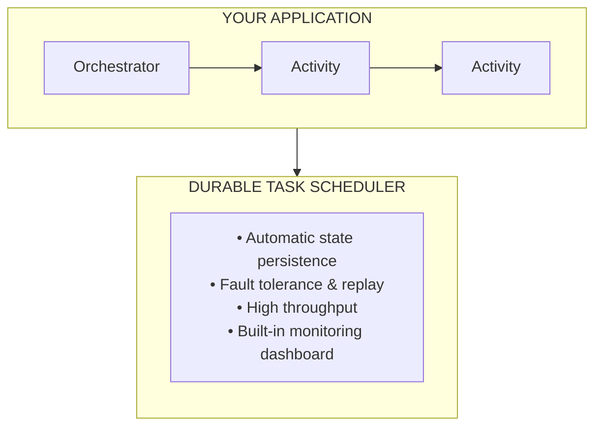

# What is Durable Task?

Build workflows that never fail. Durable Task automatically handles retries, state persistence, and crash recovery—so you can focus on your business logic.

| Component | Description | Best For |
|-----------|-------------|----------|
| **[Durable Task Scheduler](./durable-task-scheduler/durable-task-scheduler.md)** | Fully managed orchestration backend | Creating production workloads requiring high performance |
| **[Durable Task SDK guide](./durable-task-scheduler/quickstart-portable-durable-task-sdks.md)** | SDKs for .NET, Python, and Java | Building orchestrations in your preferred language |

## Choose your path

### Serverless with Azure Functions

Event-driven, pay-per-execution workloads:

```bash
func init MyApp --worker-runtime dotnet-isolated
dotnet add package Microsoft.Azure.Functions.Worker.Extensions.DurableTask
```

### Containers and Kubernetes

Full control over infrastructure and scaling:

```bash
dotnet add package Microsoft.DurableTask.Worker.AzureManaged
```

## Key benefits

- **Automatic state persistence** - Orchestration state is automatically persisted and recovered, surviving crashes and restarts
- **Built-in fault tolerance** - Automatic retries with configurable policies and replay on failures
- **Horizontal scalability** - Managed infrastructure that scales automatically to handle thousands of concurrent orchestrations
- **Built-in monitoring** - Visual debugging dashboard with execution history for troubleshooting
- **Multi-platform flexibility** - Run on Azure Functions, Container Apps, Kubernetes, or VMs
- **Durable timers** - Timers that survive restarts for long-running processes

## Quick navigation

| I want to... | Go to... |
|--------------|----------|
| **Understand the concepts** | [Core concepts](./durable-functions-types-features-overview.md) |
| **Build serverless workflows** | [Durable Functions quickstart](./durable-task-scheduler/quickstart-durable-task-scheduler.md) |
| **Run using the Durable Task SDKs** | [Durable Task SDK quickstart](./durable-task-scheduler/quickstart-portable-durable-task-sdks.md) |
| **Learn orchestration patterns** | [Patterns](./durable-functions-overview.md#application-patterns) |
| **Set up the Azure-managed backend** | [Durable Task Scheduler](./durable-task-scheduler/durable-task-scheduler.md) |

## Getting started

Choose your path based on your deployment needs:

### Option 1: Azure Functions (Serverless)

**Best for:** 
- Event-driven workloads
- Pay-per-execution
- Azure-native development

```bash
# Create a new Durable Functions project
func init MyDurableFunctionsApp --worker-runtime dotnet-isolated
cd MyDurableFunctionsApp
dotnet add package Microsoft.Azure.Functions.Worker.Extensions.DurableTask
```

[Durable Functions quickstart](./durable-task-scheduler/quickstart-durable-task-scheduler.md)

### Option 2: Azure Container Apps

**Best for:** 
- Containerized microservices
- KEDA autoscaling
- No Kubernetes management

[Container Apps quickstart](./durable-task-scheduler/quickstart-container-apps-durable-task-sdk.md)

### Option 3: Azure Kubernetes Service

**Best for:** 
- Full orchestration control
- Existing Kubernetes infrastructure

### Durable Task SDKs (all platforms)

**Best for:** 
- Building orchestrations in .NET, Python, or Java

```bash
# .NET
dotnet add package Microsoft.DurableTask.Worker.AzureManaged
dotnet add package Microsoft.DurableTask.Client.AzureManaged

# Python
pip install durabletask-azure

# Java - Add to pom.xml
```

[Durable Task SDK quickstart](./durable-task-scheduler/quickstart-portable-durable-task-sdks.md)

## How it works



## Next steps

- [Functions types and features overview](durable-functions-types-features-overview.md)
- [Orchestrator functions overview](durable-functions-orchestrations.md)
- [Create a Durable Functions app - C#](durable-functions-isolated-create-first-csharp.md)
- [Durable Functions overview](durable-functions-overview.md)