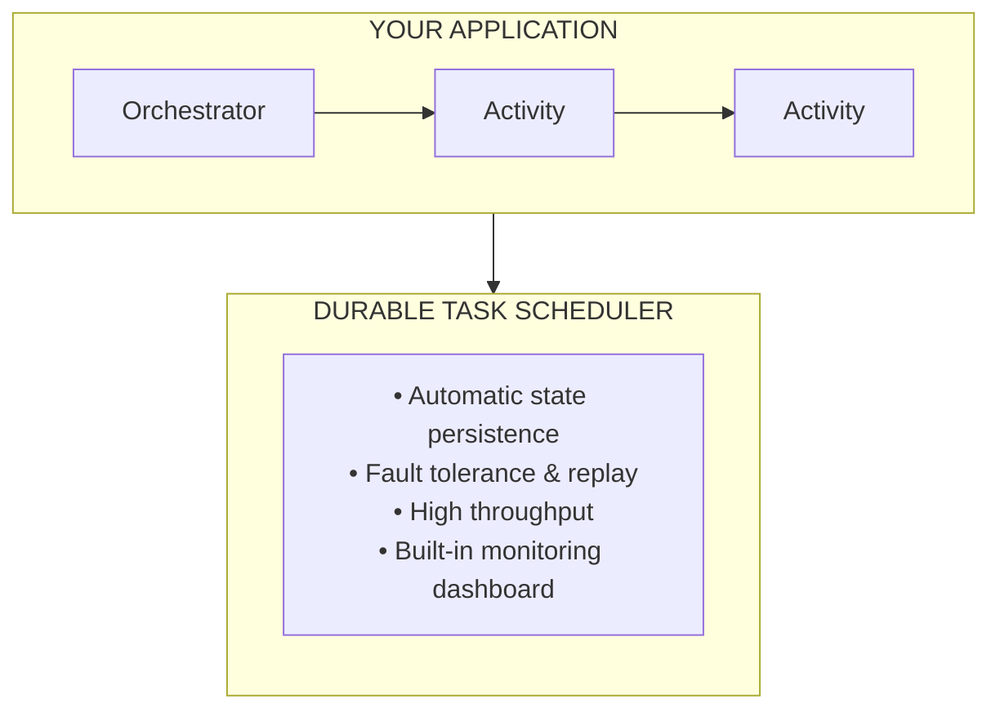

# What is Azure Durable?

Build workflows that never fail. Azure Durable automatically handles retries, state persistence, and crash recovery—so you can focus on your business logic.

Azure Durable is Microsoft's durable execution platform for building fault-tolerant workflows that automatically handle failures, retries, and state persistence.

| Component | Description | Best For |
|-----------|-------------|----------|
| **[Durable Task Scheduler](./durable-task-scheduler/overview.md)** | Fully managed orchestration backend | Production workloads requiring high performance |
| **[Hosting Options](./hosting-options/index.md)** | Azure Functions, Container Apps, or Kubernetes | Choose based on your deployment needs |
| **[Developer Guide](./developer-guide/index.md)** | SDKs for .NET, Python, and Java | Build orchestrations in your preferred language |

## Choose your path

### ⚡ Serverless with Azure Functions

Event-driven, pay-per-execution workloads:

```bash
func init MyApp --worker-runtime dotnet-isolated
dotnet add package Microsoft.Azure.Functions.Worker.Extensions.DurableTask
```

### 🐳 Containers & Kubernetes

Full control over infrastructure and scaling:

```bash
dotnet add package Microsoft.DurableTask.Worker.AzureManaged
```

## Key benefits

- ✅ **Automatic state persistence** — Orchestration state survives crashes and restarts
- ✅ **Built-in fault tolerance** — Automatic retries with configurable policies
- ✅ **Horizontal scalability** — Handle thousands of concurrent orchestrations
- ✅ **Monitoring dashboard** — Visual debugging and execution history
- ✅ **Multi-platform** — Run on Functions, Container Apps, AKS, or VMs

## Why Azure Durable?

| Challenge | Azure Durable Solution |
|-----------|------------------------|
| **Workflows fail mid-execution** | Automatic state persistence and recovery |
| **Manual retry logic is error-prone** | Built-in retry policies with exponential backoff |
| **Long-running processes timeout** | Durable timers that survive restarts |
| **Scaling stateful workloads is hard** | Managed infrastructure that scales automatically |
| **Debugging distributed workflows** | Built-in monitoring dashboard with execution history |

## Quick navigation

| I want to... | Go to... |
|--------------|----------|
| **Understand the concepts** | [📘 Core Concepts](./concepts/index.md) |
| **Choose a hosting platform** | [🏠 Hosting Options](./hosting-options/index.md) |
| **Build serverless workflows** | [⚡ Azure Functions Quickstart](./hosting-options/azure-functions/quickstart.md) |
| **Run on containers/Kubernetes** | [🔧 Developer Guide Quickstart](./developer-guide/quickstart.md) |
| **Learn orchestration patterns** | [🔄 Patterns](./patterns/index.md) |
| **Choose the right approach** | [⚖️ When to Use What](./comparison/when-to-use.md) |
| **Set up the managed backend** | [☁️ Durable Task Scheduler](./durable-task-scheduler/overview.md) |
| **Look up terminology** | [📖 Glossary](./glossary.md) |

## Getting started

Choose your path based on your deployment needs:

### Option 1: Azure Functions (Serverless)

**Best for:** Event-driven workloads, pay-per-execution, Azure-native development

```bash
# Create a new Durable Functions project
func init MyDurableFunctionsApp --worker-runtime dotnet-isolated
cd MyDurableFunctionsApp
dotnet add package Microsoft.Azure.Functions.Worker.Extensions.DurableTask
```

[📖 Azure Functions Quickstart →](./hosting-options/azure-functions/quickstart.md)

### Option 2: Azure Container Apps

**Best for:** Containerized microservices, KEDA autoscaling, no Kubernetes management

[📖 Container Apps Deployment Guide →](./hosting-options/container-apps/deployment.md)

### Option 3: Azure Kubernetes Service

**Best for:** Full orchestration control, existing Kubernetes infrastructure

[📖 Kubernetes Deployment Guide →](./hosting-options/kubernetes/deployment.md)

### Durable Task SDKs (All Platforms)

**Best for:** Building orchestrations in .NET, Python, or Java

```bash
# .NET
dotnet add package Microsoft.DurableTask.Worker.AzureManaged
dotnet add package Microsoft.DurableTask.Client.AzureManaged

# Python
pip install durabletask-azure

# Java - Add to pom.xml
```

[📖 Developer Guide Quickstart →](./developer-guide/quickstart.md)

## How it works



**Key Benefits:**

| Benefit | Description |
|---------|-------------|
| ✅ **Automatic State Management** | Your orchestration state is automatically persisted and recovered |
| ✅ **Fault Tolerance** | Automatic retries and replay on failures |
| ✅ **Scalability** | Handle thousands of concurrent orchestrations |
| ✅ **Observability** | Built-in dashboard for monitoring and debugging |
| ✅ **Flexibility** | Run on Azure Functions, Container Apps, Kubernetes, or VMs |

## Related resources

- [Azure Durable Functions Documentation (Microsoft Learn)](https://learn.microsoft.com/azure/azure-functions/durable/)
- [Durable Task Scheduler Documentation (Microsoft Learn)](https://learn.microsoft.com/azure/azure-functions/durable/durable-task-scheduler/)
- [Durable Task SDK for .NET (GitHub)](https://github.com/microsoft/durabletask-dotnet)
- [Durable Task Samples (GitHub)](https://github.com/Azure-Samples/Durable-Task-Scheduler)

## Next steps

- [Functions types and features overview](durable-functions-types-features-overview.md)
- [Orchestrator functions overview](durable-functions-orchestrations.md)
- [Choose your hosting option](durable-functions-hosting-options.md)
- [Create a Durable Functions app - C#](durable-functions-isolated-create-first-csharp.md)
- [Durable Functions overview](durable-functions-overview.md)