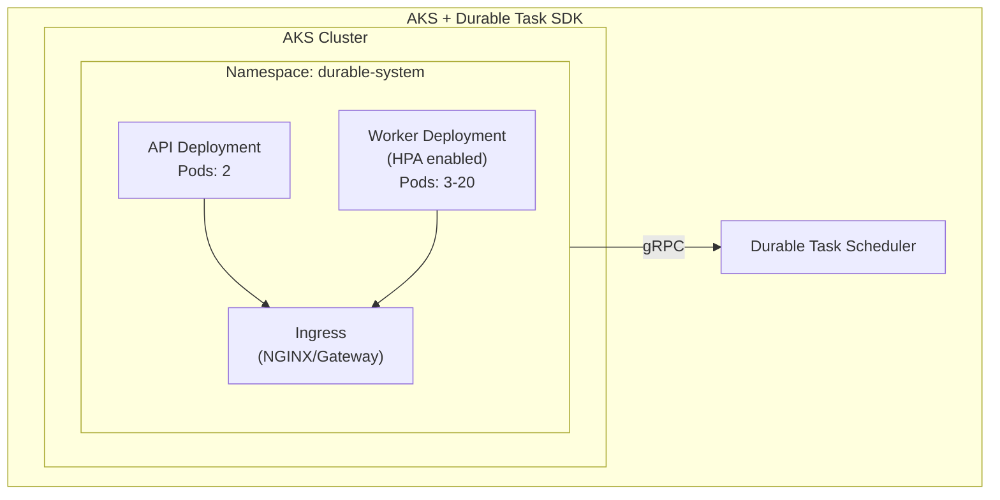
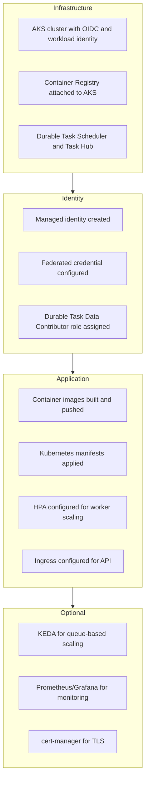

# Deploy Durable Task SDK workers to Azure Kubernetes Service

Deploy durable orchestrations to AKS for full control over scaling, networking, and operations.

## Overview

Azure Kubernetes Service (AKS) provides the most flexibility for deploying Durable Task SDK workers. Use AKS when you need fine-grained control over infrastructure, custom scaling, or integration with existing Kubernetes workloads.



---

## Prerequisites

1. Azure subscription
2. Azure CLI with aks-preview extension
3. kubectl configured
4. Helm (optional, for ingress)
5. Docker

---

## Step 1: Create infrastructure

Set variables for the deployment:

```bash
RESOURCE_GROUP="rg-durable-aks"
LOCATION="centralus"
CLUSTER_NAME="durable-aks"
SCHEDULER_NAME="my-scheduler"
REGISTRY_NAME="myacrregistry"
```

Create the resource group:

```bash
az group create --name $RESOURCE_GROUP --location $LOCATION
```

Create the AKS cluster with workload identity:

```bash
az aks create \
  --resource-group $RESOURCE_GROUP \
  --name $CLUSTER_NAME \
  --node-count 3 \
  --enable-oidc-issuer \
  --enable-workload-identity \
  --generate-ssh-keys
```

Get credentials for the cluster:

```bash
az aks get-credentials \
  --resource-group $RESOURCE_GROUP \
  --name $CLUSTER_NAME
```

Create a Container Registry:

```bash
az acr create \
  --resource-group $RESOURCE_GROUP \
  --name $REGISTRY_NAME \
  --sku Basic
```

Attach the ACR to AKS:

```bash
az aks update \
  --resource-group $RESOURCE_GROUP \
  --name $CLUSTER_NAME \
  --attach-acr $REGISTRY_NAME
```

Create the Durable Task Scheduler:

```bash
az durabletask scheduler create \
  --resource-group $RESOURCE_GROUP \
  --name $SCHEDULER_NAME \
  --location $LOCATION \
  --sku dedicated
```

Create a Task Hub:

```bash
az durabletask taskhub create \
  --resource-group $RESOURCE_GROUP \
  --scheduler-name $SCHEDULER_NAME \
  --name default
```

## Step 2: Configure workload identity

Create a managed identity:

```bash
az identity create \
  --resource-group $RESOURCE_GROUP \
  --name durable-workload-identity
```

Retrieve the identity client ID:

```bash
IDENTITY_CLIENT_ID=$(az identity show \
  --resource-group $RESOURCE_GROUP \
  --name durable-workload-identity \
  --query clientId -o tsv)
```

Retrieve the identity principal ID:

```bash
IDENTITY_PRINCIPAL_ID=$(az identity show \
  --resource-group $RESOURCE_GROUP \
  --name durable-workload-identity \
  --query principalId -o tsv)
```

Get the scheduler ID:

```bash
SCHEDULER_ID=$(az durabletask scheduler show \
  --name $SCHEDULER_NAME \
  --resource-group $RESOURCE_GROUP \
  --query id -o tsv)
```

Assign the Durable Task role:

```bash
az role assignment create \
  --role "Durable Task Data Contributor" \
  --assignee $IDENTITY_PRINCIPAL_ID \
  --scope $SCHEDULER_ID
```

Get the AKS OIDC issuer:

```bash
AKS_OIDC_ISSUER=$(az aks show \
  --resource-group $RESOURCE_GROUP \
  --name $CLUSTER_NAME \
  --query oidcIssuerProfile.issuerUrl -o tsv)
```

Create a federated credential:

```bash
az identity federated-credential create \
  --name durable-federated \
  --identity-name durable-workload-identity \
  --resource-group $RESOURCE_GROUP \
  --issuer $AKS_OIDC_ISSUER \
  --subject system:serviceaccount:durable-system:durable-worker-sa
```

## Step 3: Build and push images

Build and push the worker image:

```bash
cd durable-worker
az acr build --registry $REGISTRY_NAME --image durable-worker:v1 .
```

Build and push the API image:

```bash
cd ../durable-api
az acr build --registry $REGISTRY_NAME --image durable-api:v1 .
```

## Step 4: Create Kubernetes manifests

### namespace.yaml

```yaml
apiVersion: v1
kind: Namespace
metadata:
  name: durable-system
```

### serviceaccount.yaml

```yaml
apiVersion: v1
kind: ServiceAccount
metadata:
  name: durable-worker-sa
  namespace: durable-system
  annotations:
    azure.workload.identity/client-id: "${IDENTITY_CLIENT_ID}"
```

### configmap.yaml

```yaml
apiVersion: v1
kind: ConfigMap
metadata:
  name: durable-config
  namespace: durable-system
data:
  DTS_ENDPOINT: "https://${SCHEDULER_NAME}.${LOCATION}.durabletask.io"
  TASKHUB_NAME: "default"
```

### worker-deployment.yaml

```yaml
apiVersion: apps/v1
kind: Deployment
metadata:
  name: durable-worker
  namespace: durable-system
spec:
  replicas: 3
  selector:
    matchLabels:
      app: durable-worker
  template:
    metadata:
      labels:
        app: durable-worker
        azure.workload.identity/use: "true"
    spec:
      serviceAccountName: durable-worker-sa
      containers:
      - name: worker
        image: ${REGISTRY_NAME}.azurecr.io/durable-worker:v1
        resources:
          requests:
            cpu: "250m"
            memory: "512Mi"
          limits:
            cpu: "1"
            memory: "1Gi"
        envFrom:
        - configMapRef:
            name: durable-config
        env:
        - name: AZURE_CLIENT_ID
          value: "${IDENTITY_CLIENT_ID}"
        livenessProbe:
          httpGet:
            path: /health
            port: 8080
          initialDelaySeconds: 10
          periodSeconds: 30
        readinessProbe:
          httpGet:
            path: /ready
            port: 8080
          initialDelaySeconds: 5
          periodSeconds: 10
```

### api-deployment.yaml

```yaml
apiVersion: apps/v1
kind: Deployment
metadata:
  name: durable-api
  namespace: durable-system
spec:
  replicas: 2
  selector:
    matchLabels:
      app: durable-api
  template:
    metadata:
      labels:
        app: durable-api
        azure.workload.identity/use: "true"
    spec:
      serviceAccountName: durable-worker-sa
      containers:
      - name: api
        image: ${REGISTRY_NAME}.azurecr.io/durable-api:v1
        ports:
        - containerPort: 8080
        resources:
          requests:
            cpu: "100m"
            memory: "256Mi"
          limits:
            cpu: "500m"
            memory: "512Mi"
        envFrom:
        - configMapRef:
            name: durable-config
        env:
        - name: AZURE_CLIENT_ID
          value: "${IDENTITY_CLIENT_ID}"
---
apiVersion: v1
kind: Service
metadata:
  name: durable-api-service
  namespace: durable-system
spec:
  selector:
    app: durable-api
  ports:
  - port: 80
    targetPort: 8080
  type: ClusterIP
```

### hpa.yaml

```yaml
apiVersion: autoscaling/v2
kind: HorizontalPodAutoscaler
metadata:
  name: durable-worker-hpa
  namespace: durable-system
spec:
  scaleTargetRef:
    apiVersion: apps/v1
    kind: Deployment
    name: durable-worker
  minReplicas: 3
  maxReplicas: 20
  metrics:
  - type: Resource
    resource:
      name: cpu
      target:
        type: Utilization
        averageUtilization: 70
  - type: Resource
    resource:
      name: memory
      target:
        type: Utilization
        averageUtilization: 80
```

### ingress.yaml

```yaml
apiVersion: networking.k8s.io/v1
kind: Ingress
metadata:
  name: durable-api-ingress
  namespace: durable-system
  annotations:
    kubernetes.io/ingress.class: nginx
    cert-manager.io/cluster-issuer: letsencrypt-prod
spec:
  tls:
  - hosts:
    - durable-api.example.com
    secretName: durable-api-tls
  rules:
  - host: durable-api.example.com
    http:
      paths:
      - path: /
        pathType: Prefix
        backend:
          service:
            name: durable-api-service
            port:
              number: 80
```

## Step 5: Deploy to AKS

Create the namespace:

```bash
kubectl apply -f namespace.yaml
```

Substitute variables and apply the service account:

```bash
envsubst < serviceaccount.yaml | kubectl apply -f -
```

Apply the config map:

```bash
envsubst < configmap.yaml | kubectl apply -f -
```

Apply the worker deployment:

```bash
envsubst < worker-deployment.yaml | kubectl apply -f -
```

Apply the API deployment:

```bash
envsubst < api-deployment.yaml | kubectl apply -f -
```

Apply the HPA:

```bash
kubectl apply -f hpa.yaml
```

Optionally, deploy the ingress:

```bash
kubectl apply -f ingress.yaml
```

Verify the pod deployments:

```bash
kubectl get pods -n durable-system
```

Verify the HPA:

```bash
kubectl get hpa -n durable-system
```

## Step 6: Add health endpoints to worker

### Program.cs with health checks

```csharp
var builder = Host.CreateApplicationBuilder(args);

// Add health check endpoints
builder.Services.AddHealthChecks();
builder.WebHost.ConfigureKestrel(options => options.ListenAnyIP(8080));

builder.Services.AddDurableTaskWorker(options =>
{
    options.AddOrchestrator<OrderProcessingOrchestrator>();
    options.AddActivity<ValidateOrderActivity>();
})
.UseDurableTaskScheduler(endpoint, taskHub);

var host = builder.Build();

// Map health endpoints
var app = builder.Build();
app.MapHealthChecks("/health");
app.MapHealthChecks("/ready");

await app.RunAsync();
```

## KEDA scaling (advanced)

For queue-based scaling with KEDA:

### keda-scaledobject.yaml

```yaml
apiVersion: keda.sh/v1alpha1
kind: ScaledObject
metadata:
  name: durable-worker-scaler
  namespace: durable-system
spec:
  scaleTargetRef:
    name: durable-worker
  pollingInterval: 15
  cooldownPeriod: 300
  minReplicaCount: 1
  maxReplicaCount: 50
  triggers:
  - type: azure-queue
    metadata:
      queueName: control-queue
      accountName: storageaccount
    authenticationRef:
      name: azure-queue-auth
---
apiVersion: keda.sh/v1alpha1
kind: TriggerAuthentication
metadata:
  name: azure-queue-auth
  namespace: durable-system
spec:
  podIdentity:
    provider: azure-workload
    identityId: ${IDENTITY_CLIENT_ID}
```

## Monitoring with Prometheus

### servicemonitor.yaml

```yaml
apiVersion: monitoring.coreos.com/v1
kind: ServiceMonitor
metadata:
  name: durable-worker-monitor
  namespace: durable-system
spec:
  selector:
    matchLabels:
      app: durable-worker
  endpoints:
  - port: metrics
    interval: 30s
    path: /metrics
```

## Deployment summary



## Testing

Port-forward for local testing:

```bash
kubectl port-forward svc/durable-api-service 8080:80 -n durable-system
```

Start an orchestration:

```bash
curl -X POST http://localhost:8080/orders \
  -H "Content-Type: application/json" \
  -d '{"id": "order-123", "items": ["item1"], "total": 99.99}'
```

Check the status:

```bash
curl http://localhost:8080/orders/<instanceId>
```

Check scaling:

```bash
kubectl get hpa -n durable-system -w
```

## Next steps

- [Configure identity](../durable-task-scheduler/identity.md)
- [Use the dashboard](../durable-task-scheduler/dashboard.md)
- [Implement patterns](../durable-functions-overview.md#application-patterns)

## Troubleshooting

| Issue | Possible cause | Solution |
|-------|---------------|----------|
| `CreateContainerConfigError` | Missing environment variables | Check ConfigMap applied; verify `envsubst` processed variables |
| `403 Forbidden` to Scheduler | Workload identity misconfigured | Verify federated credential matches service account namespace/name |
| Pods stuck in `Pending` | Insufficient cluster resources | Scale node pool or reduce resource requests |
| `CrashLoopBackOff` | Application error or missing config | Check pod logs: `kubectl logs -n durable-system <pod-name>` |
| HPA not scaling | Metrics server issue | Verify metrics-server is running: `kubectl get pods -n kube-system` |
| Ingress 502 errors | Service/pod not ready | Check readiness probe; verify service selector matches pod labels |

### Debugging commands

View pod logs:

```bash
kubectl logs -n durable-system -l app=durable-worker --tail=100
```

Describe pod for events:

```bash
kubectl describe pod -n durable-system -l app=durable-worker
```

Check workload identity token:

```bash
kubectl exec -it -n durable-system <pod-name> -- \
  cat /var/run/secrets/azure/tokens/azure-identity-token
```

Verify service account annotations:

```bash
kubectl get sa durable-worker-sa -n durable-system -o yaml
```

Test DNS resolution from pod:

```bash
kubectl exec -it -n durable-system <pod-name> -- \
  nslookup $SCHEDULER_NAME.$LOCATION.durabletask.io
```

Check HPA status:

```bash
kubectl describe hpa durable-worker-hpa -n durable-system
```

View KEDA scaler logs (if using KEDA):

```bash
kubectl logs -n keda -l app=keda-operator --tail=50
```

### Common configuration mistakes

1. **Federated credential subject**: Must exactly match `system:serviceaccount:<namespace>:<service-account-name>`
2. **Workload identity label**: Pods must have `azure.workload.identity/use: "true"` label
3. **Service account annotation**: Must include `azure.workload.identity/client-id` annotation
4. **ConfigMap not applied**: Run `kubectl get configmap -n durable-system` to verify
5. **Variable substitution**: Use `envsubst` or Helm for variable replacement before applying manifests
6. **OIDC issuer mismatch**: Federated credential issuer must match AKS cluster's OIDC issuer URL