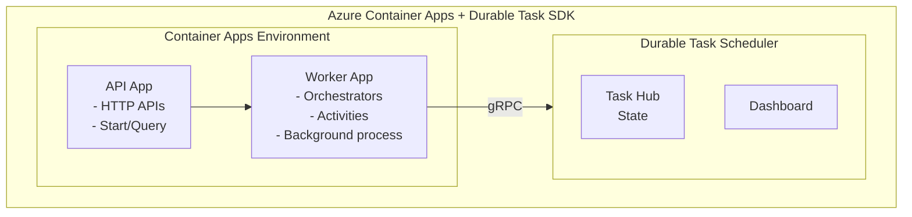
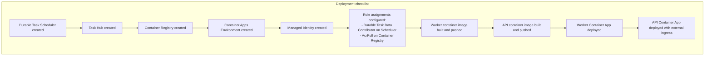

# Deploy Durable Task SDK workers to Azure Container Apps

Deploy durable orchestrations to Azure Container Apps using the Durable Task SDK.

## Overview

Azure Container Apps provides a fully managed serverless container platform that's ideal for running Durable Task SDK workers. It offers automatic scaling, built-in HTTPS, and simplified deployment.



---

## Prerequisites

1. Azure subscription
2. Azure CLI with containerapp extension
3. Docker (for building images)
4. Durable Task Scheduler resource

---

## Step 1: Create infrastructure

### Azure CLI

Set variables for the deployment:

```bash
RESOURCE_GROUP="rg-durable-aca"
LOCATION="centralus"
SCHEDULER_NAME="my-scheduler"
ENVIRONMENT_NAME="durable-env"
REGISTRY_NAME="myacrregistry"
```

Create the resource group:

```bash
az group create --name $RESOURCE_GROUP --location $LOCATION
```

Create the Durable Task Scheduler:

```bash
az durabletask scheduler create \
  --resource-group $RESOURCE_GROUP \
  --name $SCHEDULER_NAME \
  --location $LOCATION \
  --sku dedicated
```

Create a Task Hub:

```bash
az durabletask taskhub create \
  --resource-group $RESOURCE_GROUP \
  --scheduler-name $SCHEDULER_NAME \
  --name default
```

Create a Container Registry:

```bash
az acr create \
  --resource-group $RESOURCE_GROUP \
  --name $REGISTRY_NAME \
  --sku Basic \
  --admin-enabled true
```

Create the Container Apps Environment:

```bash
az containerapp env create \
  --resource-group $RESOURCE_GROUP \
  --name $ENVIRONMENT_NAME \
  --location $LOCATION
```

## Step 2: Create worker application

### Project structure

```
durable-worker/
├── Program.cs
├── Orchestrators/
│   └── OrderOrchestrator.cs
├── Activities/
│   ├── ValidateOrderActivity.cs
│   └── ProcessPaymentActivity.cs
├── durable-worker.csproj
└── Dockerfile
```

### Program.cs

```csharp
using Microsoft.DurableTask.Worker;
using Microsoft.DurableTask.Client;

var builder = Host.CreateApplicationBuilder(args);

// Configuration
var endpoint = builder.Configuration["DTS_ENDPOINT"] 
    ?? throw new InvalidOperationException("DTS_ENDPOINT required");
var taskHub = builder.Configuration["TASKHUB_NAME"] ?? "default";

// Add Durable Task Worker
builder.Services.AddDurableTaskWorker(options =>
{
    options.AddOrchestrator<OrderProcessingOrchestrator>();
    options.AddActivity<ValidateOrderActivity>();
    options.AddActivity<ProcessPaymentActivity>();
    options.AddActivity<ShipOrderActivity>();
})
.UseDurableTaskScheduler(endpoint, taskHub);

// Add Durable Task Client
builder.Services.AddDurableTaskClient()
    .UseDurableTaskScheduler(endpoint, taskHub);

var host = builder.Build();
await host.RunAsync();
```

### Dockerfile

```dockerfile
FROM mcr.microsoft.com/dotnet/sdk:8.0 AS build
WORKDIR /src
COPY . .
RUN dotnet publish -c Release -o /app/publish

FROM mcr.microsoft.com/dotnet/aspnet:8.0
WORKDIR /app
COPY --from=build /app/publish .
ENTRYPOINT ["dotnet", "durable-worker.dll"]
```

## Step 3: Create API application

### api-app/Program.cs

```csharp
using Microsoft.DurableTask.Client;

var builder = WebApplication.CreateBuilder(args);

var endpoint = builder.Configuration["DTS_ENDPOINT"]!;
var taskHub = builder.Configuration["TASKHUB_NAME"] ?? "default";

// Add Durable Task Client
builder.Services.AddDurableTaskClient()
    .UseDurableTaskScheduler(endpoint, taskHub);

var app = builder.Build();

app.MapPost("/orders", async (Order order, DurableTaskClient client) =>
{
    var instanceId = await client.ScheduleNewOrchestrationInstanceAsync(
        "OrderProcessingOrchestrator",
        order
    );
    
    return Results.Accepted($"/orders/{instanceId}", new { instanceId });
});

app.MapGet("/orders/{instanceId}", async (string instanceId, DurableTaskClient client) =>
{
    var metadata = await client.GetInstanceAsync(instanceId, getInputsAndOutputs: true);
    
    if (metadata == null) return Results.NotFound();
    
    return Results.Ok(new
    {
        instanceId = metadata.InstanceId,
        status = metadata.RuntimeStatus.ToString(),
        output = metadata.SerializedOutput
    });
});

app.Run();
```

## Step 4: Build and push images

Build the worker image:

```bash
cd durable-worker
az acr build \
  --registry $REGISTRY_NAME \
  --image durable-worker:latest .
```

Build the API image:

```bash
cd ../api-app
az acr build \
  --registry $REGISTRY_NAME \
  --image durable-api:latest .
```

## Step 5: Create user-assigned managed identity

Create the managed identity:

```bash
az identity create \
  --resource-group $RESOURCE_GROUP \
  --name durable-identity
```

Get the identity resource ID:

```bash
IDENTITY_ID=$(az identity show \
  --resource-group $RESOURCE_GROUP \
  --name durable-identity \
  --query id -o tsv)
```

Get the identity client ID:

```bash
IDENTITY_CLIENT_ID=$(az identity show \
  --resource-group $RESOURCE_GROUP \
  --name durable-identity \
  --query clientId -o tsv)
```

Get the identity principal ID:

```bash
IDENTITY_PRINCIPAL_ID=$(az identity show \
  --resource-group $RESOURCE_GROUP \
  --name durable-identity \
  --query principalId -o tsv)
```

Get the scheduler resource ID:

```bash
SCHEDULER_ID=$(az durabletask scheduler show \
  --name $SCHEDULER_NAME \
  --resource-group $RESOURCE_GROUP \
  --query id -o tsv)
```

Assign the Durable Task role:

```bash
az role assignment create \
  --role "Durable Task Data Contributor" \
  --assignee $IDENTITY_PRINCIPAL_ID \
  --scope $SCHEDULER_ID
```

Get the ACR resource ID:

```bash
ACR_ID=$(az acr show --name $REGISTRY_NAME --query id -o tsv)
```

Assign the ACR pull permission:

```bash
az role assignment create \
  --role AcrPull \
  --assignee $IDENTITY_PRINCIPAL_ID \
  --scope $ACR_ID
```

## Step 6: Deploy container apps

### Deploy worker app

```bash
az containerapp create \
  --resource-group $RESOURCE_GROUP \
  --name durable-worker \
  --environment $ENVIRONMENT_NAME \
  --image $REGISTRY_NAME.azurecr.io/durable-worker:latest \
  --registry-server $REGISTRY_NAME.azurecr.io \
  --registry-identity $IDENTITY_ID \
  --user-assigned $IDENTITY_ID \
  --min-replicas 1 \
  --max-replicas 10 \
  --cpu 0.5 \
  --memory 1Gi \
  --env-vars \
    "DTS_ENDPOINT=https://$SCHEDULER_NAME.$LOCATION.durabletask.io" \
    "TASKHUB_NAME=default" \
    "AZURE_CLIENT_ID=$IDENTITY_CLIENT_ID"
```

### Deploy API app

```bash
az containerapp create \
  --resource-group $RESOURCE_GROUP \
  --name durable-api \
  --environment $ENVIRONMENT_NAME \
  --image $REGISTRY_NAME.azurecr.io/durable-api:latest \
  --registry-server $REGISTRY_NAME.azurecr.io \
  --registry-identity $IDENTITY_ID \
  --user-assigned $IDENTITY_ID \
  --min-replicas 1 \
  --max-replicas 5 \
  --cpu 0.25 \
  --memory 0.5Gi \
  --ingress external \
  --target-port 8080 \
  --env-vars \
    "DTS_ENDPOINT=https://$SCHEDULER_NAME.$LOCATION.durabletask.io" \
    "TASKHUB_NAME=default" \
    "AZURE_CLIENT_ID=$IDENTITY_CLIENT_ID"
```

## Step 7: Configure scaling (optional)

For worker apps that need to scale based on orchestration queue depth:

```bash
# Update worker with KEDA scaling
az containerapp update \
  --resource-group $RESOURCE_GROUP \
  --name durable-worker \
  --scale-rule-name durable-scaler \
  --scale-rule-type azure-queue \
  --scale-rule-metadata \
    "queueName=control-queue" \
    "accountName=$STORAGE_ACCOUNT_NAME" \
  --scale-rule-auth \
    "connection=storage-connection-string"
```

## Deployment summary



## Testing

Get the API URL:

```bash
API_URL=$(az containerapp show \
  --resource-group $RESOURCE_GROUP \
  --name durable-api \
  --query properties.configuration.ingress.fqdn -o tsv)
```

Start an orchestration:

```bash
curl -X POST https://$API_URL/orders \
  -H "Content-Type: application/json" \
  -d '{"id": "order-123", "items": ["item1"], "total": 99.99}'
```

Check the status:

```bash
curl https://$API_URL/orders/<instanceId>
```

## Next steps

- [Configure identity](./durable-task-scheduler-identity.md)
- [Use the dashboard](./durable-task-scheduler-dashboard.md)
- [Implement patterns](../durable-functions-overview.md#application-patterns)

## Troubleshooting

| Issue | Possible cause | Solution |
|-------|---------------|----------|
| Container fails to start | Missing environment variables | Verify `DTS_ENDPOINT` and `TASKHUB_NAME` are set correctly in `--env-vars` |
| `403 Forbidden` connecting to Scheduler | Missing role assignment | Ensure managed identity has "Durable Task Data Contributor" role on the Scheduler |
| `ImagePullBackOff` error | ACR permissions | Verify identity has "AcrPull" role; check registry server URL |
| Orchestrations not processing | Worker not connected | Check worker logs with `az containerapp logs show`; verify gRPC connectivity |
| High latency/timeouts | Wrong region | Deploy Container Apps in same region as Durable Task Scheduler |
| Scaling not working | KEDA misconfiguration | Verify scale rules and authentication; check KEDA operator logs |

### Debugging commands

View worker logs:

```bash
az containerapp logs show \
  --name durable-worker \
  --resource-group $RESOURCE_GROUP \
  --follow
```

Check container app status:

```bash
az containerapp show \
  --name durable-worker \
  --resource-group $RESOURCE_GROUP \
  --query "properties.runningStatus"
```

Verify managed identity assignment:

```bash
az containerapp identity show \
  --name durable-worker \
  --resource-group $RESOURCE_GROUP
```

Test Scheduler connectivity from local machine:

```bash
curl -v https://$SCHEDULER_NAME.$LOCATION.durabletask.io
```

View revision status (for deployment issues):

```bash
az containerapp revision list \
  --name durable-worker \
  --resource-group $RESOURCE_GROUP \
  --output table
```

### Common configuration mistakes

1. **Endpoint format**: Use `https://` prefix for DTS_ENDPOINT (not `http://`)
2. **Task hub case sensitivity**: Task hub names are case-sensitive
3. **Identity propagation delay**: Wait 1-2 minutes after role assignment before testing
4. **Min replicas**: Set `--min-replicas 1` for workers to ensure always-on processing