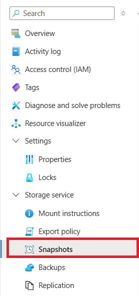
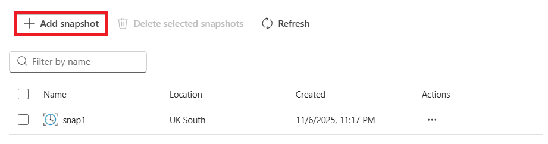
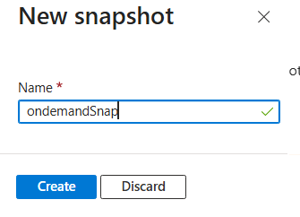

1.	Go to the volume that you want to create a snapshot for. Select **Snapshots**.

    

2.  Select **+ Add snapshot** to create an on-demand snapshot for a volume.

    

3.	In the New Snapshot window, enter a name for the new snapshot that you are creating.   

    

4. Select **Create**. 
