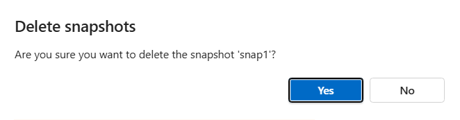

1. Go to the **Snapshots** menu of a volume. Select the three dots `...` at the end of the row of the snapshot want to delete. In the action menu, select **Delete**.

2. In the Delete snapshots window, confirm that you want to delete the snapshot by selecting **Yes**. 

      