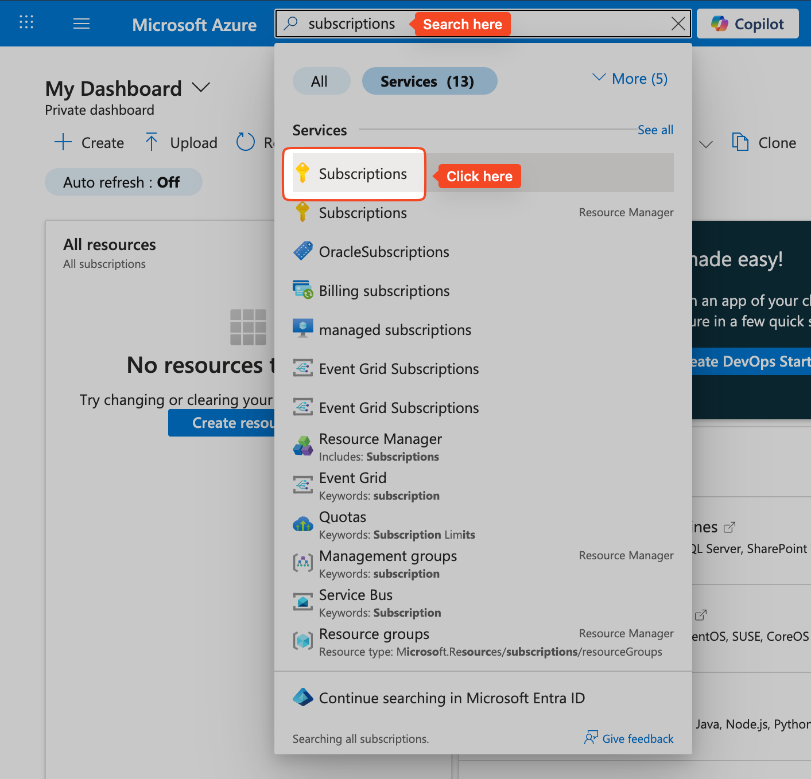
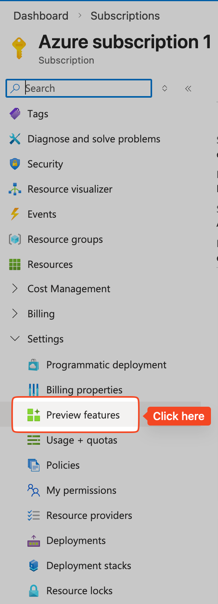
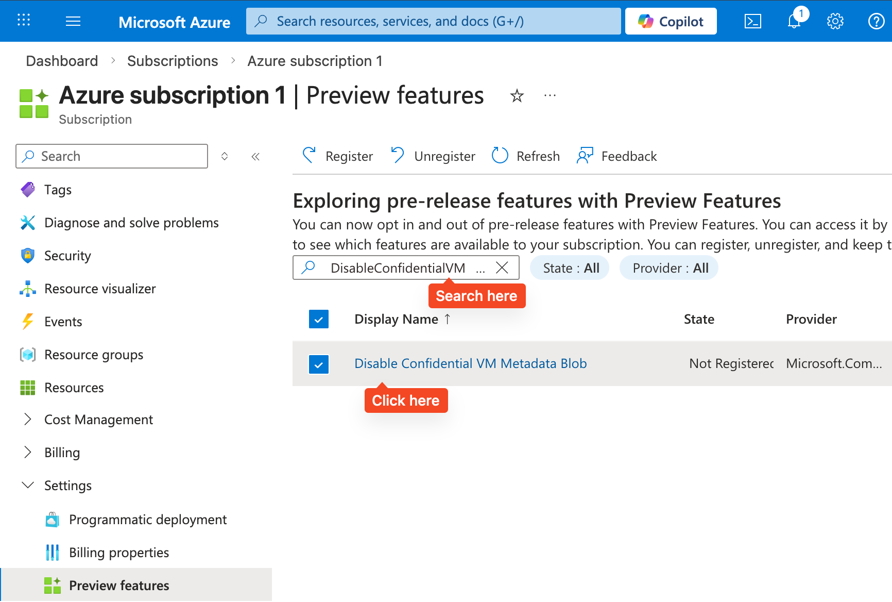
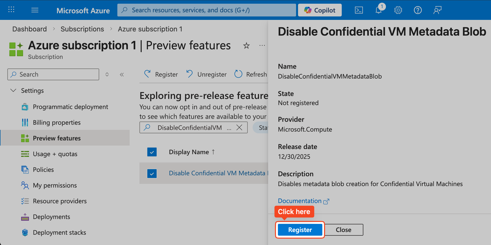

# Disable VMMD blob creation for Confidential VMs

This article outlines the background as well as the steps required to opt out of the newly introduced Virtual Machine Metadata (VMMD) blob feature in the Microsoft Azure Confidential VMs.

Microsoft Azure Confidential VMs (CVMs) recently adopted a **3blob** architecture comprising disk, VM Guest State (VMGS) and Virtual Machine Metadata (VMMD) blobs. This architecture update moves key information from the VMGS blob to a new VMMD blob to provide seamless support for various online key rotation scenarios.

Automation built for the previous architecture involving export, import, and upload scenarios may fail for certain workflows. If your workflows include a breaking scenario, you can deploy confidential VMs with legacy format by registering the `DisableConfidentialVMMetadataBlob` preview feature.

## Prerequisites

Before you begin, ensure you have the following:

* An Azure account with an active subscription. [Create an account for free.](https://azure.microsoft.com/free)
* A confidential VM with managed disks.

## Required Access

To list, register, or unregister preview features in your Azure subscription, you need access to the `Microsoft.Features/*` actions. This permission is granted through the [Contributor](https://learn.microsoft.com/en-us/azure/role-based-access-control/built-in-roles#contributor) and [Owner](https://learn.microsoft.com/en-us/azure/role-based-access-control/built-in-roles#owner) built-in roles. You can also specify the required access through a [custom role](https://learn.microsoft.com/en-us/azure/role-based-access-control/custom-roles).

> [!NOTE]
> The portal only shows a preview feature when the service that owns the feature explicitly opts in. The opt-out enablement would have to set on customer subscriptions and then the customers can continue to use **2blob** CVMs.    AFEC Name : Microsoft.Compute/DisableConfidentialVMMetadataBlob   Preview feature name: DisableConfidentialVMMetadataBlob    [Learn More…](https://learn.microsoft.com/en-us/azure/azure-resource-manager/management/preview-features?tabs=azure-portal)

## How to Opt Out of VMMD Blob creation

To opt out of the **3blob** architecture and disable the VMMD creation, follow these steps to register the `DisableConfidentialVMMetadataBlob` feature through the Azure portal:

1. Sign in to the Azure portal.

2. Search for `Subscriptions` in the top search bar and click on the link.

3. On the `Subscriptions` page, select the name of the subscription you wish to configure.

4. In the left menu, under `Settings`, select `Preview features`.

5. In the filter box of the `Preview features` screen, enter `DisableConfidentialVMMetadataBlob` and select the feature from the list.

6. Select Register.

The status will change to `Registered` once the process completes.

## Features Disabled After Opting Out

Using the legacy **2blob** architecture prevents access to the following services and capabilities designed for the new **3blob** format used in the latest Confidential VMs.

* **Backup and Restore** 
The Azure Backup service does not support 2 blob confidential VMs configured with the opt-out feature. 

* **Key Rotation** 
Online key rotation depends on the VMMD blob and therefore is only available for **3blob** resources. Confidential VMs using the **2blob** format cannot rotate keys while online. Automated key rotation may also fail if the resource is online.

* **PPS reuse** 
Introduction of the opt-out AFEC breaks PPS reuse of **2blob** resources as the platform has been redesigned to create **3blob** resources by default.

## Next Steps

* [Deploy a confidential VM from Azure](/azure/confidential-computing/quick-create-confidential-vm-portal)
* [Azure confidential computing documentation](/azure/confidential-computing/)

## Related Articles

* [Azure managed disks overview](/azure/virtual-machines/managed-disks-overview)
* [Managed disk migration guide](/azure/virtual-machines/linux/convert-unmanaged-to-managed-disks) 
