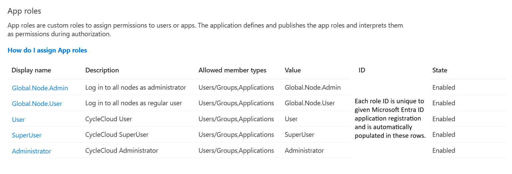
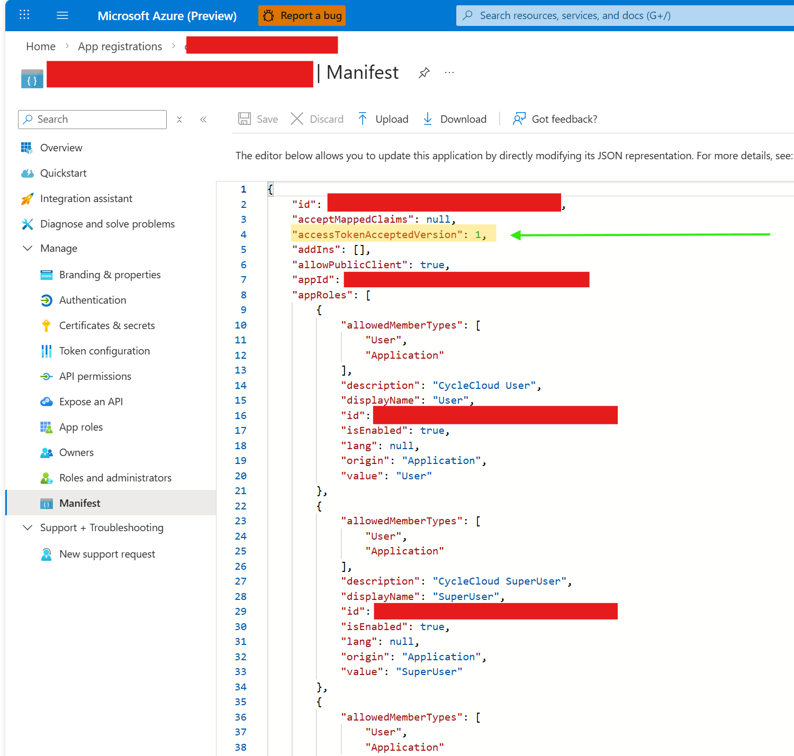
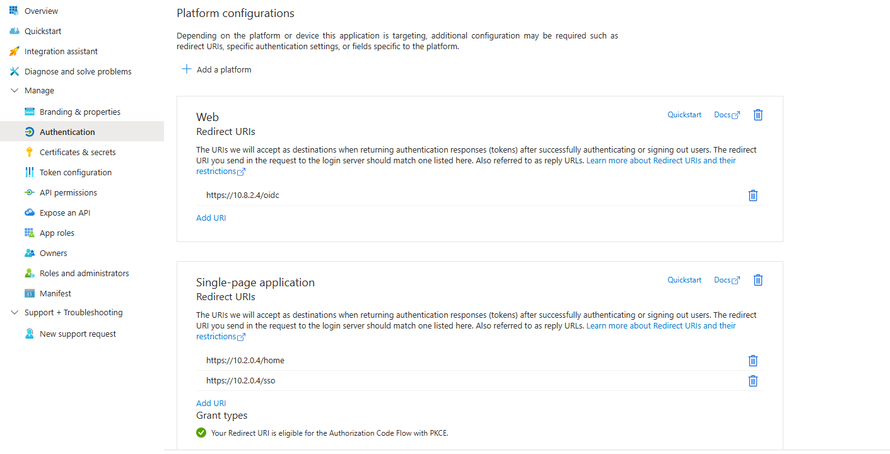
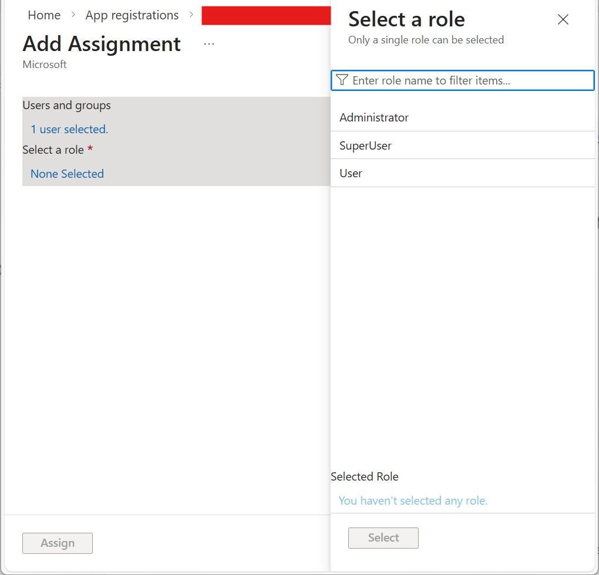

# Create a Microsoft Entra application registration for use with Azure CycleCloud and Azure CycleCloud Workspace for Slurm

[Microsoft Entra ID](/entra/fundamentals) is a cloud-based identity and access management service that enables your employees to access external resources. Azure CycleCloud's native integration with Microsoft Entra ID makes it easy to manage, authorize, and authenticate users if needed by your organization. Please check with your organization to ensure that there does not already exist an application registration available for use.

> [!NOTE]
> All users granted roles and access in a given Microsoft Entra ID application registration will have those permissions across all Azure CycleCloud installations utilizing that application registration. It is therefore advised to create separate application registrations for each CycleCloud installation to segregate users. 

## Creating the Microsoft Entra ID application registration

### Automatic

Follow the below steps to create a Microsoft Entra ID application registration **before** deploying Azure CycleCloud and Azure CycleCloud Workspace for Slurm using a utility script. 

This script will create a new user-assigned managed identity resource for exclusive use with the application registration. Please navigate to the section titled [*Open OnDemand*](#open-ondemand) for more details. 

**Script instructions**

Download the script with the following sequence of commands:

> [!IMPORTANT]
> Run the following commands from a Linux shell with the Azure CLI installed and authenticated with the Azure account designated for deployment. Azure Cloud Shell may not be supported for this scenario.

```
LATEST_RELEASE=$(curl -sSL -H 'Accept: application/vnd.github+json' "https://api.github.com/repos/Azure/cyclecloud-slurm-workspace/releases/latest" | sed -n 's/.*"tag_name":[[:space:]]*"\([^"]*\)".*/\1/p')

wget "https://raw.githubusercontent.com/Azure/cyclecloud-slurm-workspace/refs/tags/${LATEST_RELEASE}/util/entra_predeploy.sh"
```

Replace the values for ```LOCATION```,```ENTRA_MI_RESOURCE_GROUP```, ```MI_NAME```, ```APP_NAME``` and ```SERVICE_MANAGEMENT_REFERENCE``` in the downloaded script, including the characters ```<``` and ```>``` with your preferred text editor.

- ```LOCATION``` is the Azure region in which to create the managed identity resource and its resource group.
- ```ENTRA_MI_RESOURCE_GROUP``` is the name of the resource group containing the managed identity resource. 
- ```MI_NAME``` is the desired name of the managed identity resource. It may not contain spaces.
- ```APP_NAME``` is the designed name of the Microsoft Entra ID application registration. 
- ```SERVICE_MANAGEMENT_REFERENCE``` is an optional value that may be used to help identify the application registration in your organization's list of Entra ID applications. It may be left blank.

Finally, run the script: 

```
sh entra_predeploy.sh
```

Make note of the Tenant, Client, and Managed Identity Resource IDs and proceed to the [*Configuring redirect URIs*](#configuring-redirect-uris) section. 

### Manual

> [!NOTE]
> Any service principal intended for use with Azure CycleCloud  created with the Azure CLI will not have the associated enterprise application required for use with Microsoft Entra ID.

1. In the Azure portal, select the **Microsoft Entra ID** icon in the navigation pane or type "Microsoft Entra ID" in the search bar and select "Microsoft Entra ID" from the Services category in the results.
2. Go to the **App registrations** tab under the "Manage" menu.  

3. Select **New registration** from the top menu bar. No redirect URIs need to be set at this point.

4. Make note of the **Application (client) ID** and **Directory (tenant) ID** fields on the **Overview** page of the newly created application. These values will be needed later to configure Entra authentication in CycleCloud.

5. On the **Expose an API** page of your app, select **Add a scope**. This step exposes your app registration as an API for which Access Tokens can be generated. Keep the Application ID URI as the default value of `api://{ClientID}`.


6. The portal will prompt you to configure the new scope upon selecting **Save and Continue**. Enter `user_access` as the scope name and configure the other fields as desired, but ensure that **State** is set to Enabled. 

7. Go to the **API Permissions** page and select **Add a permission**. In the **Request API permissions** menu, go to **My APIs** and choose the application. Then select **Delegated permissions** and check off the scope created in the previous step. Select **Add permission**. The new permission will now appear in the **Configured permissions** table.


8. Navigate to the **Authentication** page and enable **Allow public client flows** to use the CycleCloud CLI with Microsoft Entra ID. 
9.	Next, add the user roles for CycleCloud under **App roles** by selecting **Create app role**. The **Display name** field to any desired string, but the **Value** field must match the built-in CycleCloud role for authentication to work as intended. TODO AGB: Make this accessible with screen reader 

    > [!NOTE]
    > Since Microsoft Entra ID doesn't allow roles to have spaces in them and some of the in-built CycleCloud roles include spaces (for example, “Cluster Administrator”), replace any spaces in the role names you define in Microsoft Entra ID with a dot (for example, “Data Admin” becomes “Data.Admin”). Rename any roles defined in CycleCloud to not feature dots. Role definitions in Microsoft Entra ID are case insensitive.

    At a minimum, add the following roles:
    
10. CycleCloud does not support v2.0 access tokens issued by the application registration. To remedy this, configure the application registration to issue tokens v1.0 by selecting **Manifest**, locating the property **accessTokenAcceptedVersion** in the manifest, and change the value of that property to ``1``. Be sure to click on **Save**. TODO AGB: new picture


## Configuring redirect URIs

> [!IMPORTANT]
> The following steps should be completed *after* deploying Azure CycleCloud. 
> [!NOTE]
> If you deployed using Azure CycleCloud Workspace for Slurm, then see the helper script provided [here](./ccws/plan-your-deployment.md#post-deployment-utility) to automatically execute the below instructions.

1. On the same page, select **Add a platform** under *Platform Configurations* and then select **Mobile and desktop applications**. Enter `http://localhost` as the custom URI and save by pressing **Configure**. Then navigate to the **Mobile and desktop applications** section of the **Authentication** page and add `https://localhost` as another redirect URI. Both of these URIs are required to enable the CycleCloud CLI to authenticate with the new application registration. For more information, see [Redirect URI (reply URL) restrictions and limitations](/entra/identity-platform/reply-url). Be sure to select **Save** on the bottom of the page after completing this step. The remaining fields may be left blank.

2. Select **Add a platform** under *Platform Configurations* and then choose **Single-page application**. Enter `https://{your_cyclecloud_VM_IP_or_domain_name}/home` as the custom URI and save by pressing **Configure**. Similar to the previous step, navigate to the **Mobile and desktop applications** section of the **Authentication** page and add `https://{your_cyclecloud_VM_IP_or_domain_name}/login` as a redirect URI. Add additional URIs in the same section of the Authentication page to use this application registration with multiple CycleCloud installations or to use multiple URIs for the same CycleCloud installation. Otherwise, the remaining fields may be left blank. TODO AGB: New picture?


## Permissioning users for CycleCloud
1.  After you create the required CycleCloud roles, add users and assign roles to them. To do this step, go to the app's **Enterprise Application** page. The easiest way to get there is through a helper link on your App roles page. 

1.  To add a user and assign a role, go to the **Users and groups** page of the Enterprise Application and select **Add user/group**.

2. On the **Add Assignment** page, select one or more users and the role to assign to them. You can use a search bar to filter users. Since only one app role was created in the screenshot, it's selected automatically, but the menu for selecting it is similar to how you select users. You can assign only one role at a time. To add multiple roles to the same user, repeat this process.


3. After you assign the role, the user appears on the **User and groups** page. Assigning multiple roles to a single user results in several entries for that user - one entry per role.

4. RECOMMENDED: If you want to allow access to CycleCloud only for users you explicitly add to your app, go to the **Properties of the Enterprise Application** and set **Assignment Required** to **Yes** 


## Open OnDemand

Follow the steps below if you intend to deploy Open OnDemand with Azure CycleCloud Workspace for Slurm. 

The Open OnDemand front end uses Open ID Connect (OIDC) for authentication. The OIDC provider is the Microsoft Entra ID application created using the below steps. This application uses federated credentials with a user-assigned managed identity to avoid storing secrets in the Open OnDemand configuration. 

Open OnDemand *does not* need to be enabled when initially deploying Azure CycleCloud or Azure CycleCloud Workspace for Slurm and may be easily added to CycleCloud at a later time. Therefore, the utility script that automatically creates the desired application registration also creates the aforementioned user-assigned managed identity. 

Complete the following additional steps to use Open OnDemand with your manually-created application registration. 
> [!NOTE]
> The below roles do not need to be created if you use the [utility script](./create-app-registration.md#automatic) provided above to create your Microsoft Entra ID application registration. Instead, you may simply assign the roles to your users. 
1. As in Step 9 of the *Manual* subsection of *Creating the Microsoft Entra ID application registration*, create roles named `GlobalNodeAdmin` with value `Global.Node.Admin` and `GlobalNodeUser` with value `Global.Node.User`. One of these two roles must be assigned to users intending to use Open OnDemand.
> [!NOTE]
> The below redirect URI does not need to be manually set if you use the help script provided [here](./ccws/plan-your-deployment.md#post-deployment-utility).
2. As in first step of the *Configuring redirect URIs* section, select **Add a platform** under *Platform Configurations* on the *Authentication* page and then choose **Web application**. Enter `https://{your_open_ondemand_VM_IP_or_domain_name}/oidc` as the custom URI and save by pressing **Configure**.
### Signing into Open OnDemand
Your users must first sign into Azure CycleCloud with Microsoft Entra ID before attempting to use Open OnDemand by navigating to the login URI listed in the **Single-page application** section on the Authentication page of the application registration. They may then log into Open OnDemand by navigating to the private IP or FQDN of the Open OnDemand virtual machine. Users should accept any consent messages that may appear. 