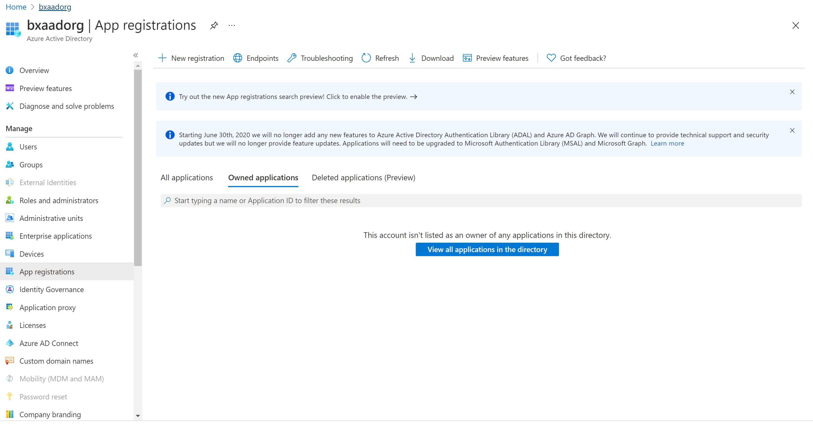
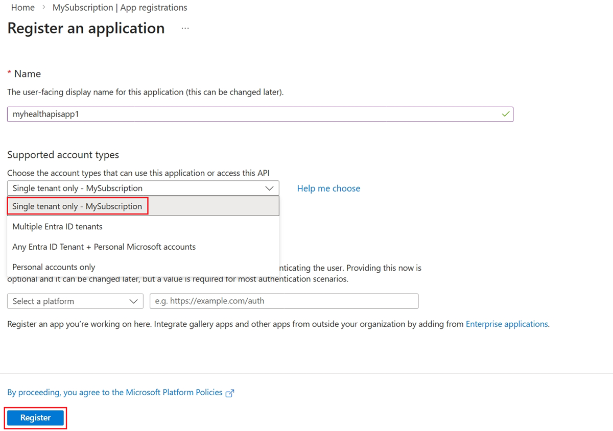
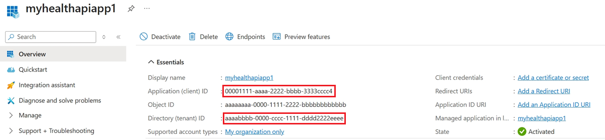
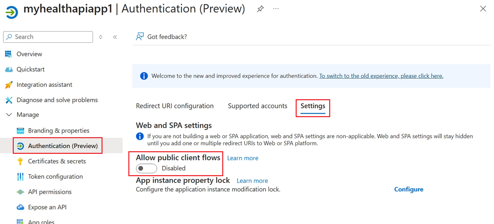
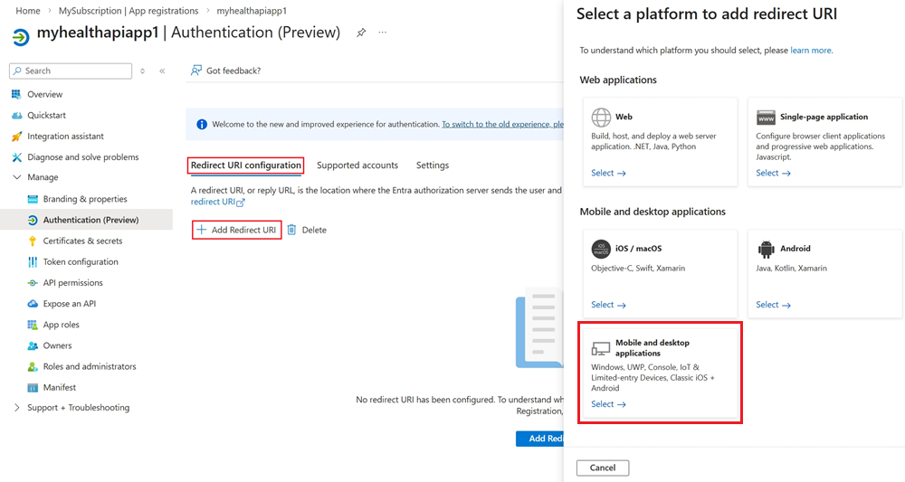
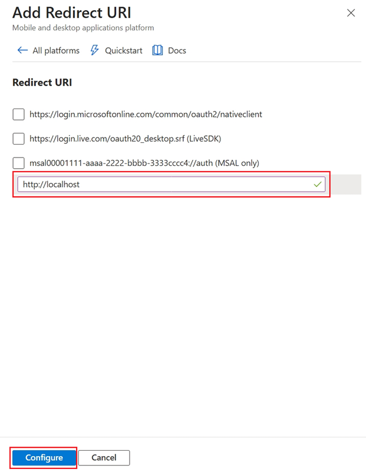
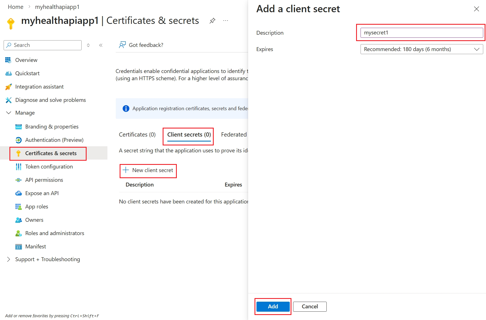
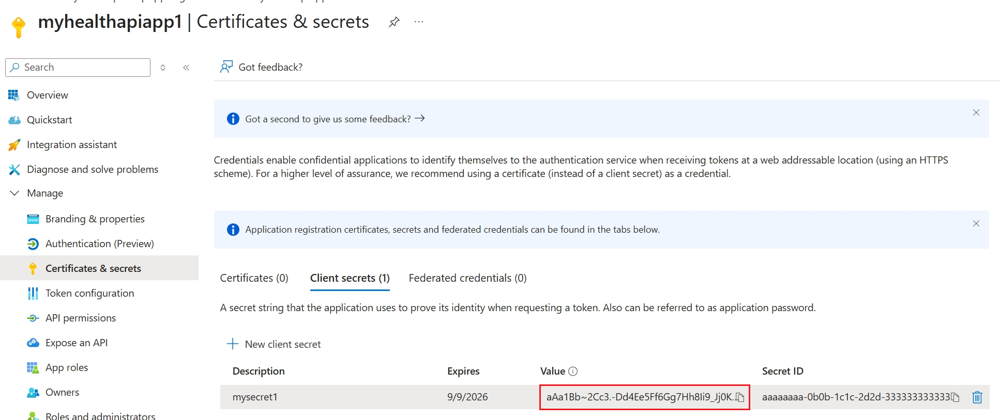
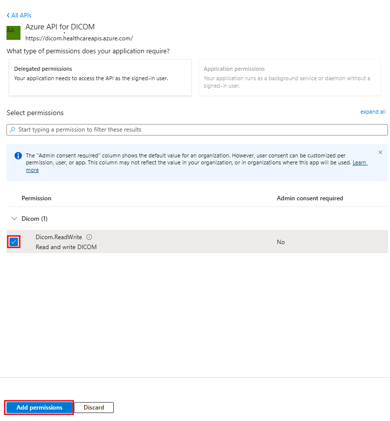

# Register a client application in Microsoft Entra ID

In this article, you learn how to register a client application in Microsoft Entra ID to access Azure Health Data Services. For more information, see [Register an application with the Microsoft identity platform](../active-directory/develop/quickstart-register-app.md).

## Register a new application

1. In the [Azure portal](https://portal.azure.com), select **Microsoft Entra ID**.
2. Select **App registrations**.

3. Select **New registration**.
4. For Supported account types, select **Accounts in this organization directory only**. Don't change the other options.

5. Select **Register**.

## Application ID (client ID)

After registering a new application, you can find the application (client) ID and Directory (tenant) ID in the **Overview** menu option. Make a note of the values for use later.

## Authentication setting: confidential vs. public

Select **Authentication** > **Settings** to review the settings. The default value for **Allow public client flows** is **No**.

If you keep this default value, the application registration is a **confidential client application** and requires a certificate or secret.

If you change the default value to **Yes** for the **Allow public client flows** option in the advanced setting, the application registration is a **public client application** and doesn't require a certificate or secret. The **Yes** value is useful when you want to build a public client application using the OAuth authorization protocol or features as described in [Public client and confidential client applications](/entra/identity-platform/msal-client-applications#when-should-you-enable-a-public-client-flow-in-your-app-registration).

For tools that require a redirect URI, such as [OAuth 2.0](/entra/identity-platform/v2-app-types), go to the **Redirect URI configuration** tab and select **Add Redirect URI** to configure the platform.

For example, when you choose **Mobile and desktop applications**, you then select the redirect URI for that platform.

## Certificates and secrets

To create a new client secret, use the following steps.

1. Go to **Certificates & Secrets** > **Client secrets**.
1. Select **New Client Secret**. 
1. In **Add a client secret**, enter a **Description**.
1. Accept the recommended 180-day value in the **Expires** field, or select a different value from the list.
1. Select **Add**.
    

1. Copy the secret value by selecting the copy button next to the **Value**.
    

>[!NOTE]
>It's important that you save the secret value, not the secret ID.

Optionally, you can upload a certificate (public key) and use the Certificate ID, a GUID value associated with the certificate. For testing purposes, you can create a self-signed certificate by using tools such as the PowerShell command `New-SelfSignedCertificate`, and then export the certificate from the certificate store.

## API permissions

The following steps are required for the DICOM service, but optional for the FHIR service. In addition, you manage user access permissions or role assignments for Azure Health Data Services through RBAC. For more details, see [Configure Azure RBAC for Azure Health Data Services](configure-azure-rbac.md).

1. Select **API permissions**.

   

2. Select **Add a permission**.

   If you're using Azure Health Data Services, add a permission to the DICOM service by searching for **Azure API for DICOM** under **APIs my organization** uses. 

   

   The search result for Azure API for DICOM appears only if you already deployed the DICOM service in the workspace.

   If you're referencing a different resource application, select your DICOM API Resource Application Registration that you created previously under **APIs my organization**.

3. Select scopes (permissions) that the confidential client application asks for on behalf of a user. Select **Dicom.ReadWrite**, and then select **Add permissions**.

   

>[!NOTE]
>Use `grant_type` of `client_credentials` when getting an access token for the FHIR service using tools such as REST Client. For more details, see [Accessing Azure Health Data Services using the REST Client Extension in Visual Studio Code](./fhir/using-rest-client.md).
>>Use `grant_type` of `client_credentials` or `authentication_code` when getting an access token for the DICOM service. For more details, see [Using DICOM with cURL](dicom/dicomweb-standard-apis-curl.md).

## Related content

[Register an application with REST API](register-application-cli-rest.md)
[Access Azure Health Data Services with a REST Client](fhir/using-rest-client.md)