# Choose an Azure platform for AI model training and fine-tuning

This guide helps solution architects recommend the right Azure platform for AI model training, fine-tuning, and inference workloads.

## Why this guidance exists

Azure provides multiple platforms capable of AI model training and fine-tuning. This creates confusion because:

- The **Well-Architected Framework (WAF)** recommends Azure Machine Learning
- The **Cloud Adoption Framework (CAF)** recommends Azure CycleCloud
- Customers can also use **AKS with partner solutions** or **Azure AI Foundry**

**All of these recommendations are valid** — they address different customer requirements. This guide clarifies when to recommend each platform.

## Decision framework

```mermaid
flowchart TD
    START([📋 Customer AI Workload]) --> REQ{What does the<br/>customer require?}
    
    REQ -->|Managed fine-tuning of<br/>foundation models| FOUNDRY[✅ Azure AI Foundry]
    REQ -->|Custom model training<br/>with MLOps lifecycle| AML[✅ Azure Machine Learning]
    REQ -->|Slurm scheduler,<br/>InfiniBand, HPC patterns| CC[✅ CycleCloud Workspace for Slurm]
    REQ -->|Kubernetes portability,<br/>partner AI platforms| AKS[✅ AKS + Partner Solutions]
    
    FOUNDRY --> B1[Benefit: Fastest path to<br/>fine-tuned models, integrated safety]
    AML --> B2[Benefit: Full MLOps,<br/>experiment tracking, managed compute]
    CC --> B3[Benefit: Maximum performance,<br/>familiar HPC workflows]
    AKS --> B4[Benefit: Multi-cloud portability,<br/>ecosystem flexibility]
    
    style FOUNDRY fill:#692B7C,color:#fff
    style AML fill:#0078D4,color:#fff
    style CC fill:#7B1FA2,color:#fff
    style AKS fill:#3F51B5,color:#fff
```

## Platform options for AI training and fine-tuning

### Azure AI Foundry

**Recommend when the customer requires:** Managed fine-tuning of foundation models with built-in safety and deployment

| Requirement | Recommendation | Benefit |
|-------------|----------------|---------|
| Fine-tune GPT, Llama, Phi, or other foundation models | Azure AI Foundry | Simplified fine-tuning without infrastructure management |
| Deploy fine-tuned models with content safety | Azure AI Foundry | Integrated content filtering and responsible AI controls |
| Build AI applications with prompt flow | Azure AI Foundry | Visual orchestration reduces development time |
| Access Azure OpenAI models with customization | Azure AI Foundry | Unified platform for model catalog, fine-tuning, and deployment |

**When to consider alternatives:**
- If the customer needs custom training loops or non-supported models → Consider Azure Machine Learning
- If the customer requires Slurm-based workflows → Consider CycleCloud

---

### Azure Machine Learning

**Recommend when the customer requires:** Custom model training with full MLOps lifecycle management

| Requirement | Recommendation | Benefit |
|-------------|----------------|---------|
| Track experiments and compare model runs | Azure Machine Learning | Built-in experiment tracking enables reproducibility |
| Automate training and deployment pipelines | Azure Machine Learning | MLOps pipelines reduce manual effort and errors |
| Train custom models (not just foundation model fine-tuning) | Azure Machine Learning | Flexibility to train any model architecture |
| Manage model versioning, registration, and governance | Azure Machine Learning | Model registry supports compliance and audit requirements |
| Use managed compute without cluster administration | Azure Machine Learning | Data scientists focus on models, not infrastructure |

> [!NOTE]
> Azure Machine Learning can attach **AKS clusters as compute targets**. This enables Azure ML's tracking and orchestration while running training on Kubernetes infrastructure.

**When to consider alternatives:**
- If fine-tuning foundation models only → Consider Azure AI Foundry for simpler path
- If the customer requires Slurm/PBS schedulers → Consider CycleCloud
- If multi-cloud portability is required → Consider AKS

---

### Azure CycleCloud (Workspace for Slurm)

**Recommend when the customer requires:** HPC-style infrastructure with Slurm schedulers and InfiniBand networking

| Requirement | Recommendation | Benefit |
|-------------|----------------|---------|
| Use Slurm, PBS, or Grid Engine job schedulers | CycleCloud Workspace for Slurm | Teams use familiar workflows, reducing migration friction |
| Run distributed training with InfiniBand/RDMA | Azure CycleCloud | Maximum network performance for multi-node training |
| Maintain full control over cluster and software stack | Azure CycleCloud | Complete customization for specialized frameworks |
| Migrate existing Slurm-based AI training to Azure | CycleCloud Workspace for Slurm | Minimal changes to existing job scripts |
| Burst on-premises HPC clusters for AI training | Azure CycleCloud | Extend existing investments with elastic cloud capacity |

**When to consider alternatives:**
- If the customer prefers managed services → Consider Azure Machine Learning
- If the customer needs MLOps pipelines → Consider Azure Machine Learning
- If Kubernetes portability is required → Consider AKS

---

### AKS with Partner Solutions

**Recommend when the customer requires:** Kubernetes-native AI platform with multi-cloud portability or partner ecosystems

| Requirement | Recommendation | Benefit |
|-------------|----------------|---------|
| Deploy AI training on Kubernetes with portability | AKS | Consistent deployment across Azure, on-premises, other clouds |
| Use Ray for distributed training (Anyscale) | AKS + Anyscale | Simplified distributed computing with managed Ray |
| Optimize GPU scheduling and utilization (Run:ai) | AKS + Run:ai | Higher GPU utilization, reduced compute costs |
| Build ML pipelines on Kubernetes (Kubeflow) | AKS + Kubeflow | Open-source flexibility, avoids proprietary lock-in |
| Run custom or emerging ML frameworks | AKS | Container-native deployment supports any framework |

**Partner solutions for AI training on AKS:**

| Partner | Focus | Customer benefit |
|---------|-------|------------------|
| **Anyscale** | Ray-based distributed ML | Simplified distributed computing at scale |
| **Run:ai** | GPU orchestration | Higher utilization, cost optimization |
| **Kubeflow** | ML pipelines | Open-source, community-driven |
| **Volcano** | Batch/HPC scheduling | HPC-style scheduling on Kubernetes |

**When to consider alternatives:**
- If the customer wants integrated experiment tracking → Consider Azure Machine Learning (can attach AKS)
- If the customer needs InfiniBand networking → Consider CycleCloud

---

## Quick reference matrix

| If the customer requires... | Recommend | Key benefit |
|-----------------------------|-----------|-------------|
| Fine-tune foundation models (GPT, Llama, Phi) | **Azure AI Foundry** | Fastest path, integrated safety |
| Custom model training with MLOps | **Azure Machine Learning** | Full lifecycle management |
| Azure ML tracking + Kubernetes compute | **Azure ML with AKS attached** | Best of both platforms |
| Slurm scheduler for AI training | **CycleCloud Workspace for Slurm** | Familiar HPC workflows |
| InfiniBand for distributed training | **Azure CycleCloud** | Maximum network performance |
| Kubernetes portability | **AKS** | Multi-cloud flexibility |
| Ray distributed computing | **AKS + Anyscale** | Managed Ray clusters |
| GPU scheduling optimization | **AKS + Run:ai** | Higher utilization |

## Comparing platforms for AI training

| Capability | AI Foundry | Azure ML | CycleCloud | AKS |
|------------|:----------:|:--------:|:----------:|:---:|
| Foundation model fine-tuning | ✅ Native | ✅ | ⚠️ Manual | ⚠️ Manual |
| Custom model training | ⚠️ Limited | ✅ Native | ✅ | ✅ |
| Experiment tracking | ✅ | ✅ Native | ❌ | ⚠️ Via MLflow |
| MLOps pipelines | ⚠️ Prompt flow | ✅ Native | ❌ | ⚠️ Via Kubeflow |
| Slurm/PBS scheduler | ❌ | ❌ | ✅ Native | ❌ |
| InfiniBand networking | ❌ | ⚠️ Limited | ✅ Native | ⚠️ Configurable |
| Kubernetes-native | ❌ | ❌ | ❌ | ✅ Native |
| Multi-cloud portable | ❌ | ❌ | ❌ | ✅ |
| Can attach to Azure ML | — | — | ❌ | ✅ |

✅ = Native support | ⚠️ = Partial/configurable | ❌ = Not supported

## Compute attachment considerations

| If the customer wants... | Recommended approach |
|--------------------------|---------------------|
| Azure ML tracking with Kubernetes compute | Attach AKS to Azure ML as compute target |
| Azure ML tracking with Slurm clusters | **Not supported** — use platforms separately with data integration |
| Combine AI Foundry fine-tuning with custom training | Use AI Foundry for fine-tuning, Azure ML for custom models |

> [!IMPORTANT]
> Azure Machine Learning can attach AKS as compute, but **cannot attach Azure CycleCloud**. When customers require both Azure ML capabilities and Slurm scheduling, design architectures with data integration between separate platforms.

## Framework alignment

| Framework | Recommends | Customer scenario |
|-----------|------------|-------------------|
| **Well-Architected Framework** | Azure Machine Learning | Customer prioritizes managed MLOps and experiment tracking |
| **Cloud Adoption Framework** | Azure CycleCloud | Customer requires HPC patterns with Slurm and InfiniBand |

> [!NOTE]
> Both frameworks provide valid guidance for different scenarios. Neither is "more correct" — recommend based on customer requirements.

## Decision scenarios

### Scenario 1: Enterprise fine-tuning a foundation model

**Requirement:** Customer wants to fine-tune Llama for their domain with content safety controls.

**Recommend:** Azure AI Foundry

**Because:** Provides the fastest path to a fine-tuned model with integrated content filtering, without requiring infrastructure expertise.

---

### Scenario 2: ML team building custom models with MLOps

**Requirement:** Customer's data science team needs experiment tracking, model versioning, and automated retraining pipelines.

**Recommend:** Azure Machine Learning

**Because:** Native MLOps capabilities reduce operational overhead and accelerate iteration cycles.

---

### Scenario 3: Research team with existing Slurm expertise

**Requirement:** Customer has HPC engineers experienced with Slurm who want to run large-scale distributed training with InfiniBand.

**Recommend:** CycleCloud Workspace for Slurm

**Because:** Familiar scheduler workflows reduce migration friction; InfiniBand delivers maximum performance for multi-node training.

---

### Scenario 4: Platform team building portable AI infrastructure

**Requirement:** Customer needs a Kubernetes-native AI platform that can run on Azure, on-premises, and other clouds.

**Recommend:** AKS with partner solutions (Anyscale or Kubeflow)

**Because:** Kubernetes provides a consistent deployment model; partner platforms add ML-specific capabilities without proprietary lock-in.

---

### Scenario 5: Customer wants Azure ML tracking with Kubernetes flexibility

**Requirement:** Customer wants to use Azure ML's experiment tracking but run training on Kubernetes.

**Recommend:** Azure Machine Learning with AKS attached as compute

**Because:** Combines Azure ML's MLOps strengths with Kubernetes flexibility in a single workflow.

---

## Multi-platform architectures

For complex implementations, platforms can be combined:

| Scenario | Architecture | Rationale |
|----------|--------------|-----------|
| Enterprise LLM application | AI Foundry (fine-tune) → AI Foundry (deploy) | End-to-end managed path |
| Custom ML with K8s serving | Azure ML (train) → AKS (inference) | MLOps + scalable inference |
| HPC team doing AI | CycleCloud (train) → Azure ML (register) → Deploy | Leverage HPC expertise |
| Multi-cloud AI strategy | AKS + Anyscale (train) → AKS (inference) | Portable architecture |

## Summary

| Customer requirement | Primary recommendation |
|----------------------|------------------------|
| Fine-tune foundation models | Azure AI Foundry |
| Custom training + MLOps | Azure Machine Learning |
| Slurm/InfiniBand for training | CycleCloud Workspace for Slurm |
| Kubernetes portability | AKS + partner solutions |
| Azure ML + Kubernetes compute | Azure ML with AKS attached |

## Next steps

- [Azure AI Foundry documentation](/azure/ai-studio/)
- [Azure Machine Learning documentation](/azure/machine-learning/)
- [CycleCloud Workspace for Slurm](/azure/cyclecloud/slurm-workspace/overview)
- [Azure Kubernetes Service documentation](/azure/aks/)

## Related resources

- [Well-Architected Framework: Azure Machine Learning](/azure/well-architected/service-guides/azure-machine-learning)
- [Cloud Adoption Framework: HPC landing zone](/azure/cloud-adoption-framework/scenarios/azure-hpc/ready)
- [Anyscale on Azure Marketplace](https://azuremarketplace.microsoft.com/marketplace/apps/anaborsa1627581675015.anyscale)
- [Run:ai on Azure Marketplace](https://azuremarketplace.microsoft.com/marketplace/apps/run-ai.runai-cluster)
