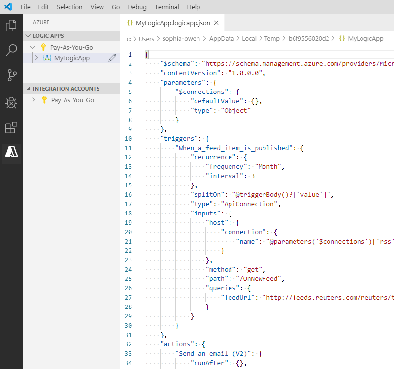
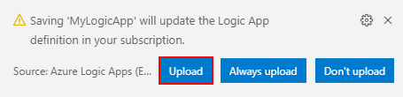
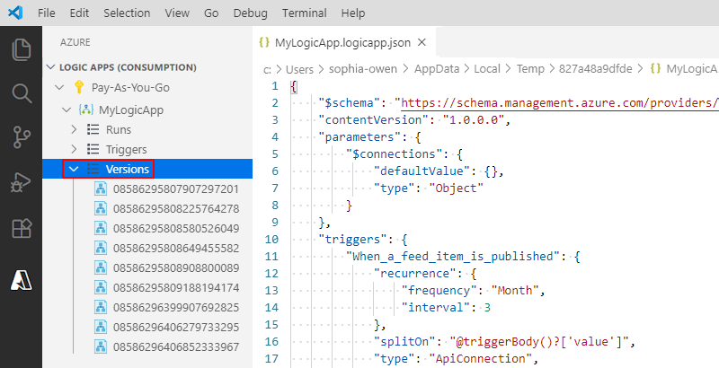
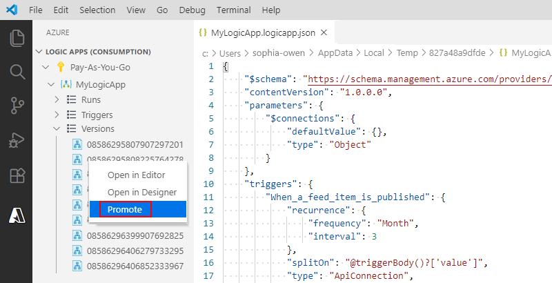
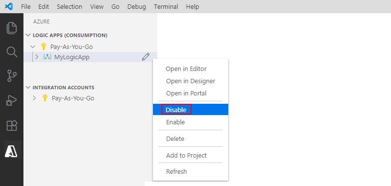
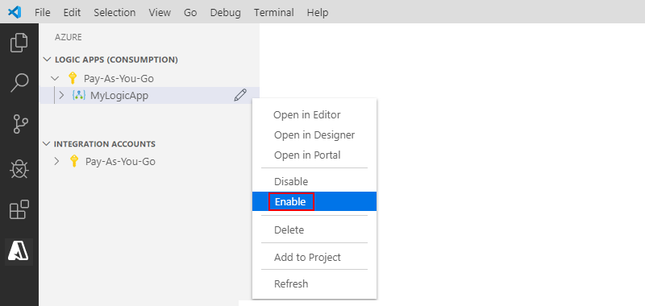
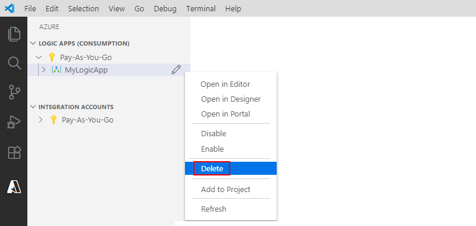

# Quickstart: Create Consumption workflows in multitenant Azure Logic Apps by using Visual Studio Code

[!INCLUDE [logic-apps-sku-consumption](../logic-apps/includes/logic-apps-sku-consumption.md)]

As an integration developer, you often need to automate business processes across SaaS apps, enterprise systems, and data sources without managing infrastructure. You also need a code-first way to build workflows so you can more efficiently version definitions, make updates, and review changes.

This quickstart shows how to create and manage Consumption workflows in multitenant Azure Logic Apps by using the local, code-first tools in Visual Studio Code. Consumption workflows provide a serverless integration model for event-driven and scheduled workflows, so you can connect services and automate processes while paying only for the actions that run.

In Visual Studio Code, you can edit workflow definitions in JavaScript Object Notation (JSON) by using the code editor, use the visual designer when needed, and manage deployed workflows in Azure. You can also work on workflows and integration accounts from any development platform where Visual Studio Code runs, such as Linux, Windows, and Mac.

The following screenshot shows how an example Consumption workflow definition might look:

:::image type="content" source="media/quickstart-create-logic-apps-visual-studio-code/visual-studio-code-overview.png" alt-text="Screenshot that shows an example Consumption logic app workflow definition in Visual Studio Code.":::

For more information, see:

- [What is Azure Logic Apps](logic-apps-overview.md)
- [Single-tenant versus multitenant in Azure Logic Apps](single-tenant-overview-compare.md).

## Prerequisites

- An Azure account and subscription. [Get a free Azure account](https://azure.microsoft.com/pricing/purchase-options/azure-account?cid=msft_learn).

- Basic knowledge about [logic app workflow definitions](logic-apps-workflow-definition-language.md) and their structure in JSON format

  The example in this article creates the same logic app workflow in this [quickstart](quickstart-create-example-consumption-workflow.md) that focuses more on the basic concepts. You can also [learn to create and manage workflows through the Azure CLI](quickstart-logic-apps-azure-cli.md). 

- Access to the web for signing in to Azure and your Azure subscription

- Download and install the following tools, if you don't have them already:

  - [Visual Studio Code version 1.25.1 or later](https://code.visualstudio.com/), which is free

  - Visual Studio Code extension for Azure Logic Apps (Consumption)

    1. Install this extension from the [Visual Studio Marketplace](https://marketplace.visualstudio.com/items?itemName=ms-azuretools.vscode-logicapps) or directly from inside Visual Studio Code.
    
       :::image type="content" source="media/quickstart-create-logic-apps-visual-studio-code/find-install-logic-apps-extension.png" alt-text="Screenshot that shows how to find and install the Azure Logic Apps Consumption extension in Visual Studio Marketplace.":::
    
    1. Reload Visual Studio Code after installation.
    
    For more information, see [Extension Marketplace](https://code.visualstudio.com/docs/editor/extension-gallery). To contribute to this extension's open-source version, visit the [Azure Logic Apps extension for Visual Studio Code on GitHub](https://github.com/Microsoft/vscode-azurelogicapps).

- If your logic app workflow needs to communicate through a firewall that limits traffic to specific IP addresses, the firewall must allow access for *both* [inbound](logic-apps-limits-and-config.md#inbound) and [outbound](logic-apps-limits-and-config.md#outbound) IP addresses used by Azure Logic Apps or the runtime in the Azure region where your logic app workflow exists. 

  If your logic app workflow also uses [managed connectors](../connectors/managed.md), such as the Office 365 Outlook connector or SQL connector, or uses [custom connectors](/connectors/custom-connectors/), the firewall must allow access for *all* the [managed connector outbound IP addresses](logic-apps-limits-and-config.md#outbound) in your logic app's Azure region.

<a name="access-azure"></a>

## Access Azure from Visual Studio Code

1. In Visual Studio Code, [sign in to your Azure account](https://code.visualstudio.com/docs/azure/resourcesextension#_how-to-sign-in-to-your-azure-account).

   If sign in takes longer than usual, Visual Studio Code prompts you to sign in through a Microsoft authentication website by providing you with a device code. To sign in with the code instead, follow these steps:

   1. Select **Use Device Code**, and then select **Copy & Open**.

   1. Select **Open Link** to open a new browser window and continue to the authentication website.

   1. On the **Sign in to your account** page, enter your authentication code, and select **Next**.

1. On the Activity bar, select the Azure icon.

   :::image type="content" source="media/quickstart-create-logic-apps-visual-studio-code/open-extensions-visual-studio-code.png" alt-text="Screenshot that shows Visual Studio Code and the Azure icon selected on the Activity bar.":::

   In the Azure pane, the **Logic Apps (Consumption)** and **Integration Accounts** sections now show the Azure subscriptions that are associated with your account. If you don't see the subscriptions that you expect, or if the sections show too many subscriptions, follow these steps:

   1. In the **Logic Apps (Consumption)** section, select **Select Subscriptions**.

      :::image type="content" source="media/quickstart-create-logic-apps-visual-studio-code/find-or-filter-subscriptions.png" alt-text="Screenshot that shows Azure pane, Logic Apps Consumption section, and Select Subscriptions selected to filter Azure subscriptions.":::

   1. From the subscriptions list, select the subscriptions you want to use.

1. In the **Logic Apps (Consumption)** section, expand your subscription to view any deployed logic apps in that subscription.

   :::image type="content" source="media/quickstart-create-logic-apps-visual-studio-code/select-azure-subscription.png" alt-text="Screenshot that shows an expanded Azure subscription with associated logic apps.":::

<a name="create-logic-app"></a>

## Create a logic app

1. In Visual Studio Code, in the **Logic Apps (Consumption)** section, from the subscription shortcut menu, select **Create Logic App**.

   :::image type="content" source="media/quickstart-create-logic-apps-visual-studio-code/create-logic-app-visual-studio-code.png" alt-text="Screenshot that shows the the subscription shortcut menu, and Create Logic App.":::

   A list appears and shows any Azure resource groups in your subscription.

1. From the resource group list, select either **Create new resource group** or an existing resource group.

   For this example, select **Create a new resource group**, for example:

   :::image type="content" source="media/quickstart-create-logic-apps-visual-studio-code/select-or-create-azure-resource-group.png" alt-text="Screenshot that shows resource group list with Create new resource group selected.":::

1. Enter a name for your Azure resource group.

   :::image type="content" source="media/quickstart-create-logic-apps-visual-studio-code/enter-name-resource-group.png" alt-text="Screenshot that shows an new Azure resource group name entered.":::

1. Select the Azure region where to save the logic app metadata.

   :::image type="content" source="media/quickstart-create-logic-apps-visual-studio-code/select-azure-location-new-resources.png" alt-text="Screenshot that shows a selected Azure region.":::

1. Enter a name for your logic app.

   :::image type="content" source="media/quickstart-create-logic-apps-visual-studio-code/enter-name-logic-app.png" alt-text="Screenshot that shows a name entered for a logic app.":::

   In the Azure window, under your Azure subscription, your new logic app and empty workflow appear. Visual Studio Code also opens a JSON (.logicapp.json) file, which includes a skeleton workflow definition, for example:
   
   :::image type="content" source="media/quickstart-create-logic-apps-visual-studio-code/empty-logic-app-workflow-definition.png" alt-text="Screenshot that shows the framework for an empty logic app workflow definition in a JSON file.":::

   You can now start manually authoring your workflow definition in this JSON file. For a technical reference about the structure and syntax of a workflow definition, see [Workflow Definition Language schema for Azure Logic Apps](../logic-apps/logic-apps-workflow-definition-language.md).

   The following sample logic app workflow definition starts with an RSS trigger and an Office 365 Outlook action. Usually, JSON elements appear alphabetically in each section. However, this sample shows these elements roughly in the order that the workflow operations appear in the designer.

   ```json
   {
      "$schema": "https://schema.management.azure.com/providers/Microsoft.Logic/schemas/2016-06-01/workflowdefinition.json#",
      "contentVersion": "1.0.0.0",
      "parameters": {
         "$connections": {
            "defaultValue": {},
            "type": "Object"
         }
      },
      "triggers": {
         "When_a_feed_item_is_published": {
            "recurrence": {
               "frequency": "Minute",
               "interval": 30
            },
            "splitOn": "@triggerBody()?['value']",
            "type": "ApiConnection",
            "inputs": {
               "host": {
                  "connection": {
                     "name": "@parameters('$connections')['rss']['connectionId']"
                  }
               },
               "method": "get",
               "path": "/OnNewFeed",
               "queries": {
                  "feedUrl": "@{encodeURIComponent('https://feeds.content.dowjones.io/public/rss/RSSMarketsMain')}",
                  "sinceProperty": "PublishDate"
               }
            }
         }
      },
      "actions": {
         "Send_an_email_(V2)": {
            "runAfter": {},
            "type": "ApiConnection",
            "inputs": {
               "body": {
                  "Body": "<p>Title: @{triggerBody()?['title']}<br>\n<br>\nDate published: @{triggerBody()?['updatedOn']}<br>\n<br>\nLink: @{triggerBody()?['primaryLink']}</p>",
                  "Subject": "RSS item: @{triggerBody()?['title']}",
                  "To": "sophia-owen@fabrikam.com"
               },
               "host": {
                  "connection": {
                     "name": "@parameters('$connections')['office365']['connectionId']"
                  }
               },
               "method": "post",
               "path": "/v2/Mail"
            }
         }
      },
      "outputs": {}
   }
   ```

   > [!IMPORTANT]
   >
   > To reuse this sample workflow definition, you need an organizational work or school account, for example, @fabrikam.com. Make sure that you replace the fictitious email address with your own email address.
   >
   > To use a different email connector, such as Outlook.com or Gmail, replace the `Send_an_email_action` action with a similar action available from an [email connector that Azure Logic Apps supports](/connectors/connector-reference/connector-reference-logicapps-connectors).
   >
   > If you want to use the Gmail connector, only G-Suite business accounts can use this connector without restriction in logic apps. If you have a Gmail consumer account, you can use this connector with only specific Google-approved services, or [create a Google client app to use for authentication with your Gmail connector](/connectors/gmail/#authentication-and-bring-your-own-application). For more information, see [Data security and privacy policies for Google connectors in Azure Logic Apps](../connectors/connectors-google-data-security-privacy-policy.md).

1. When you finish, save the workflow definition. (**File** > **Save** or press Ctrl+S).

1. When you're prompted to upload your logic app workflow definition to your Azure subscription, select **Upload**.

   This step publishes your logic app workflow definition from Visual Studio Code to the [Azure portal](https://portal.azure.com), which makes the workflow live and running in Azure.

   :::image type="content" source="media/quickstart-create-logic-apps-visual-studio-code/upload-new-logic-app.png" alt-text="Screenshot that shows a dialog box with the Upload button highlighted for uploading a logic app to the Azure portal.":::

## View workflow in the designer

In Visual Studio Code, you can open your logic app workflow in read-only design view. Although you can't edit your workflow definition in the designer, you can visually check your workflow by using the designer view.

In the Azure window, in the **Logic Apps (Consumption)** section, from your logic app shortcut menu, select **Open in Designer**.

The read-only designer opens in a separate tab and shows the logic app workflow, for example:

:::image type="content" source="media/quickstart-create-logic-apps-visual-studio-code/logic-app-designer-view.png" alt-text="Screenshot that shows your logic app's workflow in design view.":::

## View workflow in the Azure portal

To review your logic app workflow definition in Azure portal, follow these steps:

1. In the [Azure portal](https://portal.azure.com), sign in with the same Azure account and subscription associated with your logic app.

1. In the Azure portal search box, enter the logic app name. From the results list, select the logic app.

   :::image type="content" source="media/quickstart-create-logic-apps-visual-studio-code/published-logic-app-in-azure.png" alt-text="Screenshot that shows the Azure portal, search box, and name entered for logic app with the result highlighted.":::

1. On the logic app sidebar, under **Development Tools**, open the workflow in the designer or code view.

<a name="edit-logic-app"></a>

## Edit deployed logic app

In Visual Studio Code, you can open and edit the workflow definition for an already deployed logic app resource in Azure.

> [!IMPORTANT]
>
> Before you edit an actively running logic app workflow in production, minimize disruption and avoid the risk of breaking the workflow by first [disabling your logic app resource](#disable-enable-logic-apps).

1. In Visual Studio Code, on the Activity bar, select the Azure icon.

1. In the Azure window, in the **Logic Apps (Consumption)** section, expand your Azure subscription, and select the logic app you want.

1.From the logic app shortcut menu, select **Open in Editor**. Or, next to the logic app name, select the edit icon.

   :::image type="content" source="media/quickstart-create-logic-apps-visual-studio-code/open-editor-existing-logic-app.png" alt-text="Screenshot that shows Azure window, logic app shortcut menu, and Open in Editor selected.":::

   Visual Studio Code opens the *.logicapp.json file* in your local temporary folder so you can view the workflow definition.

   

1. Make your changes in the logic app's workflow definition.

1. When you're done, save your changes (**File** > **Save** or press Ctrl+S).

1. When you're prompted to upload your changes and *overwrite* your existing logic app in the Azure portal, select **Upload**.

   This step publishes your updates to your logic app resource in the [Azure portal](https://portal.azure.com).

   

## View or promote other versions

In Visual Studio Code, you can open and review the earlier versions for your logic app. You can also promote an earlier version to the current version.

> [!IMPORTANT]
>
> Before you change an actively running logic app workflow in production, you can minimize disruption and avoid the risk of breaking that logic app if you first [disable your logic app resource](#disable-enable-logic-apps).

1. In the Azure window, under **Logic Apps**, expand your Azure subscription so that you can view all the logic apps in that subscription.

1. Under your subscription, expand your logic app, and expand **Versions**.

   The **Versions** list shows your logic app's earlier versions, if any exist.

   

1. To view an earlier version, select either step:

   * To view the JSON definition, under **Versions**, select the version number for that definition. Or, open that version's shortcut menu, and select **Open in Editor**.

     A new file opens on your local computer and shows that version's JSON definition.

   * To view the version in the read-only designer view, open that version's shortcut menu, and select **Open in Designer**.

1. To promote an earlier version to the current version, follow these steps:

   1. Under **Versions**, open the earlier version's shortcut menu, and select **Promote**.

      

   1. To continue after Visual Studio Code prompts you for confirmation, select **Yes**.

      Visual Studio Code promotes the selected version to the current version and assigns a new number to the promoted version. The previously current version now appears under the promoted version.

<a name="disable-enable-logic-apps"></a>

## Disable or enable logic apps

In Visual Studio Code, if you edit a published logic app workflow and save your changes, you *overwrite* your already deployed app. To avoid breaking your logic app workflow in production and minimize disruption, disable your logic app resource first. You can then reactivate your logic app after you confirm that your logic app still works.

Disabling or enabling a logic app affects workflow instances in the following ways:

* Azure Logic Apps continues all in-progress and pending runs until they finish. Based on the volume or backlog, this process might take time to complete.

* Azure Logic Apps doesn't create or run new workflow instances.

* The trigger won't fire the next time that its conditions are met.

* The trigger state remembers the point at which the logic app was stopped. So, if you reactivate the logic app, the trigger fires for all the unprocessed items since the last run.

  To stop the trigger from firing on unprocessed items since the last run, clear the trigger's state before you reactivate the logic app:

  1. In the logic app, edit any part of the workflow's trigger.
  1. Save your changes. This step resets your trigger's current state.
  1. Reactivate your logic app.

* When a workflow is disabled, you can still resubmit runs.

To disable or enable a logic app in Visual Studio Code, follow these steps:

1. Sign in to your Azure account and subscription from [inside Visual Studio Code](#access-azure), if you haven't already.

1. In the Azure window, under **Logic Apps**, expand your Azure subscription so that you can view all the logic apps in that subscription.

   1. To disable the logic app that you want, open the logic app menu, and select **Disable**.

      

   1. When you're ready to reactivate your logic app, open the logic app menu, and select **Enable**.

      

<a name="delete-logic-apps"></a>

## Delete logic apps

Deleting a logic app affects workflow instances in the following ways:

* Azure Logic Apps makes a best effort to cancel any in-progress and pending runs.

  Even with a large volume or backlog, most runs are canceled before they finish or start. However, the cancellation process might take time to complete. Meanwhile, some runs might get picked up for execution while the service works through the cancellation process.

* Azure Logic Apps doesn't create or run new workflow instances.

* If you delete a workflow and then recreate the same workflow, the recreated workflow has different metadata. You have to resave any workflow that called the deleted workflow. That way, the caller gets the correct information for the recreated workflow. Otherwise, calls to the recreated workflow fail with an `Unauthorized` error. This behavior also applies to workflows that use artifacts in integration accounts and workflows that call Azure functions.

To delete a logic app in Visual Studio Code, follow these steps:

1. Sign in to your Azure account and subscription from [inside Visual Studio Code](#access-azure), if you haven't already.

1. In the Azure window, under **Logic Apps**, expand your Azure subscription so that you can view all the logic apps in that subscription.

1. Find the logic app that you want to delete, open the logic app menu, and select **Delete**.

   

## Next steps

> [!div class="nextstepaction"]
> [Create Standard single-tenant logic app workflows in Visual Studio Code](../logic-apps/create-standard-workflows-visual-studio-code.md)
