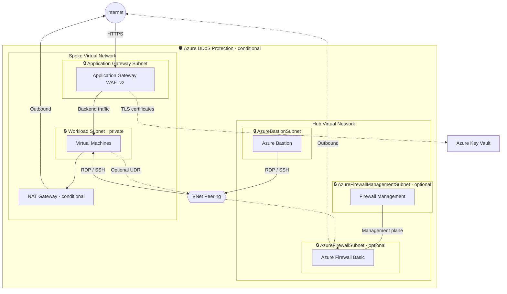

# IaaS Backend - Hub-Spoke Network Architecture

Hub-spoke network foundation for regional web applications with Virtual Machine backends.

- 🛡️ = Azure DDoS Protection (conditional)
- 🔒 = Network Security Group (on every subnet)
- Solid arrow = active traffic flow
- Dotted arrow = optional / conditional path

