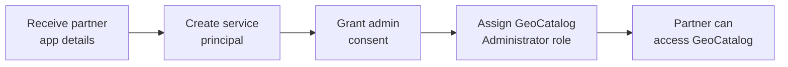

# Authorize cross-tenant partner applications for Microsoft Planetary Computer Pro

This article guides IT and cloud administrators through the process of authorizing a third-party partner application to access GeoCatalog resources. By completing these steps, you enable partner organizations—such as geospatial data providers or analytics services—to read from and write data to your Microsoft Planetary Computer Pro GeoCatalogs.

## Prerequisites

- Azure account with an active subscription - [create an account for free](https://azure.microsoft.com/free/?ref=microsoft.com&utm_source=microsoft.com&utm_medium=docs&utm_campaign=visualstudio)
- An existing [GeoCatalog resource](./deploy-geocatalog-resource.md)
- One of the following Microsoft Entra ID roles:
  - Global Administrator
  - Application Administrator
  - Cloud Application Administrator
- Owner or User Access Administrator role on the GeoCatalog resource
- Azure CLI installed and configured - [install the Azure CLI](/cli/azure/install-azure-cli)
- Information from your partner:
  - Partner's Application (client) ID
  - Redirect URI configured in the partner's application registration (Optional)

## Overview

Authorizing a partner application involves three main steps:

1. **Create a service principal** for the partner's application in your tenant
1. **Grant admin consent** to the application's permission requests
1. **Assign GeoCatalog roles** to the service principal

<!-- NOTE: For MS Learn publishing, replace the Mermaid diagram below with a PNG image -->



## Create a service principal for the partner application

A service principal is the representation of an application in your Microsoft Entra tenant. Creating a service principal for the partner's application ID establishes the identity that you can then grant permissions to.

1. Sign in to Azure CLI with an account that has Application Administrator permissions:

    ```azurecli
    az login --tenant <your-tenant-id>
    ```

1. Verify you're signed into the correct tenant:

    ```azurecli
    az account show --query "{TenantId:tenantId, User:user.name}" -o table
    ```

1. Check if a service principal already exists for the partner application:

    ```azurecli
    az ad sp list --filter "appId eq '<partner-application-id>'" --query "[0].id" -o tsv
    ```

    If this command returns an object ID, the service principal already exists. Skip to the next section.

1. Create the service principal:

    ```azurecli
    az ad sp create --id <partner-application-id>
    ```

    Example output:

    ```json
    {
      "accountEnabled": true,
      "appId": "f914857f-af79-4a22-8a37-85e772c01b7f",
      "displayName": "Partner Geospatial App",
      "id": "a1b2c3d4-e5f6-7890-abcd-ef1234567890",
      ...
    }
    ```

1. Save the service principal's `id` value (object ID) for use in subsequent steps:

    ```azurecli
    # Store the service principal object ID
    SP_ID=$(az ad sp list --filter "appId eq '<partner-application-id>'" --query "[0].id" -o tsv)
    echo "Service Principal ID: $SP_ID"
    ```

## Grant admin consent to the partner application

Admin consent authorizes the partner application to use the requested permissions. This step is required before the application can authenticate against your tenant. Your partner should provide a link to perform this action as part of the application onboarding process.

> [!NOTE]
> You can optionally contruct this URL yourself:
>
> Construct the admin consent URL using your tenant ID and the partner's application ID:
>
> ```text
> https://login.microsoftonline.com/<your-tenant-id>/adminconsent?client_id=<partner-application-id>&redirect_uri=https://localhost:8080/callback
> ```
> The redirect URI must match one of the URIs configured in the partner's application registration. Confirm the correct URI with your partner.

1. Open the URL in a web browser and sign in with a Global Administrator or Application Administrator account.

1. Review the requested permissions and select **Accept** to grant consent.

    After consent is granted, you're redirected to the specified redirect URI. You can close this browser window.

1. Verify that admin consent was granted by checking the service principal's permissions:

    ```azurecli
    az ad sp show --id $SP_ID --query "oauth2PermissionGrants" -o table
    ```

### Alternative: Grant consent via Azure portal

You can also grant admin consent through the Microsoft Entra admin center:

1. Sign in to the [Microsoft Entra admin center](https://entra.microsoft.com/)
1. Navigate to **Identity** > **Applications** > **Enterprise applications**
1. Find and select the partner application by name or application ID
1. Select **Permissions** in the left sidebar
1. Select **Grant admin consent for [your tenant]**
1. Review and accept the permissions

## Assign the appropriate GeoCatalog role

The service principal for your data or service provider needs the appropriate role in order to interact with your GeoCatalog resources. Assign the **GeoCatalog Reader** role to applications that only need read access to your GeoCatalog. Assign the **GeoCatalog Administrator** role to applications that need to create collections, ingest data, and manage items in your GeoCatalog.

> [!NOTE]
> The partner application integration feature is currently in preview and doesn't support a specific, limited access role for data or service provider partners. For this reason, it's recommended during the preview period that customers create a GeoCatalog resource dedicated to a specific partner to prevent access to other, organizational private, data.

### [GeoCatalog Administrator](#tab/geocatalog-administrator)
1. Get your GeoCatalog resource ID:

    ```azurecli
    # Set your resource details
    SUBSCRIPTION_ID="<your-subscription-id>"
    RESOURCE_GROUP="<your-resource-group>"
    GEOCATALOG_NAME="<your-geocatalog-name>"

    # Construct the resource ID
    GEOCATALOG_RESOURCE_ID="/subscriptions/$SUBSCRIPTION_ID/resourceGroups/$RESOURCE_GROUP/providers/Microsoft.Orbital/geoCatalogs/$GEOCATALOG_NAME"
    ```

1. Verify the GeoCatalog resource exists and you have access:

    ```azurecli
    az resource show --ids $GEOCATALOG_RESOURCE_ID --query "{Name:name, Location:location, Type:type}" -o table
    ```

1. Find the desired role definition:


    ```azurecli
    az role definition list --name "GeoCatalog Administrator" --query "[0].id" -o tsv
    ```

1. Check if the role assignment already exists:

    ```azurecli
    az role assignment list --assignee $SP_ID --scope $GEOCATALOG_RESOURCE_ID --query "[?roleDefinitionName=='GeoCatalog Administrator']" -o table
    ```

1. Create the role assignment:

    ```azurecli
    az role assignment create \
      --assignee $SP_ID \
      --role "GeoCatalog Administrator" \
      --scope $GEOCATALOG_RESOURCE_ID
    ```

    Example output:

    ```json
    {
      "id": "/subscriptions/.../providers/Microsoft.Authorization/roleAssignments/...",
      "principalId": "a1b2c3d4-e5f6-7890-abcd-ef1234567890",
      "roleDefinitionName": "GeoCatalog Administrator",
      "scope": "/subscriptions/.../resourceGroups/.../providers/Microsoft.Orbital/geoCatalogs/...",
      ...
    }
    ```
### [GeoCatalog Reader](#tab/geocatalog-reader)
1. Get your GeoCatalog resource ID:

    ```azurecli
    # Set your resource details
    SUBSCRIPTION_ID="<your-subscription-id>"
    RESOURCE_GROUP="<your-resource-group>"
    GEOCATALOG_NAME="<your-geocatalog-name>"

    # Construct the resource ID
    GEOCATALOG_RESOURCE_ID="/subscriptions/$SUBSCRIPTION_ID/resourceGroups/$RESOURCE_GROUP/providers/Microsoft.Orbital/geoCatalogs/$GEOCATALOG_NAME"
    ```

1. Verify the GeoCatalog resource exists and you have access:

    ```azurecli
    az resource show --ids $GEOCATALOG_RESOURCE_ID --query "{Name:name, Location:location, Type:type}" -o table
    ```

1. Find the desired role definition:


    ```azurecli
    az role definition list --name "GeoCatalog Reader" --query "[0].id" -o tsv
    ```

1. Check if the role assignment already exists:

    ```azurecli
    az role assignment list --assignee $SP_ID --scope $GEOCATALOG_RESOURCE_ID --query "[?roleDefinitionName=='GeoCatalog Reader']" -o table
    ```

1. Create the role assignment:

    ```azurecli
    az role assignment create \
      --assignee $SP_ID \
      --role "GeoCatalog Reader" \
      --scope $GEOCATALOG_RESOURCE_ID
    ```

    Example output:

    ```json
    {
      "id": "/subscriptions/.../providers/Microsoft.Authorization/roleAssignments/...",
      "principalId": "a1b2c3d4-e5f6-7890-abcd-ef1234567890",
      "roleDefinitionName": "GeoCatalog Reader",
      "scope": "/subscriptions/.../resourceGroups/.../providers/Microsoft.Orbital/geoCatalogs/...",
      ...
    }
    ```

### Alternative: Assign roles via Azure portal

You can also assign roles through the Azure portal:

1. Sign in to the [Azure portal](https://portal.azure.com/)
1. Navigate to your GeoCatalog resource
1. Select **Access control (IAM)** in the left sidebar
1. Select **Add** > **Add role assignment**
1. Select **GeoCatalog Administrator** or **GeoCatalog Reader ** from the list of roles
1. Select **Next**
1. Select **User, group, or service principal**
1. Select **Select members** and search for the partner application name
1. Select the partner application and choose **Select**
1. Select **Review + assign** to complete the assignment

## Verify the configuration

After completing the authorization steps, verify that the partner can access your GeoCatalog:

1. Confirm the service principal exists and has the correct application ID:

    ```azurecli
    az ad sp show --id $SP_ID --query "{DisplayName:displayName, AppId:appId, Id:id}" -o table
    ```

1. Verify the role assignment:

    ```azurecli
    az role assignment list --assignee $SP_ID --scope $GEOCATALOG_RESOURCE_ID -o table
    ```

1. Notify your partner that authorization is complete. Provide them with:
   - The GeoCatalog URI (found in the Azure portal on your GeoCatalog resource's Overview page)

## Grant access to more GeoCatalogs

To grant the same partner access to more GeoCatalog resources, repeat only the [Assign the appropriate GeoCatalog role](#assign-the-appropriate-geocatalog-role) section for each resource. The service principal and admin consent only need to be configured once per tenant.

## Revoke partner access

To remove a partner's access to your GeoCatalog:

### Remove role assignment only

To revoke access to a specific GeoCatalog while preserving access to others:

```azurecli
az role assignment delete --assignee $SP_ID --scope $GEOCATALOG_RESOURCE_ID --role "GeoCatalog Administrator"
```
Or 

```azurecli
az role assignment delete --assignee $SP_ID --scope $GEOCATALOG_RESOURCE_ID --role "GeoCatalog Reader"
```

### Remove all access

To completely remove the partner application from your tenant:

```azurecli
# Delete the service principal
az ad sp delete --id $SP_ID
```

> [!WARNING]
> Deleting the service principal removes all role assignments and consent grants for that application across your entire tenant.

## Troubleshooting

### Service principal creation fails

If you receive an error when creating the service principal, verify that:

- The partner's application ID is correct
- The partner's application is configured for multitenant access
- You have Application Administrator or Global Administrator role

### Admin consent fails

If admin consent fails:

- Verify the redirect URI matches the partner's application configuration
- Ensure you're signed in with sufficient privileges (Global Administrator or Application Administrator)
- Check if your tenant has policies that restrict consent to external applications

### Role assignment fails

If the role assignment fails:

- Verify you have Owner role on the GeoCatalog resource
- Confirm the GeoCatalog resource ID is correct
- Ensure the GeoCatalog Administrator role definition exists in your subscription

## Related content

- [Working with partner applications](./working-with-partner-applications.md)
- [Configure a cross-tenant application](./configure-cross-tenant-application.md)
- [Configure application authentication for Microsoft Planetary Computer Pro](./application-authentication.md)
- [Manage access for Microsoft Planetary Computer Pro](./manage-access.md)
