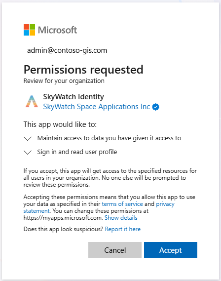

# "Enable 3rd Party Applictions for Microsoft Planetary Computer Pro (Preview)"

<!-- Required: Article headline - H1

Identify the product or service and the task the
article describes.

-->

This guide demonstrates how to register and enable a third party (3P) enterprise application within your Microsoft Azure tenant, and grant that 3P application the necessary role-based access (RBAC) roles for reading and writing data to your GeoCatalog. This process is a prerequisite in order to enable interoperability with 3P SaaS offerings, either in the delivery of data directly to MPC Pro, or in the reading of geospatial data from MPC Pro and redelivery of insights or analytic results back to MPC Pro.
<!-- Required: Introductory paragraphs (no heading)

Write a brief introduction that can help the user
determine whether the article is relevant for them
and to describe the task the article covers.

-->

## Prerequisites

- Access to a Microsoft Entra ID tenant
- Azure Subscription with permissions to manage app registrations
- Azure CLI or access to the Azure Cloud Shell
- (Optional) The Client ID for the 3P enterprise application you are adding (for verification)
<!-- Optional: Prerequisites - H2

If included, "Prerequisites" must be the first H2 in the article.

List any items that are needed to complete the How To,
such as permissions or software.

If you need to sign in to a portal to complete the How To, 
provide instructions and a link.

-->

## Register an Enterprise Application

[Introduce the procedure.]

### Using the admin consent URL
1. Grant admin consent using the URL provided by your 3P application vendor, e.g.: `https://login.microsoftonline.com/{your-customer-tenant-id}/adminconsent?client_id=YOUR_APP_CLIENT_ID`

    [  ](media/grant-admin-consent-external-application.png#lightbox)

### Using the Azure CLI

1. Open a terminal window with Azure CLI and use `az login` to login to Azure
    1. Optionally, you can open an [Azure Cloud Shell](/azure/cloud-shell/overview) instance from the Azure Portal.
1. Create the application service principal by running the following command:
    
    ```shell
    az ad sp create --id <CLIENT_ID>
    ```
    
1. Procedure step

<!-- Required: Steps to complete the task - H2

In one or more H2 sections, organize procedures. A section
contains a major grouping of steps that help the user complete
a task.

Begin each section with a brief explanation for context, and
provide an ordered list of steps to complete the procedure.

If it applies, provide sections that describe alternative tasks or
procedures.

-->

## Clean up resources

<!-- Optional: Steps to clean up resources - H2

Provide steps the user can take to clean up resources that
they might no longer need.

-->

## Next step -or- Related content

> [!div class="nextstepaction"]
> [Next sequential article title](link.md)

-or-

* [Related article title](link.md)
* [Related article title](link.md)
* [Related article title](link.md)

<!-- Optional: Next step or Related content - H2

Consider adding one of these H2 sections (not both):

A "Next step" section that uses 1 link in a blue box 
to point to a next, consecutive article in a sequence.

-or- 

A "Related content" section that lists links to 
1 to 3 articles the user might find helpful.

-->

<!--

Remove all comments except the customer intent
before you sign off or merge to the main branch.

-->