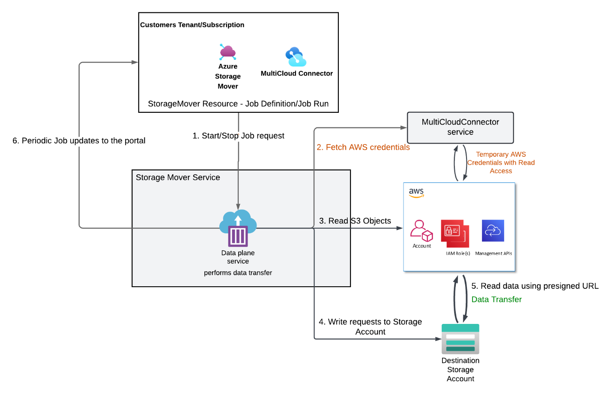

# Azure-to-private network connectivity options (ExpressRoute, VPN, SD-WAN)
## Overview

Azure supports several ways to connect to private networks. The best approach depends on your requirements for latency, bandwidth, security, cost, and operational complexity.

* **Azure ExpressRoute** - Private, dedicated connectivity that doesn't traverse the public internet.
* **Site-to-site IPsec VPN** - Encrypted tunnels over the public internet (typically using Azure VPN Gateway).
* **SD-WAN via network virtual appliances (NVAs)** - Third-party appliances provide VPN/firewall features and can terminate tunnels instead of using native gateways.

In general, ExpressRoute is preferred for the highest bandwidth and lowest latency. When ExpressRoute isn't available, use site-to-site VPN or an SD-WAN/NVA-based design.

## Key concepts

**ExpressRoute**: Private connectivity to Azure through a connectivity provider; typically used for predictable latency and higher throughput.

**Azure VPN Gateway SKU**: The gateway size/SKU affects tunnel counts and throughput; choose based on required bandwidth and resiliency.

**IPsec/IKE policy**: Cryptographic algorithms and parameters used to establish and secure VPN tunnels (for example, AES and SHA families, DH/PFS groups).

**BGP (Border Gateway Protocol)**: Dynamic routing that exchanges prefixes between networks; commonly used for active/active tunnels and route failover.

**Network virtual appliance (NVA)**: A third-party virtual network device (such as firewall/SD-WAN) deployed in Azure; often used for advanced inspection, policy, and routing.

**UDR (user-defined routes)**: Custom routes in Azure that steer traffic to a specific next hop (for example, an NVA).

**AWS Transit Gateway (TGW) / Virtual Private Gateway (VGW)**: AWS routing endpoints for VPN/Direct Connect; TGW is commonly preferred for hub-and-spoke and scale.

**AWS VPC endpoint (VPCE) for Amazon S3**: Private connectivity from a VPC to S3; often paired with **private DNS** and endpoint/bucket policies.

**S3 bucket policy and VPCE policy**: Resource-based policies that can allow/deny access, including restrictions to a specific VPCE via **aws:SourceVpce**.

**Azure Private Link Service Direct Connect**: Azure capability to create outbound private connectivity to a destination IP (for example, an AWS VPCE IP) for services such as Storage Mover private connections.

**Private connection approval**: Private connections might require explicit approval before they can be used by workloads/jobs.

**Regional alignment**: Some resources (for example, AWS VPCEs and certain Azure service constructs) are region-scoped and must be deployed in compatible regions.

## When to use each option

**ExpressRoute**: Choose when you need predictable performance, private connectivity, and higher throughput for hybrid connectivity.

**Site-to-site VPN**: Choose for faster setup, lower cost, or as a backup path; performance depends on internet conditions and gateway SKU.

**SD-WAN/NVAs**: Choose when you need vendor-specific routing, security inspection, or an existing SD-WAN operational model.

| **Option** | **Connectivity path** | **Typical strengths** | **Common tradeoffs** |
|---|---|---|---|
| **ExpressRoute** | Private circuit via provider/colocation | Low latency, high throughput, predictable performance | Lead time, cost, provider dependencies |
| **Site-to-site IPsec VPN** | Encrypted tunnels over public internet | Quick to deploy, good for backup/DR | Variable performance; throughput limits per gateway/SKU |
| **SD-WAN / NVAs** | Tunnels terminate on third-party appliances | Advanced policy, inspection, vendor features | More components to manage; appliance sizing/licensing |

## Connectivity options in Azure

### ExpressRoute

**Learn more:** [ExpressRoute documentation](/azure/expressroute/)

**Routing:** BGP is commonly used over private circuits to exchange prefixes between Azure and your network.

**Connectivity providers:** ExpressRoute is typically provisioned through a colocation or connectivity provider (for example, Equinix, Megaport).

### Site-to-site IPsec VPN (Azure VPN Gateway)

**Overview:** Use Azure VPN Gateway for encrypted site-to-site IPsec tunnels over the public internet. For higher throughput and resiliency, select an appropriate gateway SKU (for example, Generation2 and zone-redundant SKUs where available).

**Learn more:** [Tutorial - Create an S2S VPN connection](/azure/vpn-gateway/tutorial-site-to-site-portal)

**Routing:** Use BGP to exchange routes and support active/active tunnels across multiple connections.

For a detailed walkthrough of multi-tunnel BGP between Azure VPN Gateway and AWS, see: [Tutorial - Configure a BGP-enabled connection between Azure and AWS](/azure/vpn-gateway/vpn-gateway-howto-aws-bgp).

#### Implementation tips (VPN performance)

Example custom IPsec/IKE settings (validate against your device compatibility): **GCMAES256** for IPsec encryption/integrity, **SHA256** for IKE integrity, **DHGroup14**, **PFS2048**.

**Learn more:** [Configure custom IPsec/IKE connection policies](https://docs.azure.cn/en-us/vpn-gateway/ipsec-ike-policy-howto).

### SD-WAN with network virtual appliances (NVAs)

SD-WAN and firewall NVAs can terminate VPN tunnels, perform inspection, and apply centralized routing and security policy. This approach is useful when you need vendor-specific capabilities or you already operate an SD-WAN platform across sites.

**Fortinet**: FortiGate Next-Generation Firewall

**Cisco**: Catalyst SD-WAN, Meraki SD-WAN

**HPE (Aruba Networks)**: EdgeConnect SD-WAN

**Palo Alto Networks**: Prisma SD-WAN

**Arista (VMware)**: VeloCloud SD-WAN Virtual Edge

SD-WAN NVAs are commonly licensed as either pay-as-you-go (PAYG) or bring-your-own-license (BYOL). Vendor support varies by deployment option.

PAYG: Pay as you go

BYOL: Bring your own license

#### Example deployment (FortiGate NVA in Azure)

**Select a topology** (single VM, active/passive, or active/active) based on availability and throughput requirements.

**Choose a suitable VM size** (often F or D-series with higher vCPU) and enable **accelerated networking** where supported.

**Network design**: place interfaces in WAN/LAN (and protected) subnets and configure NSG rules for required management and VPN ports (for example, UDP 500/4500 for IPsec).

**Routing**: use UDRs to steer Azure-to-AWS prefixes through the NVA next hop.

**Vendor documentation:** For example steps to configure IPsec between FortiGate devices, see the Fortinet Community article below.

[How to configure VPN site-to-site between FortiGate devices (Fortinet Community)](https://community.fortinet.com/t5/FortiGate/Technical-Tip-How-to-configure-VPN-Site-to-Site-between/ta-p/197922)

## AWS connectivity to Azure

### AWS Direct Connect to Azure ExpressRoute

AWS Direct Connect can be paired with Azure ExpressRoute through a colocation/provider to create a private, high-throughput path between AWS and Azure.

**Routing:** BGP over private circuits

**Connectivity:** Typically via a colocation/connectivity provider

[What is Direct Connect? - AWS Direct Connect](https://docs.aws.amazon.com/directconnect/latest/UserGuide/Welcome.html)

[Create an Direct Connect gateway - AWS Direct Connect](https://docs.aws.amazon.com/directconnect/latest/UserGuide/create-direct-connect-gateway.html)

### AWS site-to-site VPN (BGP)

For AWS-to-Azure VPN, use dynamic routing (BGP) and prefer AWS Transit Gateway (TGW) for scale and performance when applicable.

**Learn more:** [Tutorial - Configure a BGP-enabled connection between Azure and AWS](/azure/vpn-gateway/vpn-gateway-howto-aws-bgp).

### AWS SD-WAN with NVAs

If you operate an SD-WAN platform in AWS (for example, FortiGate on EC2), you can terminate tunnels in AWS and connect to Azure using the same SD-WAN policy model used on-premises.

1. Launch the NVA from AWS Marketplace and size the instance for required throughput.
2. Attach WAN/LAN interfaces, associate an Elastic IP to the WAN interface, and disable source/destination checks if required by the appliance routing model.
3. Configure security groups and route tables to allow Azure prefixes and steer traffic through the appliance.

## Implementation details for S3 private access (VPC endpoints)

### Configure an AWS VPC endpoint (VPCE) for Amazon S3

An AWS VPC endpoint (VPCE) for S3 lets your VPC reach S3 privately. For this design, you typically enable private DNS and then constrain access using VPCE and bucket policies.

#### High-level steps

1. Verify your VPC has **DNS support** and **DNS hostnames** enabled.
2. Create an **interface** VPCE for **Amazon S3** in the target VPC and subnets, and enable **private DNS**.
3. Configure VPCE and bucket policies to allow only required S3 actions and (optionally) restrict access to the specific endpoint using **aws:SourceVpce**.

* 

Example: S3 bucket policy restricted to a specific VPCE.

* 

**Note:** Record the VPCE private IP address; it is used as the destination IP for Azure Private Link Service Direct Connect.

#### Security group considerations

Allow required traffic from Azure source prefixes to the VPCE and related AWS resources (principle of least privilege).

## Azure configuration for Private Link Service Direct Connect

### Create the Private Link Service Direct Connect resource

Private Link Service Direct Connect allows Azure to create outbound private connectivity to a destination IP address (for example, an AWS VPCE IP). In this scenario, it enables Storage Mover private connections to reach a private S3 endpoint over your established Azure-to-AWS network path.

1. Deploy the PLS Direct Connect resource in the **same Azure region** as the Storage Mover resource and the Azure virtual network used to reach AWS.
2. Enable the feature in the Azure portal using the provided flight link: [Azure portal flight link (PLS Direct Connect)](https://ms.portal.azure.com/?feature.canmodifystamps=true&exp.plsdirectconnect=true).
3. Ensure the Azure VNet/subnet selected for source NAT has connectivity to the AWS VPC and the VPCE IP address.

#### High-level steps

1. Create the **Private Link Service (Your Service)** resource for Direct Connect in the correct region.
2. Configure **Outbound settings**:
3. Set connection method to **Destination IP address** and enter the **AWS VPCE IP address**.
4. Select the **source NAT** virtual network and subnet that can route to AWS.
5. Configure private IP address settings as required for resiliency (for example, two or more addresses in supported increments).

### Create and approve private connections

After creating the Direct Connect resource, create a private connection in Storage Mover and approve it before use.

1. In **Storage Mover**, open **Storage Endpoints** and then the **Private Connections** tab.
2. Create a private connection that references the Direct Connect private link service, then approve it so it can be associated to jobs.

### Use private connections for cloud-to-cloud migration

1. Use the above Private connection as part of Create job operation. Select ‘Cloud to Cloud' migration type.
2. When creating a cloud-to-cloud migration job, set the S3 bucket type to **Private** and associate the approved private connection.
3. Verify the private connection is listed and in **Approved** state.
4. Only private connections in **Approved** state can be selected.
5. Remaining job steps are the same as a public S3-to-Blob migration.

## Architecture

### Cloud-to-cloud migration flow (private networking)

*Note: Above diagram shown with private networking to AWS but same applies for other private networking scenarios.*

### Cloud-to-cloud migration flow (public S3 bucket to Blob)

## Troubleshooting

### Connectivity and IP addressing

* **Verify Destination IP in Azure PLS:** Ensure the Azure Private Link Service is pointed specifically to the AWS VPC Endpoint's IP address. A mismatch here will prevent the initial handshake.
* **Validate Network Path:** Confirm that the underlying network infrastructure (e.g., VPN, ExpressRoute, or Cloud Interconnect) is established and routing traffic correctly between the Azure environment and the AWS VPC.
* **Check Interface Configurations:** Review the AWS VPC Endpoint configuration to ensure it is active and associated with the correct subnets and security groups.

### VPCE policy configuration

* **Audit Resource Permissions:** Inspect the `Resource` element in your VPCE policy. It must explicitly include the ARN of the target S3 bucket (e.g., `arn:aws:s3:::your-bucket-name` and `arn:aws:s3:::your-bucket-name/*`).
* **Audit Action Permissions:** Ensure the `Action` element in the VPCE policy permits necessary operations. At a minimum, `s3:Get*` and `s3:List*` are required for reading and browsing data.
* **Policy Logic:** If using a custom policy, ensure there are no "Deny" statements that inadvertently override the "Allow" statements for the Azure-sourced traffic. 

  

### S3 bucket policy constraints

* **VPCE allow listing:** Check the S3 Bucket Policy for a `Condition` block. If the bucket restricts access, it must explicitly allow the `aws:SourceVpce` corresponding to the VPC Endpoint being used.
* **Principal Access:** Ensure the IAM identity or the anonymous access (if applicable via VPCE) is not blocked by the bucket's Access Control List (ACL) or Public Access Block settings.

                

### Regional alignment

* **Region Scope Validation:** AWS VPC Endpoints for S3 are **region scoped**. A VPCE in `us-west` cannot route traffic to an S3 bucket located in `us-east`.
* **Remediation:** If a regional mismatch is identified, the S3 bucket must be migrated to the same region as the VPCE, or a new VPCE must be established in the bucket's region (noting that this may require additional cross-region routing

## Limits

* Customers can configure a maximum of 10 Private Connections/region. This includes private connection state in Approved/Pending/Disconnected state.
* PLS direct should be configured in the same region as Storage Mover Resource. 

## Performance

| **Setup** | ** Max Throughput (Apxmt)** |
|---|---|
| **Azure VPN Gateway (4 IPSec Tunnels) with single Private connection** | 4.5 Gbps |
| **Azure VPN Gateway (4 IPsec Tunnels) with 2 Private connections** | 5.6 Gbps |
| **FortiGate SDWAN with a Private Connection** | 2 Gbps |
| **2 FortiGate SDWANs each with VPN tunnel and Private Connection** | 2 Gbps * 2 |

## Next steps

Review ExpressRoute concepts and planning in the [ExpressRoute documentation](/azure/expressroute/).

Create a site-to-site VPN connection in Azure: [Tutorial - Create an S2S VPN connection](/azure/vpn-gateway/tutorial-site-to-site-portal).

For BGP between Azure and AWS, follow: [Tutorial - Configure a BGP-enabled connection between Azure and AWS](/azure/vpn-gateway/vpn-gateway-howto-aws-bgp).

