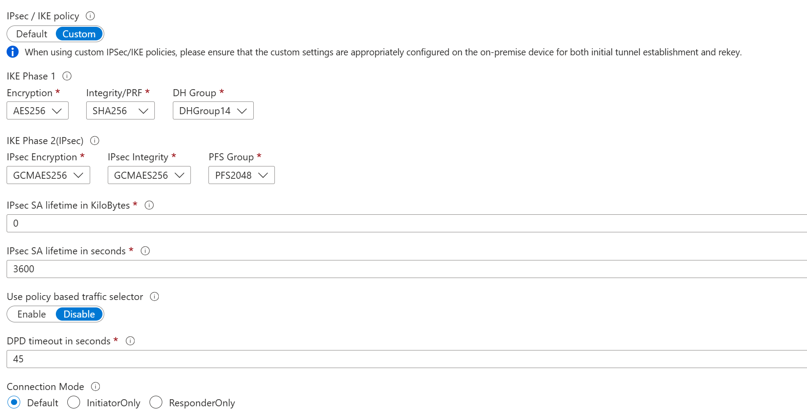
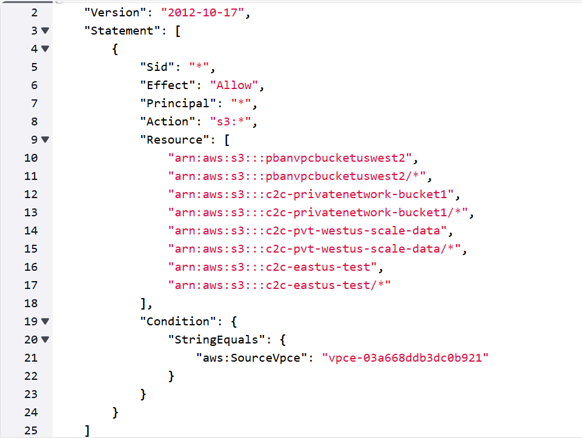
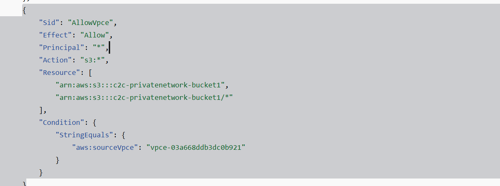
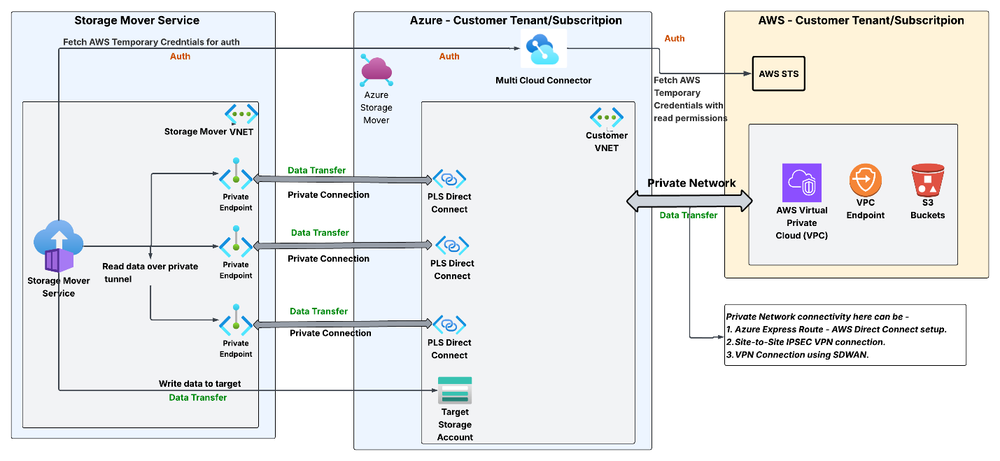
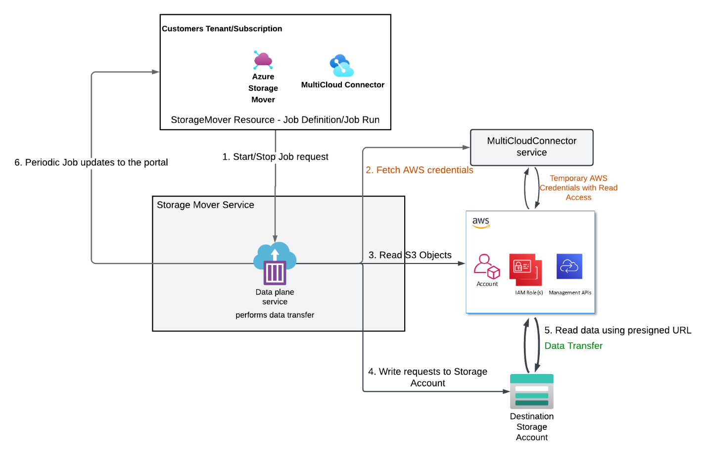

# Get started with Storage Mover Migrations requiring Private Connections

## Overview

A private connection allows enterprise customers to securely migrate data between AWS S3 and Azure Storage over private networks, keeping transfers off the public internet. By using Azure Private Link Service (PLS) and Private Endpoints (PE), this solution extends the Virtual private Cloud (VPC) network into Azure, supports strict security compliance, and helps protect sensitive information.

**Prerequisites For Setting up Storage Mover** 

Before you begin, ensure that you have:

[Understanding the Azure Storage Mover resource hierarchy | Microsoft Learn](/azure/storage-mover/resource-hierarchy)

A  [Storage Mover resource](/azure/storage-mover/storage-mover-create) deployed in your Azure subscription.

Completed the preparation from [Get started with cloud-to-cloud migration in Azure Storage Mover | Microsoft Learn](/azure/storage-mover/cloud-to-cloud-migration)

An active Azure subscription with [ permissions to create and manage Azure Storage mover and Azure Arc resources.](/azure/azure-arc/multicloud-connector/add-public-cloud)

**Prerequisite for Creating a Private Connection**

* [**Create a Private Link Service Direct Connect**](https://docs.azure.cn/en-us/private-link/create-private-link-service-portal?tabs=dynamic-ip)
* **Networking Documentation **

**Limits**

The Virtual Private Cloud feature in Azure Storage Mover has the following limits:

* A Private Link Service Direct Connect, an IP based PLS,  cannot be created directly within Storage Mover; you must establish the PLS prior to initiating the creation of a private connection. 
* It is necessary to review your AWS S3 environment to determine whether it resides behind a Virtual Private Cloud, as this process does not validate the public or private status of your S3 bucket
* When configuring your PLS, ensure it accurately maps to the Virtual Private Cloud associated with your S3 resource, since this experience does not offer validation at that level.

## Step 1: Create a Private Connection

*Configure a Private Connection in Storage Endpoints *

1. Navigate to your Storage Mover instance in Azure.
2. Under Storage endpoints, select Private Connection → Create Private Connection.

   

3. Insert a name for this Private Connection.
4. ***Note:**** this name will also reflect the name of the Private endpoint that you will later approve to connect it to Private link service.*
5. Select the appropriate Private Link Service Direct Connect that will direct you to the correct AWS S3 bucket they want to migrate onto Azure.  

   

6. Select Create and commit your changes
7. ***Note***: *Creating this Private Connection takes 20-30 seconds. You may need to refresh manually to view it in the grid.*

1. Repeat steps 1-4 to set up several Private Connections.
2. ***Note****: Create multiple private connections to avoid bandwidth limits and ensure efficient, successful data migration.*
3. ***Note:*** *There is currently a default limit of 10 private connections per subscription per region**** ***

## Step 2: Approve a Private Connection

*Select and approve your newly created Private Connection *

1. Select the checkbox for your newly created Private Connection. 
2. ***Note****: You are authorizing the connection between the Private Link service you specified during Private Connection setup and the corresponding private endpoint that has been automatically generated for you*.  
3. Click "Approve"  
4. ***Note****: Only a Private connection in Approved state can be used for a Migration job. Connections in a pending, rejected, or disconnected states will not appear as options when creating a Job.*

## Step 3: Create a Project

1. Provide a name for your Project 
2. Create your project

## Step 4: Create a Job

*Create your Multi-cloud Migration job *

1. Navigate to the Projects page.
2. Once you click on one of your Projects, select "Create Job"

1. In the "Basics" tab, select your desired Migration Type

1. Source tab, select an existing or newly created source type
2. ***Note****: Ensure your selected source type is protected by a Virtual Private Cloud.*
3. Select a "Private" type
   * Some sources will not require you to click "private", but they will require a private connection(s) to be added for the selected source 

1. Select your existing Private Connections
2. ***Note****: Select multiple private connections to avoid bandwidth limits and ensure efficient, successful data migration.*

1. Click "Next"
2. Select your Target resource, where you would like your data to be migrated to Azure. 

1. Select the proper Settings for your migration.
2. Click "Create"

## Step 5: Edit a Job

*Create your Multi-cloud Migration job *

1. Navigate to the Job you just created in your Project. 

1. Click on the "Edit" Icon
2. Select Private connections
   * You can either Delete or add new private connections by clicking the respective buttons
3. Click "Save"
   * **Note**: To locate errors related to private connections, go to the Job page and select the Monitoring tab after the Job has completed.
4. Run your Job as normal once you have decided all configurations are correct

